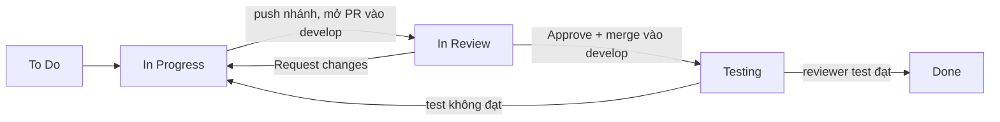

# Quy trình làm việc của nhóm FamilyConnect: từ Jira đến GitHub

> **Dành cho:** cả 5 thành viên (Tuấn, Trí, PiLo257, Huy Quốc, Lê Nhựt).
> **Đọc xong bạn biết:** nhận task ở đâu, làm trên nhánh nào, nộp bài thế nào, ai duyệt, khi nào task được coi là **Done**.
> **Nơi lưu file này:** `docs/00-process/quy-trinh-lam-viec.md`.
> **Repo:** `https://github.com/ngthanhtuann/java` | **Jira:** space JAVA (mã task `SCRUM-xx`).

---

## 1. Tóm tắt trong 1 phút

1. Mở **Jira**, chọn task của mình, kéo sang **In Progress**.
2. Trên máy: `git checkout develop` → `git pull origin develop` → **tạo nhánh riêng cho task** (có mã `SCRUM-xx`).
3. Làm việc, **commit có mã task**, push nhánh lên GitHub.
4. Mở **Pull Request (PR) vào `develop`**, chọn **reviewer**, kéo task sang **In Review**.
5. Reviewer đọc, comment, **Approve**. Người làm sửa theo góp ý.
6. **Squash and merge** vào `develop`, xóa nhánh.
7. Reviewer kiểm tra lại (task code qua cột **Testing**), rồi kéo task sang **Done**.
8. Cuối sprint, **Tuấn** kiểm tra `develop` và mở PR **`develop` → `main`**.



> Task **tài liệu** (không có code chạy) đi thẳng từ **In Review** sang **Done**, không qua **Testing**.

---

## 2. Quy tắc cố định (cả nhóm phải nhớ)

### 2.1 Ba loại nhánh

| Nhánh | Dùng cho | Ai đẩy vào |
|---|---|---|
| `main` | Bản ổn định, dùng để nộp và demo | Chỉ qua PR từ `develop`, do Tuấn làm cuối sprint |
| `develop` | Nơi gom công việc đã được duyệt của cả nhóm | Chỉ qua PR từ nhánh task |
| `feature/...`, `docs/...`, `bugfix/...` | Làm việc của từng người | Chính người làm task |

**Không ai commit thẳng vào `main` hoặc `develop`.** GitHub đã bật quy tắc chặn việc này.

### 2.2 Cách đặt tên

| Thứ | Quy ước | Ví dụ |
|---|---|---|
| Nhánh task code | `feature/SCRUM-<số>-<mô-tả-ngắn-không-dấu>` | `feature/SCRUM-35-auth-backend` |
| Nhánh task tài liệu | `docs/SCRUM-<số>-<mô-tả-ngắn>` | `docs/SCRUM-18-genealogy` |
| Nhánh sửa lỗi | `bugfix/SCRUM-<số>-<mô-tả-ngắn>` | `bugfix/SCRUM-35-sai-ma-loi-dang-nhap` |
| Commit | `SCRUM-<số>: <việc đã làm>` | `SCRUM-35: thêm API đăng nhập trả JWT` |
| Tiêu đề PR | `SCRUM-<số> <tên task>` | `SCRUM-35 Auth backend: đăng ký, đăng nhập, JWT` |

**Mã `SCRUM-xx` bắt buộc có trong cả ba chỗ** (nhánh, commit, tiêu đề PR). Có mã này thì Jira mới tự hiện nhánh, commit, PR trong phần *Development* của task.

Commit tốt và commit không nên viết:

| Nên | Không nên |
|---|---|
| `SCRUM-35: thêm entity User và migration Flyway` | `fix` |
| `SCRUM-18: use case module Gia phả (UC-GEN-01 đến 05)` | `update` |
| `SCRUM-21: bảng mã lỗi chuẩn trong quy ước API` | `abc`, `xong rồi` |

### 2.3 Ai duyệt ai (test chéo)

| Người làm | Reviewer |
|---|---|
| TV1 Tuấn | TV4 Huy Quốc |
| TV2 Trí | TV5 Lê Nhựt |
| TV3 PiLo257 | TV1 Tuấn |
| TV4 Huy Quốc | TV2 Trí |
| TV5 Lê Nhựt | TV3 PiLo257 |

Tên reviewer cũng ghi ngay ở đầu mô tả mỗi task trên Jira ("Reviewer (test chéo): TV4").

### 2.4 Ý nghĩa các cột trên Board Jira

| Cột | Nghĩa là | Ai kéo |
|---|---|---|
| **To Do** | Chưa làm | |
| **In Progress** | Đang làm, đã có nhánh | Người làm |
| **In Review** | Đã mở PR, chờ reviewer | Người làm |
| **Testing** | PR đã merge vào `develop`, reviewer đang test | Reviewer |
| **Done** | Xong theo tiêu chí hoàn thành | Reviewer |

Mỗi người chỉ có **1 đến 2 task In Progress** cùng lúc.

### 2.5 Khi nào một task được coi là Done

- Có **tiêu chí hoàn thành** trong mô tả task trên Jira và đã tự kiểm tra theo đó.
- Mọi thay đổi (code hoặc tài liệu) đã vào `develop` qua Pull Request, có ít nhất **1 Approve** từ reviewer.
- Task code: có test, không còn secret (mật khẩu, key) trong code, API mới đã có trong Swagger.
- Task tài liệu: đủ các mục theo khung sườn, đúng mã FR và quy ước API.
- Link PR đã dán vào task Jira; **reviewer là người kéo task sang Done**.

---

## 3. Chuẩn bị một lần duy nhất

### 3.1 Cài đặt

| Công cụ | Dùng để |
|---|---|
| Git | Quản lý phiên bản (git-scm.com) |
| Tài khoản GitHub, đã được **mời làm Collaborator** của repo | Push nhánh, mở PR |
| Tài khoản Jira, đã vào space JAVA | Nhận và cập nhật task |
| VS Code (hoặc IntelliJ cho backend) | Soạn tài liệu và code |

### 3.2 Cấu hình Git lần đầu

```bash
git config --global user.name "Tên của bạn"
git config --global user.email "email-github-của-bạn@gmail.com"
```

### 3.3 Lấy mã nguồn về máy

```bash
git clone https://github.com/ngthanhtuann/java.git
cd java
git checkout develop
```

Từ đó, mọi việc bắt đầu từ nhánh `develop`.

---

## 4. Làm một task từ đầu đến cuối

Mỗi bước dưới đây có **ví dụ cụ thể**. Hai ví dụ chạy xuyên suốt:

| | Ví dụ A: task tài liệu | Ví dụ B: task code |
|---|---|---|
| Task | SCRUM-18 `[1-05] Tài liệu module Gia phả` | SCRUM-35 `[3-01] Auth backend` |
| Người làm | Trí (TV2) | Tuấn (TV1) |
| Reviewer | Lê Nhựt (TV5) | Huy Quốc (TV4) |
| Nhánh | `docs/SCRUM-18-genealogy` | `feature/SCRUM-35-auth-backend` |
| Kết quả | File `docs/01-srs/use-cases/genealogy.md` | API `/auth/register`, `/auth/login` |

### Bước 1. Chọn task trên Jira

1. Mở **Board** của space JAVA, bấm biểu tượng **avatar của bạn** ở thanh lọc để chỉ thấy task của mình.
2. Lấy task trong cột **To Do** theo thứ tự ưu tiên: **Highest → High → Medium**, và theo **Due date** gần nhất.
3. Bấm vào task, **đọc kỹ 4 phần** trong mô tả: *Mô tả các bước*, *Tiêu chí hoàn thành*, *Sản phẩm bàn giao*, và dòng *Phụ thuộc*.
4. Nếu task phụ thuộc task khác chưa xong (ví dụ "cần bảng FR của Tuấn"), nhắn người đó và **ghi comment** vào task.

> **Ví dụ A.** Trí mở SCRUM-18. Mô tả ghi "Đọc lại SRS mục 3, lọc các yêu cầu chức năng (mã FR)". Trí biết phải đợi bảng FR của Tuấn trước trưa Thứ Ba, nên comment: *"Chờ bảng FR của SCRUM-14, trong lúc đó mình nháp use case."*

### Bước 2. Nhận task

1. Đảm bảo **Assignee** là tên bạn.
2. **Kéo thẻ từ To Do sang In Progress.**

> **Ví dụ B.** Tuấn mở SCRUM-35, thấy Assignee là chính mình, kéo sang **In Progress**.

### Bước 3. Tạo nhánh riêng cho task

**Luôn bắt đầu từ `develop` mới nhất:**

```bash
git checkout develop
git pull origin develop
git checkout -b docs/SCRUM-18-genealogy
```

Ví dụ B (task code):

```bash
git checkout develop
git pull origin develop
git checkout -b feature/SCRUM-35-auth-backend
```

Kiểm tra bạn đang ở đúng nhánh:

```bash
git branch
```

Dấu `*` phải nằm ở nhánh của task, không phải `develop`.

> Jira cũng có nút **Create branch** ở mục *Development* của task, sinh sẵn tên nhánh có mã task. Dùng nút này hay gõ lệnh đều được.

### Bước 4. Làm việc và commit thường xuyên

Chỉ sửa **file của module mình** để không đụng người khác.

**Ví dụ A (tài liệu).** Trí mở `docs/01-srs/use-cases/genealogy.md` và điền: danh sách use case, đặc tả `UC-GEN-01` đến `UC-GEN-09`, bảng DB, danh sách API. Sau mỗi phần xong thì commit:

```bash
git add docs/01-srs/use-cases/genealogy.md
git commit -m "SCRUM-18: danh sách use case và đặc tả UC-GEN-01 đến 05"
```

**Ví dụ B (code).** Tuấn viết migration, entity, API. Sau mỗi phần chạy được thì commit:

```bash
git add .
git commit -m "SCRUM-35: thêm migration và entity User"
git commit -m "SCRUM-35: thêm API đăng ký và đăng nhập trả JWT"
```

**Quy tắc khi làm:**
- Mỗi commit là một việc nhỏ, có ý nghĩa; không dồn một commit khổng lồ vào cuối ngày.
- Không commit file `.env`, key, mật khẩu, file build (`target/`, `node_modules/`).
- Làm xong thì **tự kiểm tra theo "Tiêu chí hoàn thành"** trên Jira trước khi mở PR.

Nếu nhánh sống hơn 2-3 ngày, kéo `develop` mới vào để tránh conflict dồn lại:

```bash
git fetch origin
git merge origin/develop
```

### Bước 5. Push nhánh lên GitHub

Lần push đầu tiên:

```bash
git push -u origin docs/SCRUM-18-genealogy
```

Những lần sau chỉ cần `git push`.

Sau 1 đến 2 phút, mở task trên Jira: mục **Development** sẽ hiện nhánh và các commit.

### Bước 6. Mở Pull Request vào `develop`

1. Vào repo trên GitHub. GitHub tự hiện khung vàng *"Compare & pull request"* cho nhánh vừa push, bấm vào đó. (Nếu không thấy: tab **Pull requests → New pull request**.)
2. **Chọn đúng hướng:** `base: develop` ← `compare: <nhánh của bạn>`. **Tuyệt đối không chọn `main`.**
3. Điền **tiêu đề**: `SCRUM-18 Tài liệu module Gia phả`.
4. Điền **mô tả** theo mẫu có sẵn (GitHub tự điền từ `.github/pull_request_template.md`). Ví dụ A:

   ```markdown
   ## Task Jira
   SCRUM-18: Tài liệu module Gia phả

   ## Loại thay đổi
   - [x] Tài liệu (`docs/`)
   - [ ] Code (backend / frontend / mobile)

   ## Đã làm
   - Danh sách 9 use case UC-GEN-01 đến 09, đặc tả đầy đủ
   - Bảng DB: family, branch, person, parent_child, marriage
   - Danh sách API cho module Gia phả

   ## Cách kiểm tra
   1. Mở docs/01-srs/use-cases/genealogy.md
   2. Đối chiếu mã FR với bảng FR trong srs.md

   ## Checklist
   - [x] Tên nhánh và commit có mã SCRUM-18
   - [x] Đã tự kiểm tra theo Tiêu chí hoàn thành của task
   - [x] Đủ các mục theo khung sườn, dùng đúng mã FR và quy ước API
   - [x] Đã chọn Reviewer đúng người test chéo
   ```

5. Ở cột bên phải, mục **Reviewers**: chọn **đúng người test chéo** (Trí chọn Lê Nhựt).
6. Bấm **Create pull request**.

**Ví dụ B (code).** Tuấn mở PR `SCRUM-35 Auth backend: đăng ký, đăng nhập, JWT`, tick mục *Code*, ghi cách kiểm tra "chạy `docker compose up`, gọi `POST /api/v1/auth/login` trên Swagger, sai mật khẩu phải trả `AUTH_001`", chọn reviewer **Huy Quốc**.

### Bước 7. Báo cho reviewer và cập nhật Jira

1. **Kéo task từ In Progress sang In Review.**
2. Viết **comment** vào task: `Đã mở PR: <dán link PR>. @HuyQuốc nhờ review giúp mình.`
3. Nhắn reviewer trong nhóm chat. Reviewer **phản hồi trong 24 giờ**.

### Bước 8. Reviewer duyệt

Việc của **reviewer** (Lê Nhựt với ví dụ A, Huy Quốc với ví dụ B):

1. Mở PR, vào tab **Files changed**.
2. Đối chiếu với **Tiêu chí hoàn thành** trong task Jira.
3. Muốn góp ý một dòng cụ thể: bấm dấu **+** bên cạnh dòng đó, viết comment.
4. Xong thì bấm **Review changes** (nút xanh trên cùng) và chọn:
   - **Approve:** đạt, cho merge.
   - **Request changes:** cần sửa, kèm lý do ngắn gọn.
   - **Comment:** chỉ ghi chú, chưa kết luận.

**Checklist cho reviewer:**

| Task tài liệu | Task code |
|---|---|
| Đủ các mục theo khung sườn, không còn ô trống chưa điền | Chạy được theo "Cách kiểm tra" trong PR |
| Mã FR đúng, khớp `srs.md` | Có unit test, test pass |
| Bảng DB có kiểu dữ liệu và khóa | API mới có trong Swagger, đúng quy ước API (`conventions.md`) |
| API có ví dụ request/response | Không có secret trong code |
| Không mâu thuẫn tài liệu của module khác | Code dễ đọc, không bỏ code thừa |

**Ví dụ góp ý hay:** *"Dòng 47: UC-GEN-04 thiếu luồng thay thế khi người này đã có đủ 2 cha mẹ ruột. Nhờ bổ sung."* Không nên viết: *"chưa ổn"*.

### Bước 9. Sửa theo góp ý

Người làm đọc comment, sửa **ngay trên nhánh cũ** rồi push thêm. PR tự cập nhật, không phải mở PR mới:

```bash
git add docs/01-srs/use-cases/genealogy.md
git commit -m "SCRUM-18: bổ sung luồng thay thế cho UC-GEN-04"
git push
```

Trả lời từng comment ("Đã sửa", "Mình giữ vì...") rồi nhắn reviewer xem lại. Lặp lại cho đến khi reviewer **Approve**.

### Bước 10. Merge vào `develop` và xóa nhánh

Khi PR có **Approve**, nút merge mở khóa:

1. Bấm mũi tên cạnh nút merge, chọn **Squash and merge** (gộp mọi commit của nhánh thành một commit sạch).
2. Giữ nguyên tiêu đề commit có mã `SCRUM-xx`, bấm **Confirm squash and merge**.
3. Bấm **Delete branch** để xóa nhánh trên GitHub (hoặc bật *Automatically delete head branches* trong Settings).

**Người merge:** người làm task (hoặc reviewer). Xóa nhánh **không làm mất công việc**, vì nội dung đã nằm trên `develop`. Nếu cần lại, bấm **Restore branch** trên trang PR.

### Bước 11. Dọn máy và cập nhật

```bash
git checkout develop
git pull origin develop
git branch -d docs/SCRUM-18-genealogy
```

### Bước 12. Kiểm tra và kéo Done (reviewer)

| Loại task | Reviewer làm gì | Cột Jira |
|---|---|---|
| **Tài liệu** | Đã Approve và merge thì **kéo thẳng sang Done**, comment "Đã duyệt, đạt" | In Review → **Done** |
| **Code** | Kéo sang **Testing**, `git pull origin develop`, chạy và thử theo "Tiêu chí hoàn thành" | In Review → **Testing** |
| | Đạt: comment "Đã test, đạt" và kéo sang **Done** | Testing → **Done** |
| | Không đạt: comment lỗi (bước tái hiện, kết quả mong đợi, kết quả thực tế), kéo về **In Progress** | Testing → **In Progress** |

Khi test code không đạt, người làm sửa trên nhánh `bugfix/SCRUM-xx-...`, mở PR mới vào `develop` và đi lại từ Bước 6.

---

## 5. Làm hoàn toàn trên web GitHub (cho bạn chưa quen lệnh Git)

Phù hợp với task tài liệu.

1. Vào repo, bấm nút chọn nhánh (đang ghi `main`) và chọn **`develop`**.
2. Mở file cần viết (ví dụ `docs/01-srs/use-cases/genealogy.md`), bấm biểu tượng bút chì **Edit this file**.
3. Viết nội dung, bấm **Commit changes…**.
4. Điền **commit message** có mã task: `SCRUM-18: use case module Gia phả`.
5. **Chọn "Create a new branch for this commit and start a pull request"** và đặt tên nhánh `docs/SCRUM-18-genealogy`. **Không chọn** "Commit directly to the develop branch".
6. Bấm **Propose changes**, rồi **Create pull request**, và làm tiếp từ **Bước 6** ở trên (đúng hướng `base: develop`, chọn reviewer).

---

## 6. Cuối sprint: đưa `develop` sang `main`

**Lịch cố định của mỗi sprint:**

| Thời điểm | Việc |
|---|---|
| Thứ Bảy 12:00 | Sprint mới bắt đầu, họp Sprint Planning |
| Giữa tuần | Họp đồng bộ 30 phút, cập nhật Board |
| **Thứ Năm** | Nộp PR để reviewer có thời gian đọc |
| **Thứ Sáu trước 12:00** | Reviewer comment và Approve |
| **Thứ Sáu 12:00 đến 22:00** | Người làm sửa, merge, kéo task sang Done |
| **Thứ Sáu 23:30** | Sprint kết thúc |
| Thứ Sáu tối | Họp Review + Retro (45 phút) |
| **Thứ Bảy sáng** | Báo cáo sprint |

**Tuấn làm cuối sprint (sau Retro, trước báo cáo):**

1. Kiểm tra `develop`: các task Done của sprint đã nằm trong đó; từ Sprint 3 trở đi chạy được bằng `docker compose up`; không có file lạ hay secret.
2. Trên GitHub: **Pull requests → New pull request**, chọn `base: main` ← `compare: develop`.
3. Tiêu đề: `Sprint 1: tài liệu giai đoạn 1`. Mô tả: liệt kê các task đã xong (SCRUM-14, 15, ...).
4. Nhờ **một người khác Approve**, rồi bấm **Create a merge commit** (**không dùng Squash** cho PR vào `main`, vì squash làm `develop` và `main` lệch lịch sử).
5. Trên Jira: **Complete sprint**. Task chưa Done chuyển sang sprint sau, ghi lý do ở buổi Retro.

---

## 7. Xử lý tình huống thường gặp

| Tình huống | Cách xử lý |
|---|---|
| **`git push` báo `rejected ... fetch first`** | Remote có commit máy bạn chưa có. Chạy `git pull origin <tên-nhánh-của-bạn>` rồi push lại. Nếu đang ở nhánh task, kéo cả `develop`: `git merge origin/develop` |
| **Quên mã `SCRUM-xx` trong commit** | Đừng sửa lịch sử. Thêm một commit nhỏ có mã, hoặc dán link commit vào bình luận của task. Lần sau nhớ ghi mã |
| **Lỡ commit thẳng vào `develop` trên máy** | **Chưa push:** tạo nhánh mới từ chỗ đó (`git checkout -b feature/SCRUM-xx-...`), rồi đưa `develop` về như cũ (`git checkout develop && git reset --hard origin/develop`). Đã push (nếu GitHub chặn thì không xảy ra), báo nhóm ngay |
| **PR báo conflict (xung đột)** | `git fetch origin`, `git merge origin/develop`, mở file có dấu `<<<<<<<`, sửa giữ phần đúng, `git add`, `git commit`, `git push`. Không biết xử lý thì nhờ người rành Git ngồi cùng |
| **Reviewer không phản hồi sau 24 giờ** | Nhắn lại trong nhóm chat và nêu rõ link PR. Quá 36 giờ thì báo Tuấn để phân người khác duyệt |
| **Phát hiện lỗi sau khi đã merge** | Không sửa thẳng trên `develop`. Tạo nhánh `bugfix/SCRUM-xx-...`, sửa và mở PR như thường. Task đã Done có lỗi thì **reopen** (kéo lại) và comment lý do |
| **Task bị chặn bởi task khác** | Comment vào task `Bị chặn bởi SCRUM-xx` và nhắn nhóm ngay. Đừng im lặng |
| **Cuối sprint task chưa xong** | Để nguyên, ghi comment rõ làm đến đâu và vì sao chưa xong. Task tự chuyển sang sprint sau khi Tuấn **Complete sprint** |
| **Ai đó bận không làm được task** | Báo trong Daily ngay khi biết. Reviewer của người đó và người nhẹ việc nhất hỗ trợ |
| **Không thấy commit/PR trong mục Development của task** | Kiểm tra mã `SCRUM-xx` viết đúng chữ hoa; đợi 5 đến 10 phút rồi refresh. Nếu vẫn không thấy, dán link PR vào bình luận của task |
| **Jira báo "Email notifications are off"** | Là giới hạn email của gói thử, không ảnh hưởng công việc. Xem thông báo **trong Jira** (biểu tượng chuông) |

---

## 8. Bảng tra nhanh

### 8.1 Lệnh Git theo thứ tự

```bash
# Bắt đầu task
git checkout develop
git pull origin develop
git checkout -b feature/SCRUM-35-auth-backend

# Làm việc
git add .
git commit -m "SCRUM-35: mô tả việc đã làm"
git push -u origin feature/SCRUM-35-auth-backend    # lần đầu
git push                                            # các lần sau

# Cập nhật nhánh khi develop đã đổi
git fetch origin
git merge origin/develop

# Sau khi PR đã merge
git checkout develop
git pull origin develop
git branch -d feature/SCRUM-35-auth-backend
```

### 8.2 Trạng thái Jira và việc ở GitHub

| Cột Jira | Việc ở GitHub |
|---|---|
| To Do | Chưa có nhánh |
| In Progress | Đã tạo nhánh, đang commit |
| In Review | Đã mở PR vào `develop`, chờ Approve |
| Testing | PR đã merge, reviewer test trên `develop` |
| Done | Reviewer xác nhận đạt; nhánh đã xóa |

### 8.3 Mức độ lỗi khi báo bug trên Jira

| Mức | Nghĩa là |
|---|---|
| **Critical** | Chặn demo, hệ thống không chạy |
| **Major** | Sai chức năng chính |
| **Minor** | Lỗi giao diện hoặc nhỏ, không ảnh hưởng luồng chính |

Bug báo trên Jira ghi: tiêu đề `[Module] mô tả ngắn`, các bước tái hiện, kết quả mong đợi, kết quả thực tế, ảnh chụp.

---

## 9. Checklist nhanh

**Người làm: trước khi bấm Create pull request**
- [ ] Nhánh bắt đầu từ `develop` mới nhất, tên có mã `SCRUM-xx`
- [ ] PR có hướng `base: develop` (không phải `main`)
- [ ] Commit và tiêu đề PR có mã `SCRUM-xx`
- [ ] Đã tự kiểm tra theo "Tiêu chí hoàn thành"
- [ ] Không có secret, file `.env`, file build
- [ ] Đã chọn đúng Reviewer
- [ ] Sau khi mở PR: task đã kéo sang **In Review**, link PR đã dán vào task

**Reviewer: trước khi bấm Approve**
- [ ] Đã đối chiếu với "Tiêu chí hoàn thành" của task
- [ ] Task tài liệu: đủ mục, đúng mã FR. Task code: chạy được, có test
- [ ] Mọi góp ý của mình đã được xử lý

**Người merge: sau khi merge**
- [ ] Đã **Squash and merge** vào `develop` và xóa nhánh
- [ ] Task Jira ở đúng cột (Testing với code, Done với tài liệu)

---

## 10. Hỏi nhanh

**Hỏi: Tôi muốn sửa một lỗi chính tả nhỏ trong tài liệu đã duyệt, có phải làm cả quy trình không?**
Có, nhưng gọn: tạo nhánh `docs/SCRUM-xx-sua-chinh-ta`, sửa, mở PR, nhờ reviewer duyệt nhanh. Mọi thay đổi đều đi qua PR để không ai sửa đè lên phần của người khác.

**Hỏi: Hai người cần sửa cùng một file thì sao?**
Cố gắng chia việc để mỗi người một file. Nếu bắt buộc, người sửa sau phải `git merge origin/develop` trước khi mở PR, và hai người nói chuyện với nhau trước khi sửa.

**Hỏi: Tôi bấm Merge nhưng nút bị khóa?**
PR chưa có **Approve** từ reviewer, hoặc còn comment chưa được xử lý. Nhắn reviewer.

**Hỏi: Sau khi Squash and merge, nhánh của tôi còn trên máy, có sao không?**
Không sao. Dọn bằng `git branch -d <tên-nhánh>` sau khi `git pull origin develop`.

**Hỏi: Task tài liệu có cần qua cột Testing không?**
Không. Từ **In Review** sang **Done** ngay sau khi merge.

---

*Tài liệu này dùng chung cho cả 8 sprint. Khi nhóm đổi quy ước, sửa file này qua PR (nhánh `docs/SCRUM-xx-cap-nhat-quy-trinh`) và thông báo cả nhóm.*
