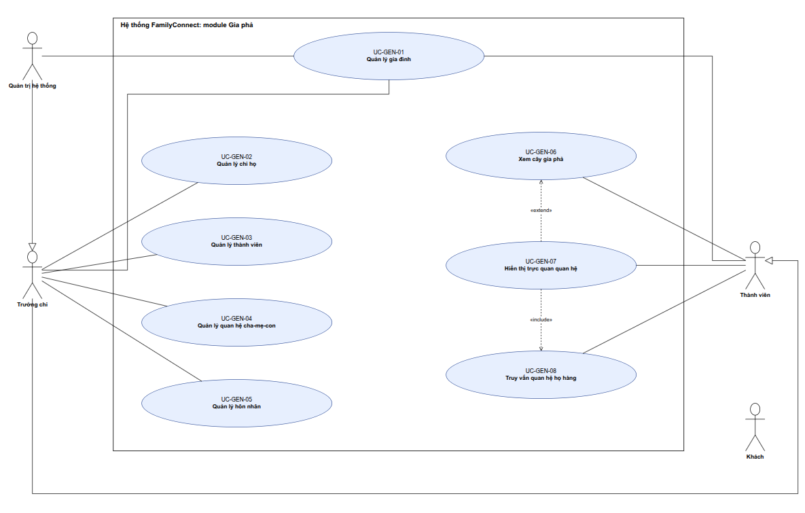

# Use case module Gia phả (Genealogy)

> **Người viết:** TV2 (Nguyễn Minh Trí) | **Reviewer:** TV5 (Lê Nhựt) | **Task Jira:** SCRUM-18 (1-05)
> **Phiên bản:** 0.4 | **Trạng thái:** Đã merge vào `develop` (Sprint 1) | **Nhánh:** `docs/SCRUM-18-genealogy`
> **Bám theo:** `docs/01-srs/srs.md` mục 3 (FR-GEN-01 đến FR-GEN-08) và Phụ lục A (phân quyền); `docs/01-srs/privacy.md`; `docs/04-api/conventions.md`; `docs/02-design/architecture.md` mục 7.
> Mục đánh dấu **[Đã chốt 9/10/2026]** là chỗ SRS chưa quy định rõ, TV2 đề xuất và leader (TV1) đã chốt; báo lại cả nhóm ở họp Sprint 2.

---

## 1. Phạm vi và danh sách use case

Module Gia phả (backend: `com.familyconnect.modules.genealogy`) quản lý gia đình, chi họ, thành viên, quan hệ cha-mẹ-con, hôn nhân; hiển thị cây gia phả tương tác (API trả về `nodes`/`edges` cho React Flow) và tra quan hệ họ hàng. Các quy tắc chính (tối đa 2 cha mẹ ruột, cha mẹ sinh trước con, chặn vòng lặp tổ tiên, người đã mất, ly hôn, tái hôn, con nuôi) ở mục 5.

| Mã UC | Tên | Actor | Mã FR | Ưu tiên | Sprint | Task Jira |
|---|---|---|---|---|---|---|
| UC-GEN-01 | Quản lý gia đình (tạo, sửa, xóa) | Tạo: người dùng đã đăng nhập chưa thuộc gia đình nào, hoặc SYSTEM_ADMIN; sửa: BRANCH_ADMIN, SYSTEM_ADMIN; xóa: SYSTEM_ADMIN | FR-GEN-01 | Must | S3 | SCRUM-37 |
| UC-GEN-02 | Quản lý chi họ | BRANCH_ADMIN, SYSTEM_ADMIN | FR-GEN-02 | Must | S3 | SCRUM-37 |
| UC-GEN-03 | Quản lý thành viên (thêm, sửa, xóa) | BRANCH_ADMIN, SYSTEM_ADMIN | FR-GEN-03 (đề tài ghi thiếu chữ, hiểu là *Member management*) | Must | S3 | SCRUM-37 |
| UC-GEN-04 | Quản lý quan hệ cha-mẹ-con | BRANCH_ADMIN, SYSTEM_ADMIN | FR-GEN-04 | Must | S4 | SCRUM-44 |
| UC-GEN-05 | Quản lý hôn nhân | BRANCH_ADMIN, SYSTEM_ADMIN | FR-GEN-05 | Must | S4 | SCRUM-44 |
| UC-GEN-06 | Xem cây gia phả (gồm mở/thu nhánh) | MEMBER (đã xác minh), BRANCH_ADMIN, SYSTEM_ADMIN | FR-GEN-06 | Must | S4-S5 | SCRUM-45, 52 |
| UC-GEN-07 | Hiển thị trực quan quan hệ giữa hai thành viên | MEMBER (đã xác minh), BRANCH_ADMIN, SYSTEM_ADMIN | FR-GEN-07 | Must | S6 | SCRUM-56 |
| UC-GEN-08 | Truy vấn quan hệ họ hàng ("A là gì của B") | MEMBER (đã xác minh), BRANCH_ADMIN, SYSTEM_ADMIN | FR-GEN-08 | Must | S5 | SCRUM-51 |

> **Khác với gợi ý trong khung sườn:** khung sườn gợi ý 9 use case (tách "Mở và thu nhánh cây" thành UC riêng, "Làm nổi bật đường quan hệ" là UC-GEN-09). Bản này gộp mở/thu nhánh vào UC-GEN-06 và đánh số lại để khớp ma trận truy vết trong SRS mục 8 (FR-GEN-08 ứng với UC-GEN-08). Nếu nhóm muốn tách lại thì chỉnh ở đây.

## 2. Tác nhân (Actor)

Hệ thống chỉ có 4 vai trò (SRS Phụ lục A): `GUEST`, `MEMBER`, `BRANCH_ADMIN`, `SYSTEM_ADMIN`. "Thành viên chưa xác minh" là một **trạng thái** của `MEMBER` (chờ trưởng chi duyệt), không phải vai trò riêng.

| Actor | Vai trò hệ thống | Quyền trong module Gia phả (theo Phụ lục A SRS) |
|---|---|---|
| Thành viên đã xác minh | `MEMBER` | Xem cây, danh sách thành viên, tra quan hệ (trong gia đình của mình). Không sửa dữ liệu. |
| Trưởng chi / quản lý gia phả | `BRANCH_ADMIN` | Thêm, sửa, xóa thành viên, quan hệ, hôn nhân, chi họ trong gia đình/chi của mình; duyệt thành viên mới (thuộc module auth). |
| Quản trị hệ thống | `SYSTEM_ADMIN` | Toàn quyền. |
| Thành viên chưa xác minh | `MEMBER` (chưa xác minh) | Chỉ xem, sửa hồ sơ của mình. Được tạo gia đình mới nếu chưa thuộc gia đình nào (UC-GEN-01). Gọi API dữ liệu gia đình nhận 403 `PERM_002`. |
| Khách | `GUEST` | Không xem được dữ liệu gia phả. |

## 3. Use Case Diagram



*Trưởng chi kế thừa quyền của Thành viên; Quản trị hệ thống kế thừa quyền của Trưởng chi. UC-GEN-07 là `«extend»` của UC-GEN-06 và `«include»` UC-GEN-08 (UC-GEN-07 gọi UC-GEN-08 để lấy đường đi). Thành viên nối tới UC-GEN-01 vì người dùng chưa thuộc gia đình nào được tạo gia đình mới. File ảnh (xuất từ draw.io, kèm dữ liệu sơ đồ): `docs/images/genealogy-usecase.drawio.png`.*

---

## 4. Đặc tả use case

> Dùng đúng mẫu `docs/01-srs/use-cases/_template.md`. Mã lỗi `GEN_xxx` xem bảng ở mục 7.2; mã chung (`VALID_001`, `PERM_001`, `PERM_002`, `NOT_FOUND_001`) theo `docs/04-api/conventions.md`.

### UC-GEN-01: Quản lý gia đình
| Mục | Nội dung |
|---|---|
| Mã FR liên quan | FR-GEN-01 |
| Actor | Tạo mới: người dùng đã đăng nhập chưa thuộc gia đình nào (kể cả `MEMBER` chưa xác minh), hoặc `SYSTEM_ADMIN` (theo `srs.md` Phụ lục A). Sửa: BRANCH_ADMIN của gia đình, SYSTEM_ADMIN. Xóa: SYSTEM_ADMIN. |
| Mô tả ngắn | Tạo, sửa, xóa mềm gia đình (dòng họ). Người dùng thường tạo gia đình thì trở thành "chủ gia đình" (BRANCH_ADMIN quản lý cả gia đình, ghi ở `member_verification`); `family.created_by` chỉ ghi nhận ai tạo bản ghi. |
| Tiền điều kiện | Đã đăng nhập. Tạo mới: chưa thuộc gia đình nào (BR-GEN-15); `SYSTEM_ADMIN` không bị ràng buộc này. Sửa, xóa: có quyền tương ứng trên gia đình đó. |
| Luồng chính (tạo gia đình) | 1. Người dùng chọn "Tạo gia đình".<br>2. Nhập tên gia đình (bắt buộc, tối đa 150 ký tự), mô tả (tùy chọn).<br>3. Hệ thống kiểm tra hợp lệ, tạo bản ghi `family` với `created_by` là người tạo.<br>4. Hệ thống gán người tạo làm `BRANCH_ADMIN` của gia đình này và đặt trạng thái đã xác minh (qua `member_verification` của module auth) **[Đã chốt 9/10/2026]**.<br>5. Hệ thống ghi audit log (cơ chế chung của SCRUM-57) và trả về gia đình vừa tạo. |
| Luồng thay thế / ngoại lệ | 2a. Tên trống hoặc quá 150 ký tự: lỗi `VALID_001`, giữ nguyên form.<br>2b. Trùng tên với gia đình khác do cùng người tạo: cảnh báo, cho phép tiếp tục.<br>2c. Người dùng đã thuộc một gia đình (và không phải `SYSTEM_ADMIN`): lỗi `GEN_013`.<br>2d. Người tạo là `SYSTEM_ADMIN`: bỏ qua bước 4, quản trị không trở thành thành viên hay `BRANCH_ADMIN` của gia đình; trưởng chi được gán sau qua chức năng quản lý người dùng (FR-ADM-01) **[Đã chốt 9/10/2026]**.<br>Sửa: người có quyền đổi tên, mô tả.<br>Xóa: chỉ `SYSTEM_ADMIN`, xóa mềm; còn thành viên thì lỗi `GEN_001`. |
| Hậu điều kiện | Gia đình tồn tại; người tạo là BRANCH_ADMIN (trừ khi người tạo là SYSTEM_ADMIN); thay đổi được ghi audit log. |
| Quy tắc nghiệp vụ | BR-GEN-09, BR-GEN-11, BR-GEN-14, BR-GEN-15 |

### UC-GEN-02: Quản lý chi họ
| Mục | Nội dung |
|---|---|
| Mã FR liên quan | FR-GEN-02 |
| Actor | BRANCH_ADMIN (trong gia đình của mình), SYSTEM_ADMIN |
| Mô tả ngắn | Tạo, sửa, xóa chi họ và xếp chi vào cây chi. |
| Tiền điều kiện | Gia đình đã tồn tại; người dùng có quyền trong gia đình. |
| Luồng chính (tạo chi) | 1. Chọn "Thêm chi họ" trong gia đình.<br>2. Nhập tên chi, (tùy chọn) chi cha, người tổ của chi, mô tả.<br>3. Hệ thống kiểm tra, tạo `branch`.<br>4. Ghi audit log, hiển thị chi mới. |
| Luồng thay thế / ngoại lệ | 2a. Chọn chi cha làm tạo vòng (chi A là cha của B, B là cha của A): từ chối, lỗi `GEN_003`.<br>2b. Người tổ hoặc chi cha không thuộc gia đình này: lỗi `VALID_001`.<br>Xóa chi: chỉ khi không còn thành viên và không còn chi con (lỗi `GEN_002`). |
| Hậu điều kiện | Chi họ nằm đúng vị trí trong cây chi. |
| Quy tắc nghiệp vụ | BR-GEN-01, BR-GEN-09, BR-GEN-12, BR-GEN-14 |

### UC-GEN-03: Quản lý thành viên
| Mục | Nội dung |
|---|---|
| Mã FR liên quan | FR-GEN-03 |
| Actor | BRANCH_ADMIN, SYSTEM_ADMIN. (MEMBER chỉ xem.) |
| Mô tả ngắn | Thêm, sửa, xóa mềm hồ sơ thành viên (`person`). |
| Tiền điều kiện | Gia đình đã tồn tại; người dùng có quyền. |
| Luồng chính (thêm thành viên) | 1. Chọn "Thêm thành viên".<br>2. Nhập họ tên, giới tính (bắt buộc); ngày sinh đầy đủ (bắt buộc với người còn sống), nơi sinh, tỉnh/thành và địa chỉ hiện tại, chi họ, ghi chú (tùy chọn); đánh dấu đã mất kèm ngày mất, nơi an táng nếu có.<br>3. Hệ thống kiểm tra hợp lệ (BR-GEN-04, 08, 16, 17).<br>4. Hệ thống tạo `person` thuộc gia đình hiện tại.<br>5. Ghi audit log, trả về hồ sơ; module `ai` được báo để cập nhật embedding (mục 9). |
| Luồng thay thế / ngoại lệ | 3a. Ngày mất trước ngày sinh: lỗi `VALID_001`.<br>3b. Người còn sống thiếu ngày sinh: lỗi `VALID_001`.<br>3c. Chi họ không thuộc gia đình: lỗi `VALID_001`.<br>3d. Họ tên và ngày sinh trùng người đã có: cảnh báo, cho phép xác nhận tiếp tục.<br>3e. Gán tài khoản cho người dưới 16 tuổi: lỗi `GEN_012`.<br>**Sửa:** cập nhật các trường cho phép. Nếu chuyển sang "đã mất", hôn nhân `MARRIED` của người đó tự chuyển `WIDOWED` (BR-GEN-08).<br>**Xóa:** xóa mềm. Nếu còn quan hệ cha-mẹ-con hoặc hôn nhân, từ chối và yêu cầu gỡ quan hệ trước (lỗi `GEN_004`). |
| Hậu điều kiện | Hồ sơ được tạo, cập nhật hoặc ẩn; có audit log. |
| Quy tắc nghiệp vụ | BR-GEN-01, 04, 08, 09, 10, 11, 14, 16, 17, 18 |

### UC-GEN-04: Quản lý quan hệ cha-mẹ-con
| Mục | Nội dung |
|---|---|
| Mã FR liên quan | FR-GEN-04 |
| Actor | BRANCH_ADMIN, SYSTEM_ADMIN |
| Mô tả ngắn | Gắn hoặc gỡ quan hệ cha/mẹ và con (ruột, nuôi, kế). |
| Tiền điều kiện | Cả cha/mẹ và con đã là thành viên của cùng một gia đình. |
| Luồng chính (thêm quan hệ) | 1. Chọn thành viên làm "con", chọn "Thêm cha/mẹ".<br>2. Chọn người cha hoặc mẹ, chọn vai trò (`FATHER`/`MOTHER`) và loại (`BIOLOGICAL` ruột / `ADOPTED` nuôi / `STEP` kế).<br>3. Hệ thống kiểm tra: cùng gia đình, chưa vượt số cha/mẹ ruột, không vòng lặp, ngày sinh hợp lý (BR-GEN-02 đến 05).<br>4. Tạo bản ghi `parent_child`.<br>5. Ghi audit log, làm mới cây. |
| Luồng thay thế / ngoại lệ | 3a. Con đã có đủ cha và mẹ ruột (cùng vai trò): lỗi `GEN_005`.<br>3b. Thêm quan hệ làm người này thành tổ tiên của chính mình: lỗi `GEN_006`.<br>3c. Cha/mẹ sinh sau hoặc cùng ngày với con: lỗi `GEN_007`. Chênh lệch dưới 15 năm: giao diện cảnh báo và yêu cầu người nhập xác nhận trước khi gửi; backend không chặn **[Đã chốt 9/10/2026]**.<br>3d. Cha và con trùng người, hoặc quan hệ đã tồn tại: lỗi `GEN_008`.<br>Gỡ quan hệ: cho phép, ghi audit log; cây tự cập nhật. |
| Hậu điều kiện | Đồ thị gia đình có thêm hoặc bớt một cạnh cha-con, vẫn là đồ thị không chu trình. |
| Quy tắc nghiệp vụ | BR-GEN-02, 03, 04, 05, 06, 11, 14 |

### UC-GEN-05: Quản lý hôn nhân
| Mục | Nội dung |
|---|---|
| Mã FR liên quan | FR-GEN-05 |
| Actor | BRANCH_ADMIN, SYSTEM_ADMIN |
| Mô tả ngắn | Thêm hôn nhân, đổi trạng thái (ly hôn, góa), xóa khi nhập nhầm. |
| Tiền điều kiện | Hai người đã là thành viên của cùng gia đình. |
| Luồng chính (thêm hôn nhân) | 1. Chọn thành viên, chọn "Thêm hôn nhân".<br>2. Chọn người còn lại, nhập ngày kết hôn; trạng thái ban đầu `MARRIED`.<br>3. Hệ thống kiểm tra BR-GEN-07 và BR-GEN-08.<br>4. Tạo bản ghi `marriage`.<br>5. Ghi audit log, làm mới cây. |
| Luồng thay thế / ngoại lệ | 3a. Một trong hai người đang có hôn nhân `MARRIED` khác: lỗi `GEN_009` (cho phép tái hôn khi hôn nhân trước là `DIVORCED` hoặc `WIDOWED`).<br>3b. Hai người có quan hệ trực hệ hoặc anh chị em ruột: lỗi `GEN_010`.<br>3c. Một trong hai đã mất: lỗi `GEN_011`.<br>**Ly hôn:** đổi trạng thái `DIVORCED`, nhập `end_date`. **Góa:** hệ thống tự đặt `WIDOWED` khi một bên được đánh dấu đã mất.<br>Xóa hôn nhân (nhập nhầm): cho phép, ghi audit log. |
| Hậu điều kiện | Lịch sử hôn nhân được giữ nguyên; con cái vẫn liên kết với cả hai cha mẹ. |
| Quy tắc nghiệp vụ | BR-GEN-07, 08, 11, 14 |

### UC-GEN-06: Xem cây gia phả
| Mục | Nội dung |
|---|---|
| Mã FR liên quan | FR-GEN-06 |
| Actor | MEMBER (đã xác minh), BRANCH_ADMIN, SYSTEM_ADMIN |
| Mô tả ngắn | Xem cây gia phả tương tác: zoom, kéo, mở và thu nhánh, xem hồ sơ tóm tắt. |
| Tiền điều kiện | Đã đăng nhập; là thành viên đã xác minh của gia đình. |
| Luồng chính | 1. Người dùng mở "Cây gia phả".<br>2. Hệ thống tải cây quanh một người gốc (mặc định là hồ sơ gắn với tài khoản, hoặc người tổ), độ sâu mặc định 3 đời.<br>3. Giao diện vẽ nút (thành viên) và cạnh (cha-con, hôn nhân) bằng React Flow.<br>4. Người dùng zoom, kéo, bấm nút để xem hồ sơ tóm tắt, mở hoặc thu nhánh. Khi mở thêm nhánh, hệ thống tải tiếp theo yêu cầu (lazy-load).<br>5. Người dùng có quyền sửa có thể bấm "Thêm cha/mẹ", "Thêm con", "Thêm vợ/chồng" ngay trên nút (chuyển sang UC-GEN-03, 04, 05). |
| Luồng thay thế / ngoại lệ | 1a. Người dùng chưa xác minh: từ chối, lỗi `PERM_002`, giao diện báo "Cần được trưởng chi duyệt".<br>2a. Gia đình chưa có thành viên: hiển thị trạng thái trống và nút "Thêm thành viên đầu tiên".<br>4a. Tải nhánh quá chậm hoặc lỗi mạng: hiển thị thông báo, cho phép thử lại, giữ nguyên phần cây đã vẽ. |
| Hậu điều kiện | Không thay đổi dữ liệu. |
| Quy tắc nghiệp vụ | BR-GEN-10 (ẩn thông tin theo vai trò, trẻ em, người đã mất), BR-GEN-14 |

### UC-GEN-07: Hiển thị trực quan quan hệ giữa hai thành viên
| Mục | Nội dung |
|---|---|
| Mã FR liên quan | FR-GEN-07 |
| Actor | MEMBER (đã xác minh), BRANCH_ADMIN, SYSTEM_ADMIN |
| Mô tả ngắn | Chọn hai thành viên và tô sáng đường quan hệ giữa họ trên cây. |
| Tiền điều kiện | Đang xem cây gia phả (UC-GEN-06). |
| Luồng chính | 1. Người dùng chọn hai thành viên A và B trên cây.<br>2. Hệ thống gọi UC-GEN-08 (`«include»`) để lấy đường đi từ A đến B và tên quan hệ.<br>3. Giao diện tô sáng chuỗi nút và cạnh trên đường đi, làm mờ phần còn lại.<br>4. Hiển thị chú thích: "A là *chú* của B", cùng đường đi qua tổ tiên chung. |
| Luồng thay thế / ngoại lệ | 2a. Không tìm thấy quan hệ huyết thống: hiển thị "Không có quan hệ huyết thống trong dữ liệu hiện có"; có thể hiển thị đường qua hôn nhân nếu có.<br>Người dùng bấm "Bỏ chọn": cây trở lại bình thường. |
| Hậu điều kiện | Không thay đổi dữ liệu. |
| Quy tắc nghiệp vụ | BR-GEN-10 (tên người trên đường đi hiển thị theo vai trò, trẻ em dưới 16 tuổi chỉ hiện tên, quan hệ, năm sinh), BR-GEN-14. Quan hệ với UC-GEN-06: `«extend»`. |

### UC-GEN-08: Truy vấn quan hệ họ hàng
| Mục | Nội dung |
|---|---|
| Mã FR liên quan | FR-GEN-08 |
| Actor | MEMBER (đã xác minh), BRANCH_ADMIN, SYSTEM_ADMIN |
| Mô tả ngắn | Hỏi "A là gì của B" và nhận tên quan hệ tiếng Việt kèm đường đi. |
| Tiền điều kiện | Hai người A và B cùng thuộc một gia đình mà người dùng được xem. |
| Luồng chính | 1. Người dùng chọn A và B, hỏi "A là gì của B?".<br>2. Hệ thống tìm tổ tiên chung gần nhất (LCA) qua bảng `parent_child`, đếm số bước từ A và từ B lên tổ tiên chung.<br>3. Hệ thống tra bảng ánh xạ (bước A, bước B, bên nội/ngoại, hơn/kém tuổi) để ra tên gọi tiếng Việt.<br>4. Trả về tên quan hệ, đường đi (danh sách người), tổ tiên chung. |
| Luồng thay thế / ngoại lệ | 2a. A và B là cùng một người: trả "Cùng một người".<br>2b. Không có tổ tiên chung: trả 200 với `supported: false`, `relation: null` (hoặc xét quan hệ qua hôn nhân: "vợ/chồng", "con dâu", "con rể" nếu có).<br>3a. Quan hệ họ hàng xa chưa có trong bảng ánh xạ: trả "Chưa hỗ trợ", kèm số bước (SRS mục 7.2).<br>3b. Thiếu ngày sinh nên không xác định hơn/kém tuổi: dùng cách gọi chung (anh/chị/em thành "anh chị em").<br>2c. Không tìm thấy A hoặc B: lỗi `NOT_FOUND_001`. |
| Hậu điều kiện | Không thay đổi dữ liệu. Thuật toán chi tiết: `docs/02-design/algorithm-relationship.md` (SCRUM-19). |
| Quy tắc nghiệp vụ | BR-GEN-10, BR-GEN-13 (con nuôi, con kế), BR-GEN-14 |

---

## 5. Quy tắc nghiệp vụ

| Mã | Quy tắc |
|---|---|
| BR-GEN-01 | Mỗi thành viên thuộc đúng một gia đình. Một thành viên thuộc tối đa một chi họ. Mọi quan hệ chỉ được tạo giữa các thành viên cùng gia đình. |
| BR-GEN-02 | Một người có tối đa **1 cha ruột và 1 mẹ ruột** (loại `BIOLOGICAL`), tức tối đa 2 cha/mẹ sinh học. Cha mẹ nuôi (`ADOPTED`) và kế (`STEP`) được ghi riêng, không tính vào giới hạn này. |
| BR-GEN-03 | **Không cho phép vòng lặp tổ tiên**: không thể thêm quan hệ làm một người trở thành tổ tiên của chính mình. Hệ thống kiểm tra bằng truy vấn đệ quy trước khi lưu. |
| BR-GEN-04 | Ngày sinh cha/mẹ phải **trước** ngày sinh con. Chênh lệch dưới 15 năm thì giao diện cảnh báo và yêu cầu người nhập xác nhận trước khi gửi; backend chỉ từ chối khi cha/mẹ sinh sau hoặc cùng ngày với con (`GEN_007`), vì gia phả đời xưa có trường hợp cha mẹ rất trẻ **[Đã chốt 9/10/2026]**. |
| BR-GEN-05 | Không tạo quan hệ cha-mẹ-con giữa một người và chính mình, hoặc trùng quan hệ đã tồn tại. |
| BR-GEN-06 | Vai trò `FATHER`/`MOTHER` mặc định theo giới tính của người được chọn; người nhập có thể đổi khi cần. |
| BR-GEN-07 | Một người chỉ có **một hôn nhân `MARRIED` tại một thời điểm**. Tái hôn chỉ được khi hôn nhân trước là `DIVORCED` hoặc `WIDOWED`. Không cho kết hôn giữa người có quan hệ trực hệ hoặc anh chị em ruột. |
| BR-GEN-08 | **Người đã mất:** có `is_deceased` và `death_date` (không trước ngày sinh). Không thêm hôn nhân mới cho người đã mất. Khi một bên được đánh dấu mất, hôn nhân `MARRIED` của họ tự chuyển `WIDOWED`, `end_date` = ngày mất. Hồ sơ vẫn hiển thị và vẫn giữ quan hệ cha-con. Không lưu nguyên nhân tử vong chi tiết. |
| BR-GEN-09 | **Xóa mềm** (đặt `deleted_at`), không xóa vật lý. Không xóa thành viên đang có quan hệ cha-mẹ-con hoặc hôn nhân khi chưa gỡ. Không xóa gia đình còn thành viên, không xóa chi còn thành viên hoặc chi con. |
| BR-GEN-10 | **Riêng tư** (theo `privacy.md`, mục "Ai được xem gì" và "Trẻ em và người đã mất"). `MEMBER` đã xác minh: thấy họ tên, năm sinh, quan hệ, nghề nghiệp; **không** thấy ngày sinh đầy đủ (trừ của mình); địa chỉ chi tiết chỉ thấy tỉnh/thành. **Trẻ em dưới 16 tuổi** (tính từ ngày sinh): `MEMBER` chỉ thấy tên, quan hệ, năm sinh; `BRANCH_ADMIN`, `SYSTEM_ADMIN` thấy đủ. **Người đã mất:** hiển thị họ tên, năm sinh, ngày mất, nơi an táng cho thành viên đã xác minh. Số điện thoại, email thuộc hồ sơ người dùng (module `user`), không nằm trong `person`. Quy tắc áp dụng cho mọi response: chi tiết, danh sách, cây, tra quan hệ. **[Đã chốt 9/10/2026: ngưỡng 16 tuổi, theo `privacy.md` mục 4 "Trẻ em và người đã mất"]** |
| BR-GEN-11 | Mọi thao tác tạo, sửa, xóa gia đình, chi, thành viên, quan hệ, hôn nhân đều ghi **audit log** (người thực hiện, hành động, đối tượng, thời điểm) theo NFR-11, qua cơ chế ghi log chung của SCRUM-57; module Gia phả không tự cài một cơ chế riêng. |
| BR-GEN-12 | Cây chi họ không có vòng lặp: chi không thể là tổ tiên (chi cha) của chính nó. |
| BR-GEN-13 | Con nuôi (`ADOPTED`) và con kế (`STEP`) vẫn được tính trong cây; thuật toán quan hệ họ hàng mặc định tính cả hai loại và hiển thị nhãn "nuôi" hoặc "kế" khi cần **[Đã chốt 9/10/2026]**. |
| BR-GEN-14 | **Tách dữ liệu theo gia đình, chống IDOR** (`privacy.md`, mục "Xác minh thành viên và tách dữ liệu gia đình"): mọi API lọc theo `family_id` của người đang đăng nhập (lấy từ `member_verification` của module auth, SCRUM-26); người chưa xác minh nhận 403 `PERM_002`; truy cập gia đình khác nhận 403 `PERM_001`. Mỗi API có một test: gia đình A gọi dữ liệu gia đình B phải bị từ chối. **Phạm vi quyền sửa:** `BRANCH_ADMIN` được gán trong `member_verification` (module auth, SCRUM-26) kèm `branch_id`. `branch_id` có giá trị: quản lý chi đó và các chi con (đi theo `branch.parent_branch_id`). `branch_id` NULL: quản lý cả gia đình (người dùng thường tạo gia đình mặc định thuộc dạng này; nếu `SYSTEM_ADMIN` tạo hộ thì trưởng chi do quản trị gán sau, không suy ra quyền từ `family.created_by`). Thành viên chưa gán chi chỉ người quản lý cả gia đình mới sửa được. Quan hệ hoặc hôn nhân giữa hai người khác chi cần có quyền ở một trong hai bên. Module Gia phả chỉ lưu UUID, không nối khóa ngoại sang bảng của module auth. |
| BR-GEN-15 | Mỗi người dùng thuộc tối đa **một gia đình** (khớp việc lọc theo `family_id` của người đăng nhập). Chỉ người chưa thuộc gia đình nào mới tạo gia đình mới; ngoại lệ là `SYSTEM_ADMIN`, được tạo gia đình thay người dùng mà không trở thành thành viên của gia đình đó (`srs.md` Phụ lục A) **[Đã chốt 9/10/2026]**. |
| BR-GEN-16 | **Trẻ em dưới 16 tuổi không có tài khoản đăng nhập riêng**: `person.user_id` phải là NULL; hồ sơ do cha mẹ hoặc trưởng chi quản lý. Kiểm tra ở tầng service (tuổi thay đổi theo thời gian nên DB không biểu diễn gọn). |
| BR-GEN-17 | Người **còn sống** phải có ngày sinh đầy đủ (`birth_date`) để hệ thống tính tuổi áp dụng BR-GEN-10. Người đã mất (tổ tiên) có thể chỉ biết năm sinh: lưu vào `birth_year`. |
| BR-GEN-18 | **Dữ liệu cho AI** (`privacy.md`, mục "Dữ liệu gửi cho AI"): người dưới 16 tuổi chỉ đưa họ tên và quan hệ vào ngữ cảnh; không gửi ngày sinh đầy đủ, địa chỉ chi tiết. Khi thành viên hoặc quan hệ thay đổi, module `ai` cập nhật embedding qua interface Java (mục 9). |

---

## 6. Thiết kế cơ sở dữ liệu

Dùng PostgreSQL, thay đổi schema qua Flyway migration (NFR-07). Khóa chính kiểu **UUID** (khớp mẫu `docs/03-database/data-dictionary.md`, nhóm đã chốt). Theo quy ước chung (`architecture.md` mục 7, quyết định 4): tên bảng `snake_case` số ít; **mọi bảng có `id`, `created_at`, `updated_at`, `deleted_at`** (xóa mềm); bảng nghiệp vụ thêm **`created_by`, `updated_by`**; không dùng `created_date`. Các bảng không có tiền tố `ai_`; module khác không join trực tiếp các bảng này (mục 9). Thời điểm (`created_at`, `updated_at`, `deleted_at`) dùng `TIMESTAMPTZ` (lưu theo UTC), khớp định dạng ISO-8601 có múi giờ ở `conventions.md` mục 5; ngày thuần (ngày sinh, ngày mất, ngày cưới) dùng `DATE`.

> **Quy ước:** khóa chính mọi bảng là `UUID` (`DEFAULT gen_random_uuid()`); bảng người dùng tên `users` (ngoại lệ duy nhất của quy ước tên số ít, vì `user` là từ khóa PostgreSQL). Cả hai đã được nhóm chốt.
>
> **Khóa ngoại chỉ trong cùng module** (`architecture.md` mục 7, quyết định 9): giữa các bảng của module Gia phả (`family`, `branch`, `person`, `parent_child`, `marriage`) dùng FK như bình thường. Cột tham chiếu sang bảng của module khác (`created_by`, `updated_by`, `user_id` sang `users` của module auth; `avatar_media_id` sang `media` của module community) chỉ lưu UUID có index, không tạo FK; service kiểm tra tồn tại, quyền và `family_id` qua interface Java của module đó.

| Bảng | Mục đích | Task tạo migration |
|---|---|---|
| family | Gia đình / dòng họ | SCRUM-37 |
| branch | Chi họ | SCRUM-37 |
| person | Thành viên (người) | SCRUM-37 |
| parent_child | Quan hệ cha/mẹ - con (ruột/nuôi/kế) | SCRUM-44 |
| marriage | Hôn nhân (ngày cưới, ly hôn) | SCRUM-44 |

### 6.1 Bảng `family`
| Cột | Kiểu | Ràng buộc | Ghi chú |
|---|---|---|---|
| id | UUID | PK | |
| name | VARCHAR(150) | NOT NULL | Tên gia đình |
| description | TEXT | | |
| created_by | UUID | NOT NULL; tham chiếu `users(id)` của module auth, kiểm tra ở service (không FK) | Người tạo bản ghi. Quyền "chủ gia đình" lấy từ `member_verification`, không suy ra từ cột này (người tạo có thể là `SYSTEM_ADMIN`) |
| updated_by | UUID | NULL; tham chiếu `users(id)` của module auth, kiểm tra ở service (không FK) | |
| created_at | TIMESTAMPTZ | NOT NULL, default now() | |
| updated_at | TIMESTAMPTZ | NOT NULL, default now() | |
| deleted_at | TIMESTAMPTZ | NULL | Xóa mềm |

Index: `(created_by)`.

### 6.2 Bảng `branch`
| Cột | Kiểu | Ràng buộc | Ghi chú |
|---|---|---|---|
| id | UUID | PK | |
| family_id | UUID | FK `family(id)`, NOT NULL | |
| name | VARCHAR(150) | NOT NULL | Tên chi |
| parent_branch_id | UUID | FK `branch(id)`, NULL | Chi cha |
| origin_person_id | UUID | FK `person(id)`, NULL | Người tổ của chi |
| description | TEXT | | |
| created_by | UUID | NOT NULL; tham chiếu `users(id)` của module auth, kiểm tra ở service (không FK) | |
| updated_by | UUID | NULL; tham chiếu `users(id)` của module auth, kiểm tra ở service (không FK) | |
| created_at | TIMESTAMPTZ | NOT NULL, default now() | |
| updated_at | TIMESTAMPTZ | NOT NULL, default now() | |
| deleted_at | TIMESTAMPTZ | NULL | Xóa mềm |

Index: `(family_id)`, `(parent_branch_id)`, `(origin_person_id)`, `(created_by)`.

### 6.3 Bảng `person`
| Cột | Kiểu | Ràng buộc | Ghi chú |
|---|---|---|---|
| id | UUID | PK | |
| family_id | UUID | FK `family(id)`, NOT NULL | Dùng lọc theo gia đình và cho module `ai` |
| branch_id | UUID | FK `branch(id)`, NULL | |
| full_name | VARCHAR(150) | NOT NULL | |
| gender | VARCHAR(10) | NOT NULL, CHECK IN ('MALE','FEMALE','OTHER') | |
| birth_date | DATE | NULL, xem CHECK bên dưới | Ngày sinh **đầy đủ**, dùng tính tuổi (BR-GEN-10, 16, 17) |
| birth_year | SMALLINT | NULL | Chỉ dùng khi người đã mất chỉ biết năm sinh; tự lấy từ `birth_date` nếu có |
| birthplace | VARCHAR(255) | | Nơi sinh |
| current_province | VARCHAR(100) | | Tỉnh/thành đang ở; `MEMBER` được xem; dùng tìm danh bạ (FR-DIR-04) |
| current_address | VARCHAR(255) | | Địa chỉ chi tiết; ẩn với `MEMBER` (BR-GEN-10) |
| is_deceased | BOOLEAN | NOT NULL, default false | |
| death_date | DATE | NULL, CHECK (death_date >= birth_date) | |
| burial_place | VARCHAR(255) | | Nơi an táng; chỉ có ý nghĩa khi đã mất |
| avatar_media_id | UUID | NULL; tham chiếu `media(id)` của module community, kiểm tra ở service (không FK) | Ảnh đại diện. Tệp lưu ở bảng `media` của module `community` (`owner_type = 'PERSON'`), chỉ phục vụ qua endpoint có kiểm tra quyền (`conventions.md` mục 7.3), không lưu đường dẫn công khai |
| user_id | UUID | NULL; tham chiếu `users(id)` của module auth, kiểm tra ở service (không FK) | Nối với tài khoản; phải NULL nếu dưới 16 tuổi (BR-GEN-16) |
| note | TEXT | | Không ghi nguyên nhân tử vong chi tiết |
| created_by | UUID | NOT NULL; tham chiếu `users(id)` của module auth, kiểm tra ở service (không FK) | |
| updated_by | UUID | NULL; tham chiếu `users(id)` của module auth, kiểm tra ở service (không FK) | |
| created_at | TIMESTAMPTZ | NOT NULL | |
| updated_at | TIMESTAMPTZ | NOT NULL | |
| deleted_at | TIMESTAMPTZ | NULL | Xóa mềm |

Ràng buộc: `CHECK (is_deceased OR birth_date IS NOT NULL)` (người còn sống bắt buộc có ngày sinh); `UNIQUE (user_id) WHERE user_id IS NOT NULL AND deleted_at IS NULL`.
Index: `(family_id)`, `(branch_id)`, `(full_name)` (hỗ trợ tìm kiếm), `(family_id, birth_date)`, `(family_id, current_province)`, `(avatar_media_id)`, `(created_by)`; `user_id` đã có chỉ mục duy nhất từng phần ở trên.

### 6.4 Bảng `parent_child`
| Cột | Kiểu | Ràng buộc | Ghi chú |
|---|---|---|---|
| id | UUID | PK | |
| parent_id | UUID | FK `person(id)`, NOT NULL | |
| child_id | UUID | FK `person(id)`, NOT NULL | |
| parent_role | VARCHAR(10) | NOT NULL, CHECK IN ('FATHER','MOTHER') | |
| kind | VARCHAR(12) | NOT NULL, default 'BIOLOGICAL', CHECK IN ('BIOLOGICAL','ADOPTED','STEP') | |
| created_by | UUID | NOT NULL; tham chiếu `users(id)` của module auth, kiểm tra ở service (không FK) | |
| updated_by | UUID | NULL; tham chiếu `users(id)` của module auth, kiểm tra ở service (không FK) | |
| created_at | TIMESTAMPTZ | NOT NULL | |
| updated_at | TIMESTAMPTZ | NOT NULL | |
| deleted_at | TIMESTAMPTZ | NULL | Xóa mềm |

Ràng buộc: `CHECK (parent_id <> child_id)`; `UNIQUE (parent_id, child_id) WHERE deleted_at IS NULL`; **chỉ mục duy nhất từng phần** `UNIQUE (child_id, parent_role) WHERE kind = 'BIOLOGICAL' AND deleted_at IS NULL` (đảm bảo tối đa 1 cha ruột và 1 mẹ ruột). Index: `(parent_id)`, `(child_id)`, `(created_by)`.

### 6.5 Bảng `marriage`
| Cột | Kiểu | Ràng buộc | Ghi chú |
|---|---|---|---|
| id | UUID | PK | |
| person1_id | UUID | FK `person(id)`, NOT NULL | |
| person2_id | UUID | FK `person(id)`, NOT NULL | |
| status | VARCHAR(10) | NOT NULL, CHECK IN ('MARRIED','DIVORCED','WIDOWED') | |
| start_date | DATE | NULL | |
| end_date | DATE | NULL | Ngày ly hôn hoặc góa |
| created_by | UUID | NOT NULL; tham chiếu `users(id)` của module auth, kiểm tra ở service (không FK) | |
| updated_by | UUID | NULL; tham chiếu `users(id)` của module auth, kiểm tra ở service (không FK) | |
| created_at | TIMESTAMPTZ | NOT NULL | |
| updated_at | TIMESTAMPTZ | NOT NULL | |
| deleted_at | TIMESTAMPTZ | NULL | Xóa mềm |

Ràng buộc: `CHECK (person1_id <> person2_id)`. Các quy tắc "một hôn nhân `MARRIED` tại một thời điểm", "không cho kết hôn người thân" và "hai người cùng gia đình" kiểm tra ở tầng service (DB không biểu diễn gọn). Index: `(person1_id)`, `(person2_id)`, `(created_by)`.

### 6.6 Vì sao dùng bảng quan hệ `parent_child` thay vì cột `parent_id` trong `person`
1. **Một người có hai cha mẹ.** Một cột `parent_id` chỉ lưu được một người. Dùng hai cột `father_id`, `mother_id` thì không biểu diễn được cha mẹ nuôi hoặc cha mẹ kế.
2. **Phân loại quan hệ.** Bảng quan hệ cho thêm cột `kind` (ruột, nuôi, kế) và `parent_role` mà không đổi bảng `person`.
3. **Truy vấn tổ tiên và hậu duệ.** Bảng cạnh là dạng danh sách kề của đồ thị, nên recursive CTE đi lên (tìm tổ tiên chung, thuật toán LCA) và đi xuống (lấy cây) đơn giản, dùng index trên `parent_id` và `child_id`.
4. **Dễ mở rộng và dễ kiểm tra ràng buộc.** Chỉ mục duy nhất từng phần chặn quá 1 cha và 1 mẹ ruột ngay ở DB; kiểm tra vòng lặp gom vào một chỗ.
5. **Hôn nhân tách riêng** (`marriage`) vì một người có thể tái hôn nhiều lần và cần lưu lịch sử, không thể nhét vào một cột trong `person`.

### 6.7 Truy vấn đệ quy mẫu (kiểm tra vòng lặp tổ tiên)
```sql
-- Kiểm tra: nếu thêm :new_parent làm cha/mẹ của :child thì :child có thể là tổ tiên của :new_parent không?
WITH RECURSIVE ancestors AS (
  SELECT parent_id FROM parent_child
   WHERE child_id = :new_parent AND deleted_at IS NULL
  UNION
  SELECT pc.parent_id FROM parent_child pc
    JOIN ancestors a ON pc.child_id = a.parent_id
   WHERE pc.deleted_at IS NULL
)
SELECT EXISTS (SELECT 1 FROM ancestors WHERE parent_id = :child);  -- true => từ chối (GEN_006)
```

### 6.8 Thế hệ (generation)

Bảng `person` **không có cột thế hệ**: thế hệ thay đổi mỗi khi thêm hoặc gỡ quan hệ cha-mẹ-con nên được **tính từ `parent_child`**, không lưu. Quy ước: đời 1 là người không có cha mẹ trong gia đình (tổ tiên gốc); người có cha mẹ thì đời của họ bằng đời lớn nhất của cha hoặc mẹ cộng 1.

```sql
WITH RECURSIVE gen(person_id, g) AS (
  SELECT p.id, 1 FROM person p
   WHERE p.family_id = :familyId AND p.deleted_at IS NULL
     AND NOT EXISTS (SELECT 1 FROM parent_child pc WHERE pc.child_id = p.id AND pc.deleted_at IS NULL)
  UNION ALL
  SELECT pc.child_id, gen.g + 1 FROM parent_child pc JOIN gen ON pc.parent_id = gen.person_id
   WHERE pc.deleted_at IS NULL
)
SELECT person_id, MAX(g) AS generation FROM gen GROUP BY person_id;
```

Người vào gia đình bằng hôn nhân (không có cha mẹ trong gia đình nhưng có vợ/chồng ở bảng `marriage`) lấy **đời của vợ/chồng**; bước này làm ở tầng service sau truy vấn trên. Module `genealogy` cung cấp thế hệ cho `directory` (tìm theo thế hệ, FR-DIR-04) và `dashboard` (thống kê theo thế hệ, FR-DSH-01) qua interface Java (mục 9), hai module này không tự tính và không join bảng `parent_child`.

---

## 7. Danh sách API

Tất cả API nằm dưới `/api/v1`, tên tài nguyên số nhiều, theo `docs/04-api/conventions.md`: response thành công `{ "success": true, "data": ..., "meta": {...} }`, lỗi `{ "success": false, "error": { "code", "message", "details" } }`, phân trang `?page=0&size=20&sort=createdAt,desc`. Đặc tả đầy đủ (request, response mẫu, mã lỗi) ở `docs/04-api/openapi/genealogy.yaml`.

### 7.1 Endpoint

| Method | Đường dẫn | Mục đích | UC | Quyền |
|---|---|---|---|---|
| GET | `/families` | Gia đình của tôi | UC-GEN-01 | Người đã đăng nhập |
| POST | `/families` | Tạo gia đình | UC-GEN-01 | Người đã đăng nhập, chưa thuộc gia đình nào; SYSTEM_ADMIN |
| GET | `/families/{familyId}` | Xem gia đình | UC-GEN-01 | MEMBER đã xác minh trở lên (gia đình của mình) |
| PUT | `/families/{familyId}` | Sửa gia đình | UC-GEN-01 | BRANCH_ADMIN, SYSTEM_ADMIN |
| DELETE | `/families/{familyId}` | Xóa mềm gia đình | UC-GEN-01 | SYSTEM_ADMIN |
| GET | `/families/{familyId}/branches` | Danh sách chi họ | UC-GEN-02 | MEMBER đã xác minh trở lên |
| POST | `/families/{familyId}/branches` | Tạo chi họ | UC-GEN-02 | BRANCH_ADMIN, SYSTEM_ADMIN |
| PUT | `/branches/{branchId}` | Sửa chi họ | UC-GEN-02 | BRANCH_ADMIN, SYSTEM_ADMIN |
| DELETE | `/branches/{branchId}` | Xóa mềm chi họ | UC-GEN-02 | BRANCH_ADMIN, SYSTEM_ADMIN |
| GET | `/families/{familyId}/persons` | Danh sách thành viên (phân trang, lọc) | UC-GEN-03 | MEMBER đã xác minh trở lên |
| POST | `/families/{familyId}/persons` | Thêm thành viên | UC-GEN-03 | BRANCH_ADMIN, SYSTEM_ADMIN |
| GET | `/persons/{personId}` | Xem hồ sơ thành viên | UC-GEN-03 | MEMBER đã xác minh trở lên |
| PUT | `/persons/{personId}` | Sửa thành viên | UC-GEN-03 | BRANCH_ADMIN, SYSTEM_ADMIN |
| DELETE | `/persons/{personId}` | Xóa mềm thành viên | UC-GEN-03 | BRANCH_ADMIN, SYSTEM_ADMIN |
| POST | `/persons/{personId}/parents` | Thêm cha/mẹ cho thành viên | UC-GEN-04 | BRANCH_ADMIN, SYSTEM_ADMIN |
| DELETE | `/persons/{personId}/parents/{parentId}` | Gỡ quan hệ cha-mẹ-con | UC-GEN-04 | BRANCH_ADMIN, SYSTEM_ADMIN |
| POST | `/marriages` | Thêm hôn nhân | UC-GEN-05 | BRANCH_ADMIN, SYSTEM_ADMIN |
| PUT | `/marriages/{marriageId}` | Đổi trạng thái hôn nhân (ly hôn, góa) | UC-GEN-05 | BRANCH_ADMIN, SYSTEM_ADMIN |
| DELETE | `/marriages/{marriageId}` | Xóa hôn nhân | UC-GEN-05 | BRANCH_ADMIN, SYSTEM_ADMIN |
| GET | `/families/{familyId}/tree` | Lấy cây dạng nodes và edges | UC-GEN-06 | MEMBER đã xác minh trở lên |
| GET | `/relationships` | Truy vấn A là gì của B, kèm đường đi (`personA`, `personB`) | UC-GEN-07, 08 | MEMBER đã xác minh trở lên |

### 7.2 Mã lỗi riêng của module (theo `conventions.md` mục 3.1)

Mã chung dùng nguyên: `VALID_001` (400), `NOT_FOUND_001` (404), `PERM_001` (403, không đủ quyền hoặc gia đình khác), `PERM_002` (403, chưa xác minh), `AUTH_002` (401). Mã riêng của module (đều HTTP 409, vi phạm quy tắc nghiệp vụ):

| Mã | Ý nghĩa | Quy tắc |
|---|---|---|
| GEN_001 | Gia đình còn thành viên, không xóa được | BR-GEN-09 |
| GEN_002 | Chi còn thành viên hoặc chi con, không xóa được | BR-GEN-09 |
| GEN_003 | Chi cha tạo vòng lặp | BR-GEN-12 |
| GEN_004 | Thành viên còn quan hệ cha-mẹ-con hoặc hôn nhân, không xóa được | BR-GEN-09 |
| GEN_005 | Đã đủ cha và mẹ ruột | BR-GEN-02 |
| GEN_006 | Tạo vòng lặp tổ tiên | BR-GEN-03 |
| GEN_007 | Cha/mẹ sinh sau hoặc cùng ngày với con | BR-GEN-04 |
| GEN_008 | Quan hệ cha-mẹ-con đã tồn tại hoặc trùng người | BR-GEN-05 |
| GEN_009 | Đang có hôn nhân `MARRIED` khác | BR-GEN-07 |
| GEN_010 | Không được kết hôn giữa người thân | BR-GEN-07 |
| GEN_011 | Người đã mất, không thêm hôn nhân mới | BR-GEN-08 |
| GEN_012 | Người dưới 16 tuổi không được gán tài khoản | BR-GEN-16 |
| GEN_013 | Người dùng đã thuộc một gia đình | BR-GEN-15 |

Ngày mất trước ngày sinh, người còn sống thiếu ngày sinh, chi họ không thuộc gia đình: dùng `VALID_001` kèm `details`. "Không có quan hệ họ hàng" không phải lỗi: API trả 200 với `supported: false`.

---

## 8. Ma trận truy vết (phần Gia phả)

| FR | Use case | Bảng DB | API | Task Jira |
|---|---|---|---|---|
| FR-GEN-01 | UC-GEN-01 | family | `/families`, `/families/{id}` | SCRUM-37 |
| FR-GEN-02 | UC-GEN-02 | branch | `/families/{id}/branches`, `/branches/{id}` | SCRUM-37 |
| FR-GEN-03 | UC-GEN-03 | person | `/families/{id}/persons`, `/persons/{id}` | SCRUM-37 |
| FR-GEN-04 | UC-GEN-04 | parent_child | `/persons/{id}/parents`, `/persons/{id}/parents/{parentId}` | SCRUM-44 |
| FR-GEN-05 | UC-GEN-05 | marriage | `/marriages`, `/marriages/{id}` | SCRUM-44 |
| FR-GEN-06 | UC-GEN-06 | person, parent_child, marriage | `/families/{id}/tree` | SCRUM-45, 52 |
| FR-GEN-07 | UC-GEN-07 | person, parent_child | `/relationships` | SCRUM-56 |
| FR-GEN-08 | UC-GEN-08 | parent_child, person | `/relationships` | SCRUM-51 |

---

## 9. Liên kết với module khác

| Với module | Cách làm | Quy ước |
|---|---|---|
| `auth`, `admin` (SCRUM-26, 35, 57) | Biết người dùng thuộc gia đình nào, đã xác minh chưa, vai trò gì qua bảng `member_verification`; module Gia phả không tạo bảng thành viên riêng. | Chỉ lưu `user_id`, `created_by`, `updated_by` (UUID, không FK), không dùng quan hệ entity xuyên module |
| Audit log (SCRUM-57) | Ghi log tự động qua cơ chế chung (AOP hoặc event listener) khi tạo, sửa, xóa. | BR-GEN-11 |
| `ai` (SCRUM-55, 63) | Cung cấp dữ liệu thành viên, quan hệ cho embedding qua **interface Java** của module `genealogy` (tên chốt khi làm SCRUM-37, ví dụ `GenealogyGateway`); báo `ai` cập nhật embedding khi dữ liệu đổi. | Quyết định 3 trong `architecture.md`; BR-GEN-18 |
| `directory` | Tìm danh bạ theo tỉnh/thành dùng `person.current_province` và theo thế hệ (mục 6.8) qua interface Java. | Không join trực tiếp bảng `person`, `parent_child` |
| `dashboard` | Thống kê số thành viên, giới tính, thế hệ (mục 6.8) qua interface Java. | Không join trực tiếp |
| `community` (SCRUM-20) | Ảnh đại diện thành viên lưu ở bảng `media` (`owner_type = 'PERSON'`); Gia phả chỉ giữ `avatar_media_id` (UUID, không FK), không tạo bảng ảnh riêng; service kiểm tra tệp tồn tại và cùng `family_id` qua interface của `community`. | `conventions.md` mục 7.3; ảnh và tệp đính kèm dùng `media` của `community` |

---

## 10. Màn hình liên quan

- Wireframe module Gia phả (quản lý thành viên và cây tương tác): task SCRUM-29, Sprint 2. Link Figma và ảnh sẽ dán tại `docs/05-ui/figma-links.md` khi có.
- Màn hình dự kiến: danh sách và hồ sơ thành viên, form thêm thành viên, cây gia phả (React Flow), hộp thoại thêm cha/mẹ, vợ/chồng, màn hình tra quan hệ.

## 11. Câu hỏi còn mở

1. Ai được tạo gia đình? **Đã chốt 9/10/2026:** theo SRS Phụ lục A, người dùng chưa thuộc gia đình nào (trở thành BRANCH_ADMIN quản lý cả gia đình và được coi là đã xác minh) và SYSTEM_ADMIN. Khi SYSTEM_ADMIN tạo thì quản trị không thành thành viên; trưởng chi được gán sau qua quản lý người dùng (UC-GEN-01 luồng 2d). Mỗi người dùng thuộc tối đa một gia đình (BR-GEN-15); người thuộc cả bên nội và bên ngoại chỉ gắn tài khoản với một gia đình, đây là giới hạn phạm vi của đồ án.
2. Cha mẹ sinh cách con dưới 15 năm thì cảnh báo hay từ chối? **Đã chốt 9/10/2026:** cảnh báo ở giao diện, backend không chặn. (BR-GEN-04)
3. Con nuôi, con kế có được tính trong thuật toán quan hệ họ hàng không? **Đã chốt 9/10/2026:** có, kèm nhãn "(nuôi)" hoặc "(kế)", khớp `algorithm-relationship.md`. (BR-GEN-13)
4. FR-GEN-07 "Relationship visualization" là gì? **Đã chốt 9/10/2026:** là tô sáng đường quan hệ giữa hai người (UC-GEN-07); việc vẽ cây thuộc FR-GEN-06 (UC-GEN-06). Giữ hai use case riêng.
5. Ngưỡng trẻ em: **đã chốt 9/10/2026** là dưới 16 tuổi, theo `privacy.md` mục 4. (BR-GEN-10, 16)
6. Các mã `GEN_001` đến `GEN_013` ở mục 7.2 là mã riêng của module, theo quy tắc `<MODULE>_<số>` (HTTP 409) ở `conventions.md` mục 3.1; không cần thêm vào bảng mã chung.
7. Cách tính thế hệ ở mục 6.8 (người vào gia đình bằng hôn nhân lấy đời của vợ/chồng): **đã chốt 9/10/2026**; `directory` và `dashboard` dùng đúng cách tính này.
