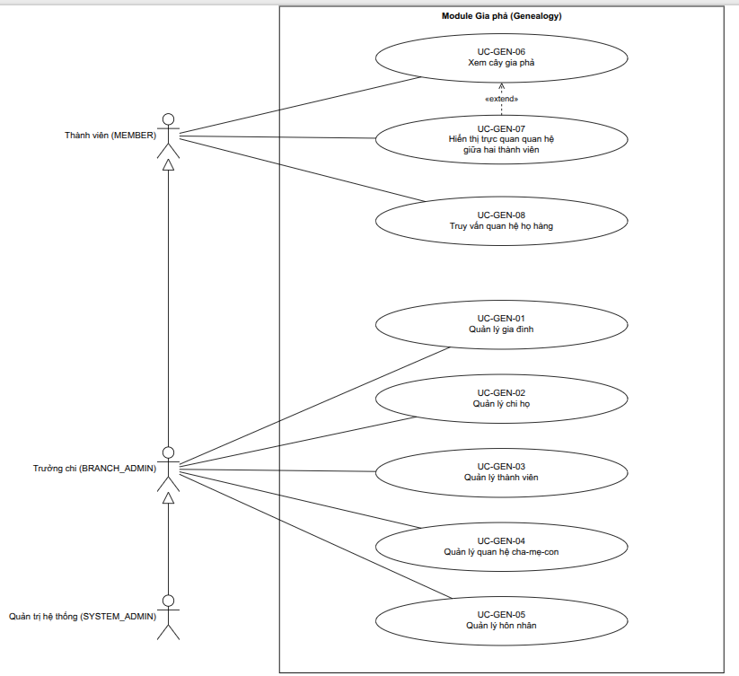

# Use case module Gia phả (Genealogy)

> **Người viết:** TV2 (Nguyễn Minh Trí) | **Reviewer:** TV5 (Lê Nhựt) | **Task Jira:** SCRUM-18 (1-05)
> **Phiên bản:** 0.2 | **Trạng thái:** Nháp | **Nhánh:** `docs/SCRUM-18-genealogy`
> **Bám theo:** `docs/01-srs/srs.md` mục 3 (FR-GEN-01 đến FR-GEN-08) và Phụ lục A (phân quyền).
> Mục đánh dấu **[Cần nhóm xác nhận]** là chỗ SRS chưa quy định rõ, TV2 tạm đề xuất.

---

## 1. Phạm vi và danh sách use case

Module Gia phả quản lý gia đình, chi họ, thành viên, quan hệ cha-mẹ-con, hôn nhân; hiển thị cây gia phả tương tác (API trả về `nodes`/`edges` cho React Flow) và tra quan hệ họ hàng. Các quy tắc chính (tối đa 2 cha mẹ ruột, cha mẹ sinh trước con, chặn vòng lặp tổ tiên, người đã mất, ly hôn, tái hôn, con nuôi) ở mục 5.

| Mã UC | Tên | Actor | Mã FR | Ưu tiên | Sprint | Task Jira |
|---|---|---|---|---|---|---|
| UC-GEN-01 | Quản lý gia đình (tạo, sửa, xóa) | BRANCH_ADMIN, SYSTEM_ADMIN | FR-GEN-01 | Must | S3 | SCRUM-37 |
| UC-GEN-02 | Quản lý chi họ | BRANCH_ADMIN, SYSTEM_ADMIN | FR-GEN-02 | Must | S3 | SCRUM-37 |
| UC-GEN-03 | Quản lý thành viên (thêm, sửa, xóa) | BRANCH_ADMIN, SYSTEM_ADMIN | FR-GEN-03 (đề tài ghi thiếu chữ, hiểu là *Member management*) | Must | S3 | SCRUM-37 |
| UC-GEN-04 | Quản lý quan hệ cha-mẹ-con | BRANCH_ADMIN, SYSTEM_ADMIN | FR-GEN-04 | Must | S4 | SCRUM-44 |
| UC-GEN-05 | Quản lý hôn nhân | BRANCH_ADMIN, SYSTEM_ADMIN | FR-GEN-05 | Must | S4 | SCRUM-44 |
| UC-GEN-06 | Xem cây gia phả (gồm mở/thu nhánh) | MEMBER, BRANCH_ADMIN, SYSTEM_ADMIN | FR-GEN-06 | Must | S4-S5 | SCRUM-45, 52 |
| UC-GEN-07 | Hiển thị trực quan quan hệ giữa hai thành viên | MEMBER, BRANCH_ADMIN, SYSTEM_ADMIN | FR-GEN-07 | Must | S6 | SCRUM-56 |
| UC-GEN-08 | Truy vấn quan hệ họ hàng ("A là gì của B") | MEMBER, BRANCH_ADMIN, SYSTEM_ADMIN | FR-GEN-08 | Must | S5 | SCRUM-51 |

> **Khác với gợi ý trong khung sườn:** khung sườn gợi ý 9 use case (tách "Mở và thu nhánh cây" thành UC riêng, "Làm nổi bật đường quan hệ" là UC-GEN-09). Bản này gộp mở/thu nhánh vào UC-GEN-06 và đánh số lại để khớp ma trận truy vết trong SRS mục 8 (FR-GEN-08 ứng với UC-GEN-08). Nếu nhóm muốn tách lại thì chỉnh ở đây.

## 2. Tác nhân (Actor)

| Actor | Vai trò hệ thống | Quyền trong module Gia phả (theo Phụ lục A SRS) |
|---|---|---|
| Thành viên đã xác minh | `MEMBER` | Xem cây, danh sách thành viên, tra quan hệ (trong gia đình của mình). Không sửa dữ liệu. |
| Trưởng chi / quản lý gia phả | `BRANCH_ADMIN` | Thêm, sửa, xóa thành viên, quan hệ, hôn nhân, chi họ trong gia đình/chi của mình. |
| Quản trị hệ thống | `SYSTEM_ADMIN` | Toàn quyền. |
| Khách, thành viên chưa xác minh | `GUEST` / `MEMBER` chưa xác minh | Không xem được dữ liệu gia phả. |

## 3. Use Case Diagram



*Trưởng chi kế thừa quyền của Thành viên; Quản trị hệ thống kế thừa quyền của Trưởng chi. File nguồn: `img/genealogy-usecase.drawio`.*

---

## 4. Đặc tả use case

### UC-GEN-01: Quản lý gia đình (FR-GEN-01)
- **Mã FR liên quan:** FR-GEN-01
- **Mô tả ngắn:** Tạo, sửa, xóa mềm gia đình (dòng họ).
- **Actor:** BRANCH_ADMIN, SYSTEM_ADMIN.
- **Tiền điều kiện:** đã đăng nhập.
- **Luồng chính (tạo gia đình):**
  1. Người dùng chọn "Tạo gia đình".
  2. Nhập tên gia đình (bắt buộc), mô tả (tùy chọn).
  3. Hệ thống kiểm tra hợp lệ, tạo bản ghi `family`.
  4. Hệ thống gán người tạo làm `BRANCH_ADMIN` của gia đình này **[Cần nhóm xác nhận]**.
  5. Hệ thống ghi audit log và trả về gia đình vừa tạo.
- **Luồng thay thế / lỗi:**
  - 2a. Tên trống hoặc quá 150 ký tự: báo lỗi, giữ nguyên form.
  - 2b. Trùng tên với gia đình khác do cùng người tạo: cảnh báo, cho phép tiếp tục.
  - Sửa: người có quyền đổi tên, mô tả. Xóa: chỉ `SYSTEM_ADMIN`; chỉ cho xóa mềm, không xóa nếu còn thành viên (lỗi `FAMILY_NOT_EMPTY`).
- **Hậu điều kiện:** gia đình tồn tại; thay đổi được ghi audit log.
- **Quy tắc:** BR-GEN-09, BR-GEN-11.

### UC-GEN-02: Quản lý chi họ (FR-GEN-02)
- **Mã FR liên quan:** FR-GEN-02
- **Mô tả ngắn:** Tạo, sửa, xóa chi họ và xếp chi vào cây chi.
- **Actor:** BRANCH_ADMIN (trong gia đình của mình), SYSTEM_ADMIN.
- **Tiền điều kiện:** gia đình đã tồn tại; người dùng có quyền trong gia đình.
- **Luồng chính (tạo chi):**
  1. Chọn "Thêm chi họ" trong gia đình.
  2. Nhập tên chi, (tùy chọn) chi cha, người tổ của chi, mô tả.
  3. Hệ thống kiểm tra, tạo `branch`.
  4. Hệ thống ghi audit log, hiển thị chi mới.
- **Luồng thay thế / lỗi:**
  - 2a. Chọn chi cha làm tạo vòng (chi A là cha của B, B là cha của A): từ chối, lỗi `BRANCH_CYCLE`.
  - 2b. Người tổ không thuộc gia đình này: từ chối.
  - Xóa chi: chỉ khi không còn thành viên và không còn chi con (lỗi `BRANCH_NOT_EMPTY`).
- **Hậu điều kiện:** chi họ nằm đúng vị trí trong cây chi.
- **Quy tắc:** BR-GEN-01, BR-GEN-12.

### UC-GEN-03: Quản lý thành viên (FR-GEN-03)
- **Mã FR liên quan:** FR-GEN-03
- **Mô tả ngắn:** Thêm, sửa, xóa mềm hồ sơ thành viên.
- **Actor:** BRANCH_ADMIN, SYSTEM_ADMIN. (MEMBER chỉ xem.)
- **Tiền điều kiện:** gia đình đã tồn tại; người dùng có quyền.
- **Luồng chính (thêm thành viên):**
  1. Chọn "Thêm thành viên".
  2. Nhập họ tên, giới tính (bắt buộc); ngày sinh, nơi sinh, nơi ở, chi họ, ghi chú (tùy chọn); đánh dấu đã mất và ngày mất nếu có.
  3. Hệ thống kiểm tra hợp lệ (BR-GEN-04, BR-GEN-08).
  4. Hệ thống tạo `person` thuộc gia đình hiện tại.
  5. Ghi audit log, trả về hồ sơ.
- **Luồng thay thế / lỗi:**
  - 3a. Ngày mất trước ngày sinh: từ chối, lỗi `INVALID_DEATH_DATE`.
  - 3b. Chi họ không thuộc gia đình: từ chối.
  - 3c. Họ tên + ngày sinh trùng người đã có: cảnh báo trùng, cho phép xác nhận tiếp tục.
  - **Sửa:** cập nhật các trường cho phép. Nếu chuyển sang "đã mất", hôn nhân `MARRIED` của người đó tự chuyển `WIDOWED` (BR-GEN-08).
  - **Xóa:** xóa mềm. Nếu người đó còn quan hệ cha-mẹ-con hoặc hôn nhân, hệ thống từ chối và yêu cầu gỡ quan hệ trước (lỗi `PERSON_HAS_RELATIONSHIPS`).
- **Hậu điều kiện:** hồ sơ được tạo, cập nhật hoặc ẩn; có audit log.
- **Quy tắc:** BR-GEN-01, 04, 08, 09, 10, 11.

### UC-GEN-04: Quản lý quan hệ cha-mẹ-con (FR-GEN-04)
- **Mã FR liên quan:** FR-GEN-04
- **Mô tả ngắn:** Gắn hoặc gỡ quan hệ cha/mẹ và con (ruột, nuôi, kế).
- **Actor:** BRANCH_ADMIN, SYSTEM_ADMIN.
- **Tiền điều kiện:** cả cha/mẹ và con đã là thành viên của cùng một gia đình.
- **Luồng chính (thêm quan hệ):**
  1. Chọn thành viên làm "con", chọn "Thêm cha/mẹ".
  2. Chọn người cha hoặc mẹ, chọn vai trò (`FATHER`/`MOTHER`) và loại (`BIOLOGICAL` ruột / `ADOPTED` nuôi / `STEP` kế).
  3. Hệ thống kiểm tra: cùng gia đình, chưa vượt số cha/mẹ ruột, không vòng lặp, ngày sinh hợp lý (BR-GEN-02 đến 05).
  4. Tạo bản ghi `parent_child`.
  5. Ghi audit log, làm mới cây.
- **Luồng thay thế / lỗi:**
  - 3a. Con đã có đủ cha và mẹ ruột (cùng vai trò): lỗi `PARENT_LIMIT_EXCEEDED`.
  - 3b. Thêm quan hệ làm người này thành tổ tiên của chính mình: lỗi `ANCESTOR_CYCLE`.
  - 3c. Cha/mẹ sinh sau hoặc cùng ngày với con: lỗi `INVALID_BIRTH_ORDER`. Chênh lệch dưới 15 năm: cảnh báo, cho phép xác nhận **[Cần nhóm xác nhận]**.
  - 3d. Cha và con trùng người, hoặc quan hệ đã tồn tại: lỗi `RELATION_EXISTS`.
  - Xóa quan hệ: cho phép, ghi audit log; cây tự cập nhật.
- **Hậu điều kiện:** đồ thị gia đình có thêm hoặc bớt một cạnh cha-con, vẫn là đồ thị không chu trình.
- **Quy tắc:** BR-GEN-02, 03, 04, 05, 06, 11.

### UC-GEN-05: Quản lý hôn nhân (FR-GEN-05)
- **Mã FR liên quan:** FR-GEN-05
- **Mô tả ngắn:** Thêm hôn nhân, đổi trạng thái (ly hôn, góa), xóa khi nhập nhầm.
- **Actor:** BRANCH_ADMIN, SYSTEM_ADMIN.
- **Tiền điều kiện:** hai người đã là thành viên của cùng gia đình.
- **Luồng chính (thêm hôn nhân):**
  1. Chọn thành viên, chọn "Thêm hôn nhân".
  2. Chọn người còn lại, nhập ngày kết hôn, trạng thái ban đầu `MARRIED`.
  3. Hệ thống kiểm tra BR-GEN-07 và BR-GEN-08.
  4. Tạo bản ghi `marriage`.
  5. Ghi audit log, làm mới cây.
- **Luồng thay thế / lỗi:**
  - 3a. Một trong hai người đang có hôn nhân `MARRIED` khác: lỗi `ALREADY_MARRIED` (cho phép tái hôn khi hôn nhân trước là `DIVORCED` hoặc `WIDOWED`).
  - 3b. Hai người có quan hệ trực hệ hoặc anh chị em ruột: lỗi `MARRIAGE_NOT_ALLOWED`.
  - 3c. Một trong hai đã mất: lỗi `PERSON_DECEASED`.
  - **Ly hôn:** đổi trạng thái `DIVORCED`, nhập `end_date`. **Góa:** hệ thống tự đặt `WIDOWED` khi một bên được đánh dấu đã mất.
  - Xóa hôn nhân (nhập nhầm): cho phép, ghi audit log.
- **Hậu điều kiện:** lịch sử hôn nhân được giữ nguyên; con cái vẫn liên kết với cả hai cha mẹ.
- **Quy tắc:** BR-GEN-07, 08, 11.

### UC-GEN-06: Xem cây gia phả (FR-GEN-06)
- **Mã FR liên quan:** FR-GEN-06
- **Mô tả ngắn:** Xem cây gia phả tương tác: zoom, kéo, mở và thu nhánh, xem hồ sơ tóm tắt.
- **Actor:** MEMBER (đã xác minh), BRANCH_ADMIN, SYSTEM_ADMIN.
- **Tiền điều kiện:** đã đăng nhập; là thành viên đã xác minh của gia đình.
- **Luồng chính:**
  1. Người dùng mở "Cây gia phả".
  2. Hệ thống tải cây quanh một người gốc (mặc định là hồ sơ của người dùng, hoặc người tổ), với độ sâu mặc định 3 đời.
  3. Giao diện vẽ nút (thành viên) và cạnh (cha-con, hôn nhân) bằng React Flow.
  4. Người dùng zoom, kéo, bấm nút để xem hồ sơ tóm tắt, mở hoặc thu nhánh. Khi mở thêm nhánh, hệ thống tải tiếp theo yêu cầu (lazy-load).
  5. Người dùng có quyền sửa có thể bấm "Thêm cha/mẹ", "Thêm con", "Thêm vợ/chồng" ngay trên nút (chuyển sang UC-GEN-03, 04, 05).
- **Luồng thay thế / lỗi:**
  - 1a. Người dùng chưa xác minh: từ chối, báo "Cần được trưởng chi duyệt".
  - 2a. Gia đình chưa có thành viên: hiển thị trạng thái trống và nút "Thêm thành viên đầu tiên".
  - 4a. Tải nhánh quá chậm hoặc lỗi mạng: hiển thị thông báo, cho phép thử lại, giữ nguyên phần cây đã vẽ.
- **Hậu điều kiện:** không thay đổi dữ liệu.
- **Quy tắc:** BR-GEN-10 (ẩn thông tin nhạy cảm theo vai trò).

### UC-GEN-07: Hiển thị trực quan quan hệ giữa hai thành viên (FR-GEN-07)
- **Mã FR liên quan:** FR-GEN-07
- **Mô tả ngắn:** Chọn hai thành viên và tô sáng đường quan hệ giữa họ trên cây.
- **Actor:** MEMBER, BRANCH_ADMIN, SYSTEM_ADMIN.
- **Tiền điều kiện:** đang xem cây gia phả (UC-GEN-06).
- **Luồng chính:**
  1. Người dùng chọn hai thành viên A và B trên cây.
  2. Hệ thống gọi UC-GEN-08 để lấy đường đi từ A đến B và tên quan hệ.
  3. Giao diện tô sáng (highlight) chuỗi nút và cạnh trên đường đi, làm mờ phần còn lại.
  4. Hiển thị chú thích: "A là *chú* của B", cùng đường đi qua tổ tiên chung.
- **Luồng thay thế / lỗi:**
  - 2a. Không tìm thấy quan hệ huyết thống: chỉ hiển thị "Không có quan hệ huyết thống trong dữ liệu hiện có", có thể hiển thị đường qua hôn nhân nếu có.
  - Người dùng bấm "Bỏ chọn": cây trở lại bình thường.
- **Hậu điều kiện:** không thay đổi dữ liệu.
- **Quan hệ:** *extend* của UC-GEN-06.

### UC-GEN-08: Truy vấn quan hệ họ hàng (FR-GEN-08)
- **Mã FR liên quan:** FR-GEN-08
- **Mô tả ngắn:** Hỏi "A là gì của B" và nhận tên quan hệ tiếng Việt kèm đường đi.
- **Actor:** MEMBER, BRANCH_ADMIN, SYSTEM_ADMIN.
- **Tiền điều kiện:** hai người A và B cùng thuộc một gia đình mà người dùng được xem.
- **Luồng chính:**
  1. Người dùng chọn A và B, hỏi "A là gì của B?".
  2. Hệ thống tìm tổ tiên chung gần nhất (LCA) qua bảng `parent_child`, đếm số bước từ A và từ B lên tổ tiên chung.
  3. Hệ thống tra bảng ánh xạ (bước A, bước B, bên nội/ngoại, hơn/kém tuổi) để ra tên gọi tiếng Việt.
  4. Trả về tên quan hệ, đường đi (danh sách người), tổ tiên chung.
- **Luồng thay thế / lỗi:**
  - 2a. A và B là cùng một người: trả "Cùng một người".
  - 2b. Không có tổ tiên chung: trả `NO_RELATION` (hoặc xét quan hệ qua hôn nhân: "vợ/chồng", "con dâu", "con rể" nếu có).
  - 3a. Quan hệ họ hàng xa chưa có trong bảng ánh xạ: trả "Chưa hỗ trợ", kèm số bước. (Theo SRS mục 7.2.)
  - 3b. Thiếu ngày sinh nên không xác định hơn/kém tuổi: dùng cách gọi chung (anh/chị/em → "anh chị em").
- **Hậu điều kiện:** không thay đổi dữ liệu. Thuật toán chi tiết: `docs/02-design/algorithm-relationship.md` (SCRUM-19).

---

## 5. Quy tắc nghiệp vụ

| Mã | Quy tắc |
|---|---|
| BR-GEN-01 | Mỗi thành viên thuộc đúng một gia đình. Một thành viên thuộc tối đa một chi họ. Mọi quan hệ chỉ được tạo giữa các thành viên cùng gia đình. |
| BR-GEN-02 | Một người có tối đa **1 cha ruột và 1 mẹ ruột** (loại `BIOLOGICAL`). Cha mẹ nuôi (`ADOPTED`) và kế (`STEP`) được ghi riêng, không tính vào giới hạn này. |
| BR-GEN-03 | **Không cho phép vòng lặp tổ tiên**: không thể thêm quan hệ làm một người trở thành tổ tiên của chính mình. Hệ thống kiểm tra bằng truy vấn đệ quy trước khi lưu. |
| BR-GEN-04 | Ngày sinh cha/mẹ phải **trước** ngày sinh con. Chênh lệch dưới 15 năm thì cảnh báo, cho người dùng xác nhận **[Cần nhóm xác nhận]**. |
| BR-GEN-05 | Không tạo quan hệ cha-mẹ-con giữa một người và chính mình, hoặc trùng quan hệ đã tồn tại. |
| BR-GEN-06 | Vai trò `FATHER`/`MOTHER` mặc định theo giới tính của người được chọn; người nhập có thể đổi khi cần. |
| BR-GEN-07 | Một người chỉ có **một hôn nhân `MARRIED` tại một thời điểm**. Tái hôn chỉ được khi hôn nhân trước là `DIVORCED` hoặc `WIDOWED`. Không cho kết hôn giữa người có quan hệ trực hệ hoặc anh chị em ruột. |
| BR-GEN-08 | **Người đã mất:** có `is_deceased` và `death_date` (không trước ngày sinh). Không thêm hôn nhân mới cho người đã mất. Khi một bên được đánh dấu mất, hôn nhân `MARRIED` của họ tự chuyển `WIDOWED`, `end_date` = ngày mất. Hồ sơ vẫn hiển thị và vẫn giữ quan hệ cha-con. |
| BR-GEN-09 | **Xóa mềm** (đặt `deleted_at`), không xóa vật lý. Không xóa thành viên đang có quan hệ cha-mẹ-con hoặc hôn nhân khi chưa gỡ. Không xóa gia đình còn thành viên, không xóa chi còn thành viên hoặc chi con. |
| BR-GEN-10 | **Riêng tư:** trường nhạy cảm (số điện thoại, địa chỉ, ngày sinh đầy đủ) hiển thị theo vai trò; với **trẻ em (dưới 18 tuổi)** và **người đã mất**, chỉ hiển thị thông tin tối thiểu cho `MEMBER` (xem `privacy.md`). |
| BR-GEN-11 | Mọi thao tác tạo, sửa, xóa gia đình, chi, thành viên, quan hệ, hôn nhân đều ghi **audit log** (người thực hiện, hành động, đối tượng, thời điểm) theo NFR-11. |
| BR-GEN-12 | Cây chi họ không có vòng lặp: chi không thể là tổ tiên (chi cha) của chính nó. |
| BR-GEN-13 | Con nuôi (`ADOPTED`) và con kế (`STEP`) vẫn được tính trong cây; thuật toán quan hệ họ hàng mặc định tính cả hai loại và hiển thị nhãn "nuôi" hoặc "kế" khi cần **[Cần nhóm xác nhận]**. |

---

## 6. Thiết kế cơ sở dữ liệu

Dùng PostgreSQL, thay đổi schema qua Flyway migration (NFR-07). Khóa chính kiểu UUID. Theo quy ước của khung sườn: tên bảng `snake_case` số ít; **mọi bảng có `created_at`, `updated_at`, `deleted_at`** (xóa mềm).

| Bảng | Mục đích | Trạng thái |
|---|---|---|
| family | Gia đình / dòng họ | Đã thiết kế |
| branch | Chi họ | Đã thiết kế |
| person | Thành viên (người) | Đã thiết kế |
| parent_child | Quan hệ cha/mẹ - con (ruột/nuôi/kế) | Đã thiết kế |
| marriage | Hôn nhân (ngày cưới, ly hôn) | Đã thiết kế |

### 6.1 Bảng `family`
| Cột | Kiểu | Ràng buộc | Ghi chú |
|---|---|---|---|
| id | UUID | PK | |
| name | VARCHAR(150) | NOT NULL | Tên gia đình |
| description | TEXT | | |
| created_by | UUID | FK `users(id)`, NOT NULL | |
| created_at | TIMESTAMP | NOT NULL, default now() | |
| updated_at | TIMESTAMP | NOT NULL, default now() | |
| deleted_at | TIMESTAMP | NULL | Xóa mềm |

### 6.2 Bảng `branch`
| Cột | Kiểu | Ràng buộc | Ghi chú |
|---|---|---|---|
| id | UUID | PK | |
| family_id | UUID | FK `family(id)`, NOT NULL | |
| name | VARCHAR(150) | NOT NULL | Tên chi |
| parent_branch_id | UUID | FK `branch(id)`, NULL | Chi cha |
| origin_person_id | UUID | FK `person(id)`, NULL | Người tổ của chi |
| description | TEXT | | |
| created_at | TIMESTAMP | NOT NULL, default now() | |
| updated_at | TIMESTAMP | NOT NULL, default now() | |
| deleted_at | TIMESTAMP | NULL | Xóa mềm |

### 6.3 Bảng `person`
| Cột | Kiểu | Ràng buộc | Ghi chú |
|---|---|---|---|
| id | UUID | PK | |
| family_id | UUID | FK `family(id)`, NOT NULL | |
| branch_id | UUID | FK `branch(id)`, NULL | |
| full_name | VARCHAR(150) | NOT NULL | |
| gender | VARCHAR(10) | NOT NULL, CHECK IN ('MALE','FEMALE','OTHER') | |
| birth_date | DATE | NULL | |
| birthplace | VARCHAR(255) | | |
| current_location | VARCHAR(255) | | Dùng cho tìm danh bạ (FR-DIR-04) |
| is_deceased | BOOLEAN | NOT NULL, default false | |
| death_date | DATE | NULL, CHECK (death_date >= birth_date) | |
| avatar_url | VARCHAR(500) | | |
| user_id | UUID | FK `users(id)`, UNIQUE, NULL | Nối với tài khoản nếu thành viên đã đăng ký |
| note | TEXT | | |
| created_at | TIMESTAMP | NOT NULL | |
| updated_at | TIMESTAMP | NOT NULL | |
| deleted_at | TIMESTAMP | NULL | Xóa mềm |

Index: `(family_id)`, `(branch_id)`, `(full_name)` (hỗ trợ tìm kiếm), `(family_id, birth_date)`.

### 6.4 Bảng `parent_child`
| Cột | Kiểu | Ràng buộc | Ghi chú |
|---|---|---|---|
| id | UUID | PK | |
| parent_id | UUID | FK `person(id)`, NOT NULL | |
| child_id | UUID | FK `person(id)`, NOT NULL | |
| parent_role | VARCHAR(10) | NOT NULL, CHECK IN ('FATHER','MOTHER') | |
| kind | VARCHAR(12) | NOT NULL, default 'BIOLOGICAL', CHECK IN ('BIOLOGICAL','ADOPTED','STEP') | |
| created_at | TIMESTAMP | NOT NULL | |
| updated_at | TIMESTAMP | NOT NULL | |
| deleted_at | TIMESTAMP | NULL | Xóa mềm |

Ràng buộc: `CHECK (parent_id <> child_id)`; `UNIQUE (parent_id, child_id) WHERE deleted_at IS NULL`; **chỉ mục duy nhất từng phần** `UNIQUE (child_id, parent_role) WHERE kind = 'BIOLOGICAL' AND deleted_at IS NULL` (đảm bảo tối đa 1 cha ruột và 1 mẹ ruột). Index: `(parent_id)`, `(child_id)`.

### 6.5 Bảng `marriage`
| Cột | Kiểu | Ràng buộc | Ghi chú |
|---|---|---|---|
| id | UUID | PK | |
| person1_id | UUID | FK `person(id)`, NOT NULL | |
| person2_id | UUID | FK `person(id)`, NOT NULL | |
| status | VARCHAR(10) | NOT NULL, CHECK IN ('MARRIED','DIVORCED','WIDOWED') | |
| start_date | DATE | NULL | |
| end_date | DATE | NULL | Ngày ly hôn hoặc góa |
| created_at | TIMESTAMP | NOT NULL | |
| updated_at | TIMESTAMP | NOT NULL | |
| deleted_at | TIMESTAMP | NULL | Xóa mềm |

Ràng buộc: `CHECK (person1_id <> person2_id)`. Các quy tắc "một hôn nhân `MARRIED` tại một thời điểm" và "không cho kết hôn người thân" kiểm tra ở tầng service (DB không biểu diễn gọn). Index: `(person1_id)`, `(person2_id)`.

### 6.6 Vì sao dùng bảng quan hệ `parent_child` thay vì cột `parent_id` trong `person`
1. **Một người có hai cha mẹ.** Một cột `parent_id` chỉ lưu được một người. Dùng hai cột `father_id`, `mother_id` thì không biểu diễn được cha mẹ nuôi hoặc cha mẹ kế.
2. **Phân loại quan hệ.** Bảng quan hệ cho thêm cột `kind` (ruột, nuôi, kế) và `parent_role` mà không đổi bảng `person`.
3. **Truy vấn tổ tiên và hậu duệ.** Bảng cạnh là dạng danh sách kề của đồ thị, nên recursive CTE đi lên (tìm tổ tiên chung, thuật toán LCA) và đi xuống (lấy cây) đơn giản, dùng index trên `parent_id` và `child_id`.
4. **Dễ mở rộng và dễ kiểm tra ràng buộc.** Chỉ mục duy nhất từng phần chặn quá 1 cha và 1 mẹ ruột ngay ở DB; kiểm tra vòng lặp gom vào một chỗ.
5. **Hôn nhân tách riêng** (`marriage`) vì một người có thể tái hôn nhiều lần và cần lưu lịch sử, không thể nhét vào một cột trong `person`.

### 6.7 Truy vấn đệ quy mẫu (kiểm tra vòng lặp tổ tiên)
```sql
-- Kiểm tra: nếu thêm :new_parent làm cha/mẹ của :child thì :child có thể là tổ tiên của :new_parent không?
WITH RECURSIVE ancestors AS (
  SELECT parent_id FROM parent_child WHERE child_id = :new_parent
  UNION
  SELECT pc.parent_id FROM parent_child pc JOIN ancestors a ON pc.child_id = a.parent_id
)
SELECT EXISTS (SELECT 1 FROM ancestors WHERE parent_id = :child);  -- true => từ chối (ANCESTOR_CYCLE)
```

---

## 7. Danh sách API

Tất cả API nằm dưới `/api/v1`, theo quy ước chung trong `docs/04-api/conventions.md`. Đặc tả đầy đủ (request, response, mã lỗi) ở `docs/04-api/openapi/genealogy.yaml`.

| Method | Đường dẫn | Mục đích | UC | Quyền |
|---|---|---|---|---|
| POST | `/families` | Tạo gia đình | UC-GEN-01 | Người đã đăng nhập |
| GET | `/families/{familyId}` | Xem gia đình | UC-GEN-01 | MEMBER đã xác minh trở lên |
| PUT | `/families/{familyId}` | Sửa gia đình | UC-GEN-01 | BRANCH_ADMIN, SYSTEM_ADMIN |
| DELETE | `/families/{familyId}` | Xóa mềm gia đình | UC-GEN-01 | SYSTEM_ADMIN |
| GET | `/families/{familyId}/branches` | Danh sách chi họ | UC-GEN-02 | MEMBER trở lên |
| POST | `/families/{familyId}/branches` | Tạo chi họ | UC-GEN-02 | BRANCH_ADMIN, SYSTEM_ADMIN |
| PUT | `/branches/{branchId}` | Sửa chi họ | UC-GEN-02 | BRANCH_ADMIN, SYSTEM_ADMIN |
| DELETE | `/branches/{branchId}` | Xóa mềm chi họ | UC-GEN-02 | BRANCH_ADMIN, SYSTEM_ADMIN |
| GET | `/families/{familyId}/persons` | Danh sách thành viên (phân trang, lọc) | UC-GEN-03 | MEMBER trở lên |
| POST | `/families/{familyId}/persons` | Thêm thành viên | UC-GEN-03 | BRANCH_ADMIN, SYSTEM_ADMIN |
| GET | `/persons/{personId}` | Xem hồ sơ thành viên | UC-GEN-03 | MEMBER trở lên |
| PUT | `/persons/{personId}` | Sửa thành viên | UC-GEN-03 | BRANCH_ADMIN, SYSTEM_ADMIN |
| DELETE | `/persons/{personId}` | Xóa mềm thành viên | UC-GEN-03 | BRANCH_ADMIN, SYSTEM_ADMIN |
| POST | `/persons/{personId}/parents` | Thêm cha/mẹ cho thành viên | UC-GEN-04 | BRANCH_ADMIN, SYSTEM_ADMIN |
| DELETE | `/parent-child/{id}` | Gỡ quan hệ cha-mẹ-con | UC-GEN-04 | BRANCH_ADMIN, SYSTEM_ADMIN |
| POST | `/marriages` | Thêm hôn nhân | UC-GEN-05 | BRANCH_ADMIN, SYSTEM_ADMIN |
| PUT | `/marriages/{id}` | Đổi trạng thái hôn nhân (ly hôn, góa) | UC-GEN-05 | BRANCH_ADMIN, SYSTEM_ADMIN |
| DELETE | `/marriages/{id}` | Xóa hôn nhân | UC-GEN-05 | BRANCH_ADMIN, SYSTEM_ADMIN |
| GET | `/families/{familyId}/tree` | Lấy cây dạng nodes và edges | UC-GEN-06 | MEMBER trở lên |
| GET | `/families/{familyId}/relationship` | Truy vấn A là gì của B, kèm đường đi | UC-GEN-07, 08 | MEMBER trở lên |

---

## 8. Ma trận truy vết (phần Gia phả)

| FR | Use case | Bảng DB | API | Task Jira |
|---|---|---|---|---|
| FR-GEN-01 | UC-GEN-01 | family | `/families` | SCRUM-37 |
| FR-GEN-02 | UC-GEN-02 | branch | `/families/{id}/branches`, `/branches/{id}` | SCRUM-37 |
| FR-GEN-03 | UC-GEN-03 | person | `/families/{id}/persons`, `/persons/{id}` | SCRUM-37 |
| FR-GEN-04 | UC-GEN-04 | parent_child | `/persons/{id}/parents`, `/parent-child/{id}` | SCRUM-44 |
| FR-GEN-05 | UC-GEN-05 | marriage | `/marriages` | SCRUM-44 |
| FR-GEN-06 | UC-GEN-06 | person, parent_child, marriage | `/families/{id}/tree` | SCRUM-45, 52 |
| FR-GEN-07 | UC-GEN-07 | person, parent_child | `/families/{id}/relationship` | SCRUM-56 |
| FR-GEN-08 | UC-GEN-08 | parent_child, person | `/families/{id}/relationship` | SCRUM-51 |

---

## 9. Màn hình liên quan

- Wireframe module Gia phả (quản lý thành viên và cây tương tác): task SCRUM-29, Sprint 2. Link Figma và ảnh sẽ dán tại `docs/05-ui/figma-links.md` khi có.
- Màn hình dự kiến: danh sách và hồ sơ thành viên, form thêm thành viên, cây gia phả (React Flow), hộp thoại thêm cha/mẹ, vợ/chồng, màn hình tra quan hệ.

## 10. Câu hỏi còn mở

1. Ai được tạo gia đình, và người tạo có tự động thành `BRANCH_ADMIN` của gia đình đó không? (UC-GEN-01)
2. Cha mẹ sinh cách con dưới 15 năm thì cảnh báo hay từ chối? (BR-GEN-04)
3. Con nuôi, con kế có được tính trong thuật toán quan hệ họ hàng không? (BR-GEN-13)
4. Nhóm hiểu FR-GEN-07 "Relationship visualization" là tô sáng đường quan hệ giữa hai người (như UC-GEN-07), hay là toàn bộ việc vẽ cây? Nếu là vẽ cây thì gộp UC-GEN-07 vào UC-GEN-06.
5. Cấu trúc response và mã lỗi cần đối chiếu lại với `docs/04-api/conventions.md` (SCRUM-21) khi file này được duyệt.
