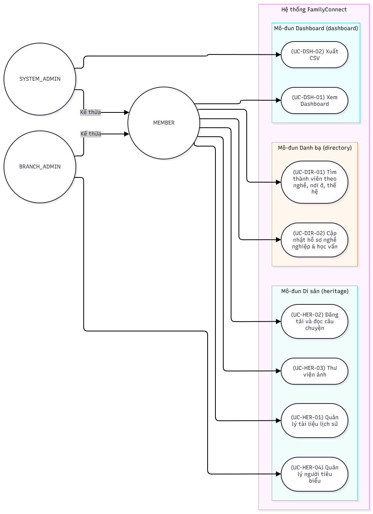

> **Người viết:** TV4 (Huy Quốc) | **Reviewer:** Nguyễn Thanh Tuấn | **Task Jira:** SCRUM-22
> **Trạng thái:** Chờ review

# TÀI LIỆU ĐẶC TẢ MODULE: HERITAGE, DIRECTORY, DASHBOARD
**Nhánh Git:** docs/SCRUM-22-heritage-directory-dashboard
**Gói backend:** com.familyconnect.modules.heritage, com.familyconnect.modules.directory, com.familyconnect.modules.dashboard

## 1. YÊU CẦU CHỨC NĂNG (FR)
Theo tài liệu SRS mục 3, các yêu cầu chức năng thuộc phạm vi 3 module bao gồm:
*   **Family Directory (Danh bạ):**
    *   FR-DIR-01 + FR-DIR-04: Danh bạ thành viên và Tìm thành viên theo nghề nghiệp, nơi ở, thế hệ (Dùng chung endpoint).
    *   FR-DIR-02: Hồ sơ nghề nghiệp (profession_profile).
    *   FR-DIR-03: Hồ sơ học vấn (education_profile).
*   **Family Heritage (Di sản):**
    *   FR-HER-01: Quản lý tài liệu lịch sử (heritage_document).
    *   FR-HER-02: Đăng tải và đọc câu chuyện gia đình (family_story).
    *   FR-HER-03: Quản lý danh sách người tiêu biểu (outstanding_member).
    *   FR-HER-04: Thư viện ảnh (sử dụng chung bảng media của module community).
    *   FR-HER-05: Kho lưu trữ số.
*   **Dashboard & Reporting (Thống kê):**
    *   FR-DSH-01 đến FR-DSH-04: Thống kê gia đình, hoạt động cộng đồng, sự kiện, nhân khẩu.
    *   FR-DSH-05: Tạo báo cáo CSV (Lưu ý: Xuất PDF thuộc phạm vi Sprint 6-7 ở SCRUM-62, 95).

## 2. SƠ ĐỒ VÀ ĐẶC TẢ USE CASE

### 2.1 Use Case Diagram


### 2.2 Danh sách Actor & Mối quan hệ
*   **Thành viên (MEMBER):** Người dùng đã đăng nhập và được Trưởng chi xác minh vào gia đình (sở hữu `family_id` hợp lệ).
*   **Quản trị viên chi họ (BRANCH_ADMIN):** Kế thừa toàn bộ quyền hạn của MEMBER, bổ sung quyền phê duyệt, quản lý và trích xuất dữ liệu tổng hợp trong phạm vi chi họ của mình (hoặc toàn gia đình nếu `branch_id` rỗng).
*   **Quản trị viên hệ thống (SYSTEM_ADMIN):** Kế thừa toàn bộ quyền hạn của MEMBER, có quyền quản lý và trích xuất dữ liệu trên toàn bộ gia đình.

### 2.3 Đặc tả chi tiết 8 Use Case

| Tên Use Case | UC-DIR-01: Tìm thành viên theo nghề nghiệp, nơi ở, thế hệ |
| :--- | :--- |
| **Mã UC / FR** | UC-DIR-01 / FR-DIR-01, FR-DIR-04 |
| **Actor** | MEMBER, BRANCH_ADMIN, SYSTEM_ADMIN |
| **Tiền điều kiện** | Người dùng đã xác thực, có token hợp lệ và được duyệt vào gia đình. |
| **Luồng chính** | 1. Người dùng truy cập Danh bạ, nhập các tiêu chí tìm kiếm tùy chọn (kết hợp Nghề nghiệp, Nơi ở, Thế hệ).<br>2. Hệ thống kiểm tra xác thực, lấy `family_id`.<br>3. Truy vấn danh sách thành viên thỏa mãn từ module genealogy qua interface.<br>4. Lọc thông tin theo độ tuổi và hiển thị kết quả phân trang. |
| **Luồng lỗi** | - Chưa đăng nhập/token hết hạn: 401 AUTH_002.<br>- Chưa xác minh: 403 PERM_002. |
| **Hậu điều kiện** | Người dùng xem được danh bạ theo chính sách quyền riêng tư. |
| **Quy tắc** | **BR-DIR-01:** Trẻ em dưới 16 tuổi bắt buộc ẩn khỏi kết quả tìm kiếm theo nghề nghiệp/nơi ở. Trong danh bạ chung, ẩn liên hệ, nơi làm việc, trường học; chỉ trả về họ tên, quan hệ, năm sinh. |

| Tên Use Case | UC-DIR-02: Cập nhật hồ sơ nghề nghiệp & học vấn |
| :--- | :--- |
| **Mã UC / FR** | UC-DIR-02 / FR-DIR-02, FR-DIR-03 |
| **Actor** | MEMBER, BRANCH_ADMIN, SYSTEM_ADMIN |
| **Tiền điều kiện** | Chỉ sửa hồ sơ của chính mình (`person.user_id` = người đăng nhập) hoặc cha mẹ sửa cho con dưới 16 tuổi (quan hệ `parent_child`). BRANCH_ADMIN sửa cho người trong chi (kể cả người chưa có tài khoản, theo BR-GEN-14). SYSTEM_ADMIN sửa cho người trong toàn gia đình. |
| **Luồng chính** | 1. Người dùng chọn cập nhật thông tin.<br>2. Hệ thống kiểm tra quyền sửa.<br>3. Validate dữ liệu.<br>4. Lưu/ghi đè bản ghi duy nhất của người dùng vào bảng. |
| **Luồng lỗi** | - Dữ liệu không hợp lệ: 400 VALID_001.<br>- Sửa hồ sơ người khác không có quyền: 403 PERM_001.<br>- Chưa xác minh gia đình: 403 PERM_002.<br>- Không tìm thấy thành viên: 404 NOT_FOUND_001. |
| **Hậu điều kiện** | Dữ liệu hồ sơ cá nhân được đồng bộ và lưu trữ. |
| **Quy tắc** | **BR-DIR-02:** Mỗi người chỉ có 1 dòng hồ sơ đang active. Năm tốt nghiệp không vượt quá năm hiện tại + 10. |

| Tên Use Case | UC-HER-01: Quản lý tài liệu lịch sử |
| :--- | :--- |
| **Mã UC / FR** | UC-HER-01 / FR-HER-01, FR-HER-05 |
| **Actor** | MEMBER, BRANCH_ADMIN, SYSTEM_ADMIN |
| **Tiền điều kiện** | File tải lên qua module Community, có `media_id` hợp lệ, thuộc cùng `family_id` của người dùng. |
| **Luồng chính** | 1. Thêm mới: Nhập Tiêu đề, Mô tả, Danh mục và `media_id`. Hệ thống kiểm tra `media_id` tồn tại và `media.family_id` trùng `family_id` của người dùng, sau đó ghi bản ghi vào `heritage_document`.<br>2. Sửa/Xóa: Hệ thống kiểm tra quyền (người đăng hoặc Admin) và thực hiện cập nhật/xóa mềm.<br>3. Báo module AI cập nhật embedding qua interface. |
| **Luồng lỗi** | - Dùng `media_id` gia đình khác hoặc cố sửa/xóa khi không đủ quyền: 403 PERM_001.<br>- Chưa xác minh: 403 PERM_002.<br>- Dữ liệu thiếu: 400 VALID_001.<br>- Không tìm thấy tài liệu: 404 NOT_FOUND_001. |
| **Hậu điều kiện** | Tài liệu xuất hiện/được cập nhật/bị xóa trong kho lưu trữ số. |
| **Quy tắc** | **BR-HER-01:** Phân loại theo category. Chỉ người đăng tải hoặc Admin trong phạm vi quyền hạn mới được phép sửa/xóa. |

| Tên Use Case | UC-HER-02: Quản lý câu chuyện gia đình |
| :--- | :--- |
| **Mã UC / FR** | UC-HER-02 / FR-HER-02 |
| **Actor** | MEMBER, BRANCH_ADMIN, SYSTEM_ADMIN |
| **Tiền điều kiện** | Đã đăng nhập và xác minh. |
| **Luồng chính** | 1. Thêm mới: Nhập Tiêu đề, Nội dung và (tùy chọn) đối tượng liên quan `related_person_id` (phải thuộc cùng `family_id`). Hệ thống lưu vào `family_story` và gán `created_by` là người đăng.<br>2. Sửa/Xóa: Hệ thống kiểm tra quyền (tác giả hoặc Admin) và thực hiện.<br>3. Báo module AI cập nhật embedding qua interface. |
| **Luồng lỗi** | - Cố sửa/xóa chuyện của người khác khi không có quyền: 403 PERM_001.<br>- Chưa xác minh: 403 PERM_002.<br>- Rỗng tiêu đề/nội dung: 400 VALID_001.<br>- Không tìm thấy câu chuyện: 404 NOT_FOUND_001. |
| **Hậu điều kiện** | Câu chuyện hiển thị/cập nhật/bị xóa trên bảng tin di sản. |
| **Quy tắc** | **BR-HER-02:** Tên tác giả hiển thị sẽ tra cứu qua interface bằng ID người đăng. |

| Tên Use Case | UC-HER-03: Thư viện ảnh dòng họ |
| :--- | :--- |
| **Mã UC / FR** | UC-HER-03 / FR-HER-04 |
| **Actor** | MEMBER, BRANCH_ADMIN, SYSTEM_ADMIN |
| **Tiền điều kiện** | Đã đăng nhập và xác minh. |
| **Luồng chính** | 1. Gửi yêu cầu GET đọc danh sách ảnh từ module community qua interface với điều kiện `owner_type = 'HERITAGE'` và `family_id`.<br>2. Trả kết quả ảnh phân trang. |
| **Luồng lỗi** | - Chưa xác minh: 403 PERM_002.<br>*(Ghi chú: Việc upload tệp bị quá dung lượng hoặc sai định dạng do module community xử lý)* |
| **Hậu điều kiện** | Người dùng xem được danh sách hình ảnh di sản. |
| **Quy tắc** | **BR-HER-03:** Không có bảng riêng, đọc trực tiếp từ `media`. |

| Tên Use Case | UC-HER-04: Quản lý người tiêu biểu |
| :--- | :--- |
| **Mã UC / FR** | UC-HER-04 / FR-HER-03 |
| **Actor** | BRANCH_ADMIN, SYSTEM_ADMIN |
| **Tiền điều kiện** | Có quyền quản trị tương ứng với phạm vi gia đình/chi họ (BR-GEN-14). |
| **Luồng chính** | 1. Chọn thành viên, nhập thành tích, thứ tự.<br>2. Kiểm tra `person_id` thuộc cùng `family_id` (với BRANCH_ADMIN: thuộc chi của mình).<br>3. Ghi vào `outstanding_member`. |
| **Luồng lỗi** | - Member thông thường hoặc thao tác ngoài chi của mình: 403 PERM_001.<br>- Chưa xác minh: 403 PERM_002.<br>- Trùng người đã vinh danh: 409 HER_001.<br>- Dữ liệu không hợp lệ: 400 VALID_001.<br>- Không tìm thấy: 404 NOT_FOUND_001. |
| **Hậu điều kiện** | Danh sách người tiêu biểu được cập nhật. |
| **Quy tắc** | **BR-HER-04:** Chỉ quản trị viên thêm/sửa/xóa. Mỗi người chỉ xuất hiện 1 lần. |

| Tên Use Case | UC-DSH-01: Xem Dashboard tổng quan |
| :--- | :--- |
| **Mã UC / FR** | UC-DSH-01 / FR-DSH-01 đến FR-DSH-04 |
| **Actor** | MEMBER, BRANCH_ADMIN, SYSTEM_ADMIN |
| **Tiền điều kiện** | Đã xác minh `family_id`. BRANCH_ADMIN xem trong phạm vi chi họ của mình (hoặc toàn gia đình nếu `branch_id` rỗng). |
| **Luồng chính** | 1. Người dùng xem Dashboard.<br>2. Gọi interface đến genealogy, community, events để tổng hợp số liệu.<br>3. Trả về JSON thống kê. |
| **Luồng lỗi** | - Chưa đăng nhập/token lỗi: 401 AUTH_002.<br>- Chưa xác minh: 403 PERM_002. |
| **Hậu điều kiện** | Biểu đồ Dashboard hiển thị trực quan các chỉ số hiện tại. |
| **Quy tắc** | **BR-DSH-01:** Chỉ đọc qua interface Java. Thống kê nghề nghiệp, nơi ở phải loại trừ trẻ dưới 16 tuổi. |

| Tên Use Case | UC-DSH-02: Xuất báo cáo CSV |
| :--- | :--- |
| **Mã UC / FR** | UC-DSH-02 / FR-DSH-05 |
| **Actor** | BRANCH_ADMIN, SYSTEM_ADMIN |
| **Tiền điều kiện** | Đã xác minh `family_id` và có quyền quản trị. BRANCH_ADMIN xuất trong phạm vi chi họ. |
| **Luồng chính** | 1. Quản trị viên nhấn xuất CSV.<br>2. Lấy toàn bộ dữ liệu danh bạ qua interface genealogy.<br>3. Ẩn thông tin liên hệ và địa chỉ chi tiết; với trẻ dưới 16 tuổi chỉ điền `id`, `fullName`, `relationship`, `birthYear`, các cột còn lại để trống.<br>4. Chèn dấu `'` trước các ô chứa `=`, `+`, `-`, `@` để chống Injection.<br>5. Trả file UTF-8 kèm BOM.<br>6. Ghi Audit Log hành động xuất dữ liệu. |
| **Luồng lỗi** | - Sai token: 401 AUTH_002.<br>- Không đủ quyền (MEMBER gọi): 403 PERM_001.<br>- Chưa xác minh: 403 PERM_002. |
| **Hậu điều kiện** | File CSV được tải về thiết bị. Hệ thống lưu vết thao tác (SCRUM-57). |
| **Quy tắc** | **BR-DSH-02:** Danh sách cột (camelCase): `id`, `fullName`, `birthYear`, `gender`, `relationship`, `generation`, `jobTitle`, `workLocation`. Với trẻ dưới 16 tuổi chỉ điền `id`, `fullName`, `relationship`, `birthYear` (theo mục "Trẻ em và người đã mất" của privacy.md). Audit log bắt buộc. |
---
## 3. DANH SÁCH API, LIÊN KẾT MODULE & CÂU HỎI MỞ

### 3.1 Danh sách API
| Method | URL | Use Case | Vai trò | Mã lỗi chính |
| :--- | :--- | :--- | :--- | :--- |
| GET | `/directory/members` | UC-DIR-01 | MEMBER, BRANCH_ADMIN, SYSTEM_ADMIN | AUTH_002, PERM_002 |
| GET | `/directory/members/{personId}/profession-profile` | Xem HS | MEMBER, BRANCH_ADMIN, SYSTEM_ADMIN | AUTH_002, PERM_002, NOT_FOUND_001 |
| PUT | `/directory/members/{personId}/profession-profile` | UC-DIR-02 | MEMBER, BRANCH_ADMIN, SYSTEM_ADMIN | AUTH_002, PERM_001, PERM_002, VALID_001 |
| GET | `/directory/members/{personId}/education-profile` | Xem HS | MEMBER, BRANCH_ADMIN, SYSTEM_ADMIN | AUTH_002, PERM_002, NOT_FOUND_001 |
| PUT | `/directory/members/{personId}/education-profile` | UC-DIR-02 | MEMBER, BRANCH_ADMIN, SYSTEM_ADMIN | AUTH_002, PERM_001, PERM_002, VALID_001 |
| GET/POST | `/heritage/documents` | UC-HER-01 | MEMBER, BRANCH_ADMIN, SYSTEM_ADMIN | AUTH_002, PERM_001, PERM_002, VALID_001 |
| GET/PATCH/DELETE | `/heritage/documents/{id}` | UC-HER-01 | MEMBER, BRANCH_ADMIN, SYSTEM_ADMIN | AUTH_002, PERM_001, PERM_002, VALID_001, NOT_FOUND_001 |
| GET/POST | `/heritage/stories` | UC-HER-02 | MEMBER, BRANCH_ADMIN, SYSTEM_ADMIN | AUTH_002, PERM_001, PERM_002, VALID_001 |
| GET/PATCH/DELETE | `/heritage/stories/{id}` | UC-HER-02 | MEMBER, BRANCH_ADMIN, SYSTEM_ADMIN | AUTH_002, PERM_001, PERM_002, VALID_001, NOT_FOUND_001 |
| GET | `/heritage/photos` | UC-HER-03 | MEMBER, BRANCH_ADMIN, SYSTEM_ADMIN | AUTH_002, PERM_002 |
| GET/POST | `/heritage/outstanding-members` | UC-HER-04 | BRANCH_ADMIN, SYSTEM_ADMIN | AUTH_002, PERM_001, PERM_002, VALID_001, HER_001 |
| PATCH/DELETE | `/heritage/outstanding-members/{id}` | UC-HER-04 | BRANCH_ADMIN, SYSTEM_ADMIN | AUTH_002, PERM_001, PERM_002, VALID_001, NOT_FOUND_001 |
| GET | `/dashboard/statistics` | UC-DSH-01 | MEMBER, BRANCH_ADMIN, SYSTEM_ADMIN | AUTH_002, PERM_001, PERM_002 |
| GET | `/dashboard/reports/members` | UC-DSH-02 | BRANCH_ADMIN, SYSTEM_ADMIN | AUTH_002, PERM_001, PERM_002 |

### 3.2 Liên kết module khác
*   **Genealogy:** Cung cấp nhân khẩu học qua `GenealogyInterface.getDemographics()`.
*   **Community:** Cung cấp hình ảnh qua `CommunityInterface.getHeritageMedia()`. Báo module này khi tải lên ảnh/tệp.
*   **Events:** Cung cấp sự kiện qua `EventInterface.getUpcomingEvents()`.
*   **AI:** Báo cập nhật embedding qua `AiGateway`.

### 3.3 Bảng mã lỗi riêng (Module Errors)
| Mã lỗi | HTTP Status | Thông điệp |
| :--- | :--- | :--- |
| `HER_001` | 409 Conflict | Thành viên đã tồn tại trong danh sách tiêu biểu. |

### 3.4 Câu hỏi còn mở (Open Questions)
1. **Định nghĩa Đời 1 (Thống kê thế hệ):** SQL 5.2 đệ quy trên bảng `parent_child`, coi Đời 1 là những người không phải `child_id` của ai. Câu này chưa loại được người cưới vào (họ cũng không có cha mẹ trong cây nên bị tính là Đời 1). Cần module `genealogy` xác nhận cách loại trừ (ví dụ join bảng hôn nhân) và tên bảng/cột `parent_child`, `person.birth_date` để query chính xác.
2. **Xóa tệp vật lý:** Khi xóa mềm `heritage_document`, có gọi sang MinIO xóa cứng file không?
3. **Quyền nhánh tộc:** BRANCH_ADMIN có quyền can thiệp vào tài liệu chung của toàn dòng họ không?

## 4. THIẾT KẾ CƠ SỞ DỮ LIỆU
*Quy ước chung: Khóa chính UUID. Các bảng có `id`, `created_at`, `updated_at`, `deleted_at`, `created_by` (FK -> `users(id)`), `updated_by` (FK -> `users(id)`). FK dùng `ON DELETE RESTRICT`.*

```sql
-- 1. Bảng tài liệu lịch sử
-- Mục đích: Lưu trữ thông tin tham chiếu đến các tệp/hình ảnh tài liệu (gia phả, sắc phong) của dòng họ.
CREATE TABLE heritage_document (
    id UUID PRIMARY KEY DEFAULT gen_random_uuid(),
    family_id UUID NOT NULL,
    title VARCHAR(255) NOT NULL,
    description TEXT,
    category VARCHAR(100),
    media_id UUID NOT NULL,
    created_at TIMESTAMP WITH TIME ZONE NOT NULL DEFAULT CURRENT_TIMESTAMP,
    updated_at TIMESTAMP WITH TIME ZONE NOT NULL DEFAULT CURRENT_TIMESTAMP,
    deleted_at TIMESTAMP WITH TIME ZONE NULL,
    created_by UUID NOT NULL,
    updated_by UUID NOT NULL,
    CONSTRAINT fk_heritage_doc_media FOREIGN KEY (media_id) REFERENCES media(id) ON DELETE RESTRICT,
    CONSTRAINT fk_heritage_doc_family FOREIGN KEY (family_id) REFERENCES family(id) ON DELETE RESTRICT,
    CONSTRAINT fk_heritage_doc_creator FOREIGN KEY (created_by) REFERENCES users(id) ON DELETE RESTRICT,
    CONSTRAINT fk_heritage_doc_updater FOREIGN KEY (updated_by) REFERENCES users(id) ON DELETE RESTRICT
);
CREATE INDEX idx_heritage_doc_media ON heritage_document (media_id);
CREATE INDEX idx_heritage_doc_family ON heritage_document (family_id, created_at DESC) WHERE deleted_at IS NULL;

-- 2. Bảng câu chuyện gia đình
-- Mục đích: Lưu trữ các bài viết hồi ký, câu chuyện tiểu sử liên quan đến dòng họ hoặc cá nhân.
CREATE TABLE family_story (
    id UUID PRIMARY KEY DEFAULT gen_random_uuid(),
    family_id UUID NOT NULL,
    title VARCHAR(255) NOT NULL,
    content TEXT NOT NULL,
    related_person_id UUID NULL,
    created_at TIMESTAMP WITH TIME ZONE NOT NULL DEFAULT CURRENT_TIMESTAMP,
    updated_at TIMESTAMP WITH TIME ZONE NOT NULL DEFAULT CURRENT_TIMESTAMP,
    deleted_at TIMESTAMP WITH TIME ZONE NULL,
    created_by UUID NOT NULL,
    updated_by UUID NOT NULL,
    CONSTRAINT fk_family_story_family FOREIGN KEY (family_id) REFERENCES family(id) ON DELETE RESTRICT,
    CONSTRAINT fk_family_story_related FOREIGN KEY (related_person_id) REFERENCES person(id) ON DELETE RESTRICT,
    CONSTRAINT fk_family_story_creator FOREIGN KEY (created_by) REFERENCES users(id) ON DELETE RESTRICT,
    CONSTRAINT fk_family_story_updater FOREIGN KEY (updated_by) REFERENCES users(id) ON DELETE RESTRICT
);
CREATE INDEX idx_family_story_family ON family_story (family_id, created_at DESC) WHERE deleted_at IS NULL;

-- 3. Bảng người tiêu biểu
-- Mục đích: Vinh danh những cá nhân xuất sắc trong dòng họ, quy định thứ tự hiển thị trên danh sách.
CREATE TABLE outstanding_member (
    id UUID PRIMARY KEY DEFAULT gen_random_uuid(),
    family_id UUID NOT NULL,
    person_id UUID NOT NULL,
    achievement TEXT NOT NULL,
    display_order INT NOT NULL DEFAULT 0,
    created_at TIMESTAMP WITH TIME ZONE NOT NULL DEFAULT CURRENT_TIMESTAMP,
    updated_at TIMESTAMP WITH TIME ZONE NOT NULL DEFAULT CURRENT_TIMESTAMP,
    deleted_at TIMESTAMP WITH TIME ZONE NULL,
    created_by UUID NOT NULL,
    updated_by UUID NOT NULL,
    CONSTRAINT fk_outstanding_person FOREIGN KEY (person_id) REFERENCES person(id) ON DELETE RESTRICT,
    CONSTRAINT fk_outstanding_family FOREIGN KEY (family_id) REFERENCES family(id) ON DELETE RESTRICT,
    CONSTRAINT fk_outstanding_creator FOREIGN KEY (created_by) REFERENCES users(id) ON DELETE RESTRICT,
    CONSTRAINT fk_outstanding_updater FOREIGN KEY (updated_by) REFERENCES users(id) ON DELETE RESTRICT
);
CREATE UNIQUE INDEX uq_outstanding_person ON outstanding_member (family_id, person_id) WHERE deleted_at IS NULL;
CREATE INDEX idx_outstanding_display ON outstanding_member (family_id, display_order);

-- 4. Bảng hồ sơ nghề nghiệp
-- Mục đích: Lưu trữ 1 dòng hồ sơ công việc/công ty hiện tại của một cá nhân từ 16 tuổi trở lên.
CREATE TABLE profession_profile (
    id UUID PRIMARY KEY DEFAULT gen_random_uuid(),
    family_id UUID NOT NULL,
    person_id UUID NOT NULL,
    job_title VARCHAR(150) NOT NULL,
    company VARCHAR(255),
    work_location VARCHAR(255),
    created_at TIMESTAMP WITH TIME ZONE NOT NULL DEFAULT CURRENT_TIMESTAMP,
    updated_at TIMESTAMP WITH TIME ZONE NOT NULL DEFAULT CURRENT_TIMESTAMP,
    deleted_at TIMESTAMP WITH TIME ZONE NULL,
    created_by UUID NOT NULL,
    updated_by UUID NOT NULL,
    CONSTRAINT fk_prof_person FOREIGN KEY (person_id) REFERENCES person(id) ON DELETE RESTRICT,
    CONSTRAINT fk_prof_family FOREIGN KEY (family_id) REFERENCES family(id) ON DELETE RESTRICT,
    CONSTRAINT fk_prof_creator FOREIGN KEY (created_by) REFERENCES users(id) ON DELETE RESTRICT,
    CONSTRAINT fk_prof_updater FOREIGN KEY (updated_by) REFERENCES users(id) ON DELETE RESTRICT
);
CREATE UNIQUE INDEX uq_prof_person ON profession_profile (person_id) WHERE deleted_at IS NULL;

-- 5. Bảng hồ sơ học vấn
-- Mục đích: Lưu trữ 1 dòng bằng cấp/trường học cao nhất hoặc hiện tại của một cá nhân.
CREATE TABLE education_profile (
    id UUID PRIMARY KEY DEFAULT gen_random_uuid(),
    family_id UUID NOT NULL,
    person_id UUID NOT NULL,
    school VARCHAR(255) NOT NULL,
    degree VARCHAR(100),
    graduation_year INT CHECK (graduation_year >= 1900),
    created_at TIMESTAMP WITH TIME ZONE NOT NULL DEFAULT CURRENT_TIMESTAMP,
    updated_at TIMESTAMP WITH TIME ZONE NOT NULL DEFAULT CURRENT_TIMESTAMP,
    deleted_at TIMESTAMP WITH TIME ZONE NULL,
    created_by UUID NOT NULL,
    updated_by UUID NOT NULL,
    CONSTRAINT fk_edu_person FOREIGN KEY (person_id) REFERENCES person(id) ON DELETE RESTRICT,
    CONSTRAINT fk_edu_family FOREIGN KEY (family_id) REFERENCES family(id) ON DELETE RESTRICT,
    CONSTRAINT fk_edu_creator FOREIGN KEY (created_by) REFERENCES users(id) ON DELETE RESTRICT,
    CONSTRAINT fk_edu_updater FOREIGN KEY (updated_by) REFERENCES users(id) ON DELETE RESTRICT
);
CREATE UNIQUE INDEX uq_edu_person ON education_profile (person_id) WHERE deleted_at IS NULL;
```
## 5. CHỈ SỐ DASHBOARD & CÂU TRUY VẤN SQL CHUẨN HÓA
| Chỉ số | FR | Nguồn dữ liệu (Interface) | Vai trò xem được |
| :--- | :--- | :--- | :--- |
| Tổng thành viên | FR-DSH-01 | `GenealogyInterface.getTotalMembers()` | MEMBER, BRANCH_ADMIN, SYSTEM_ADMIN |
| Theo thế hệ | FR-DSH-04 | `GenealogyInterface.getDemographics()` | MEMBER, BRANCH_ADMIN, SYSTEM_ADMIN |
| Theo giới tính | FR-DSH-04 | `GenealogyInterface.getDemographics()` | MEMBER, BRANCH_ADMIN, SYSTEM_ADMIN |
| Nghề nghiệp | FR-DSH-04 | `DirectoryInterface.getJobStats()` | MEMBER, BRANCH_ADMIN, SYSTEM_ADMIN |
| Nơi ở | FR-DSH-04 | `DirectoryInterface.getLocationStats()` | MEMBER, BRANCH_ADMIN, SYSTEM_ADMIN |
| Bài đăng theo tuần | FR-DSH-02 | `CommunityInterface.getWeeklyPosts()` | MEMBER, BRANCH_ADMIN, SYSTEM_ADMIN |
| Sự kiện sắp tới | FR-DSH-03 | `EventInterface.getUpcomingEvents()` | MEMBER, BRANCH_ADMIN, SYSTEM_ADMIN |
### 5.1 Tổng thành viên (bao gồm cả người đã mất):
```sql
SELECT COUNT(*) AS total_members
FROM person
WHERE family_id = :familyId AND deleted_at IS NULL;
```
5.2 Thống kê theo thế hệ:
```sql
WITH RECURSIVE generation_tree AS (
    SELECT p.id, 1 AS generation
    FROM person p
    WHERE p.family_id = :familyId 
      AND p.deleted_at IS NULL
      AND NOT EXISTS (SELECT 1 FROM parent_child pc0 WHERE pc0.child_id = p.id AND pc0.deleted_at IS NULL)
    UNION ALL
    SELECT pc.child_id, gt.generation + 1
    FROM parent_child pc
    INNER JOIN generation_tree gt ON pc.parent_id = gt.id
    WHERE pc.deleted_at IS NULL
),
person_generation AS (
    SELECT id, MIN(generation) AS generation  -- người có cả cha lẫn mẹ trong cây chỉ tính một lần
    FROM generation_tree
    GROUP BY id
)
SELECT generation, COUNT(*) AS count
FROM person_generation
GROUP BY generation
ORDER BY generation ASC;
```
5.3 Thống kê giới tính:
```sql
SELECT gender, COUNT(*) AS count
FROM person
WHERE family_id = :familyId AND deleted_at IS NULL
GROUP BY gender;
```
5.4 Thống kê nghề nghiệp (Loại trừ trẻ dưới 16 tuổi bằng birth_date):
```sql
SELECT pf.job_title, COUNT(*) AS count
FROM profession_profile pf
JOIN person p ON p.id = pf.person_id
WHERE pf.family_id = :familyId 
  AND pf.deleted_at IS NULL 
  AND p.deleted_at IS NULL
  AND EXTRACT(YEAR FROM AGE(p.birth_date)) >= 16
GROUP BY pf.job_title
ORDER BY count DESC;
```
5.5 Thống kê nơi ở (Loại trừ trẻ dưới 16 tuổi bằng birth_date):
```sql
SELECT p.current_province AS location, COUNT(*) AS count
FROM person p
WHERE p.family_id = :familyId 
  AND p.deleted_at IS NULL 
  AND p.current_province IS NOT NULL
  AND EXTRACT(YEAR FROM AGE(p.birth_date)) >= 16
GROUP BY p.current_province
ORDER BY count DESC;
```
5.6 Bài đăng 8 tuần gần nhất:
```sql
WITH date_series AS (
    SELECT generate_series(
        DATE_TRUNC('week', CURRENT_TIMESTAMP AT TIME ZONE 'Asia/Ho_Chi_Minh') - INTERVAL '7 weeks',
        DATE_TRUNC('week', CURRENT_TIMESTAMP AT TIME ZONE 'Asia/Ho_Chi_Minh'),
        '1 week'::interval
    ) AS week_start
)
SELECT ds.week_start, COUNT(p.id) AS post_count
FROM date_series ds
LEFT JOIN post p ON DATE_TRUNC('week', p.created_at AT TIME ZONE 'Asia/Ho_Chi_Minh') = ds.week_start
    AND p.family_id = :familyId AND p.deleted_at IS NULL
GROUP BY ds.week_start
ORDER BY ds.week_start DESC;
```
5.7 5 sự kiện sắp tới:
```sql
SELECT id, title, start_at
FROM event
WHERE family_id = :familyId 
  AND deleted_at IS NULL 
  AND start_at >= CURRENT_TIMESTAMP
ORDER BY start_at ASC
LIMIT 5;

```
