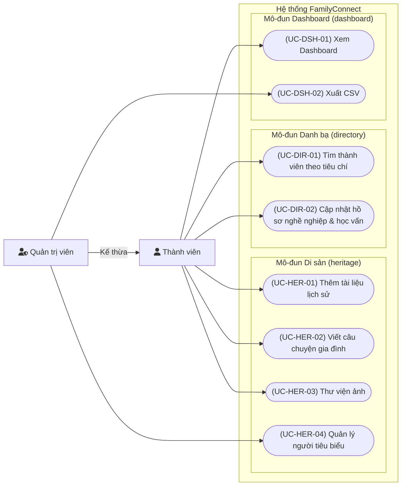

# Use case: Heritage, Directory, Dashboard

> **Người viết:** TV4 (Huy Quốc) | **Reviewer:** TV2 (Nguyễn Minh Trí) | **Task Jira:** SCRUM-22 | **Hạn nộp review:** Thứ Năm 8/10
> **Trạng thái:** Chờ review 
> Cách làm: tạo nhánh `docs/<mã SCRUM>-<tên-ngắn>` từ `develop`, điền vào file này, mở Pull Request vào `develop`. Xem `docs/README.md`.

# TÀI LIỆU ĐẶC TẢ MODULE: HERITAGE, DIRECTORY, DASHBOARD
**Mã task Jira:** SCRUM-22  
**Nhánh Git:** `docs/SCRUM-22-heritage-directory-dashboard`  
**Gói backend:** `com.familyconnect.modules.heritage`, `com.familyconnect.modules.directory`, `com.familyconnect.modules.dashboard`

---

## 1. YÊU CẦU CHỨC NĂNG (FR)
Theo tài liệu SRS mục 3, các yêu cầu chức năng thuộc phạm vi 3 module bao gồm:
* **Family Directory (Danh bạ):**
  * `FR-DIR-01`: Danh bạ thành viên.
  * `FR-DIR-02`: Hồ sơ nghề nghiệp (`profession_profile`).
  * `FR-DIR-03`: Hồ sơ học vấn (`education_profile`).
  * `FR-DIR-04`: Tìm thành viên theo nghề nghiệp, nơi ở hoặc thế hệ.
* **Family Heritage (Di sản):**
  * `FR-HER-01`: Quản lý tài liệu lịch sử (`heritage_document`).
  * `FR-HER-02`: Đăng tải và đọc câu chuyện gia đình (`family_story`).
  * `FR-HER-03`: Quản lý danh sách người tiêu biểu (`outstanding_member`).
  * `FR-HER-04`: Thư viện ảnh (sử dụng chung bảng `media` của module `community`).
  * `FR-HER-05`: Kho lưu trữ số.
* **Dashboard & Reporting (Thống kê):**
  * `FR-DSH-01`: Thống kê gia đình.
  * `FR-DSH-02`: Dashboard hoạt động cộng đồng.
  * `FR-DSH-03`: Thống kê sự kiện.
  * `FR-DSH-04`: Thống kê nhân khẩu.
  * `FR-DSH-05`: Tạo báo cáo (xuất PDF, xuất dữ liệu CSV).

---

## 2. SƠ ĐỒ VÀ ĐẶC TẢ USE CASE
### 2.1

### 2.2 Danh sách Actor & Mối quan hệ
* **Thành viên (`MEMBER`):** Người dùng đã đăng nhập và được Trưởng chi xác minh vào gia đình (sở hữu `family_id` hợp lệ).
* **Quản trị viên (`BRANCH_ADMIN`, `SYSTEM_ADMIN`):** Kế thừa toàn bộ quyền hạn của `MEMBER` (mối quan hệ *Generalization*), bổ sung quyền phê duyệt, quản lý danh sách người tiêu biểu và trích xuất dữ liệu tổng hợp.

---

### 2.3 Đặc tả chi tiết 8 Use Case

#### UC-DIR-01: Tìm thành viên theo nghề nghiệp, nơi ở, thế hệ
* **Mã UC:** `UC-DIR-01` (Khớp `FR-DIR-04`)
* **Actor:** `MEMBER`, `BRANCH_ADMIN`, `SYSTEM_ADMIN`.
* **Tiền điều kiện:** Người dùng đã xác thực, có token hợp lệ và đã được phê duyệt vào gia đình (`family_id`).
* **Luồng chính:**
  1. Người dùng truy cập Danh bạ, nhập tiêu chí tìm kiếm: Nghề nghiệp (`job`), Nơi ở (`location`) hoặc Thế hệ (`generation`).
  2. Hệ thống kiểm tra ngữ cảnh xác thực, lấy `family_id` từ token.
  3. Hệ thống truy vấn các thành viên thỏa mãn điều kiện thuộc `family_id` đó.
  4. Hệ thống kiểm tra độ tuổi của từng thành viên:
     * Thành viên $\ge$ 16 tuổi: Trả về đầy đủ họ tên, quan hệ, năm sinh, nghề nghiệp, nơi ở.
     * Trẻ em < 16 tuổi: **Bắt buộc ẩn** liên hệ, nơi làm việc, trường học và ngày sinh chi tiết; chỉ trả về họ tên, quan hệ và năm sinh.
  5. Hệ thống hiển thị danh sách kết quả kèm phân trang.
* **Luồng thay thế / Lỗi:**
  * Chưa đăng nhập / token hết hạn: Trả về 401 `AUTH_001` / `AUTH_002`.
  * Chưa được duyệt vào gia đình: Trả về 403 `PERM_002`.
  * Không có kết quả: Hiển thị danh sách rỗng (`data: []`).
* **Hậu điều kiện:** Người dùng xem được danh bạ theo đúng chính sách quyền riêng tư.
* **Quy tắc nghiệp vụ:** Bắt buộc lọc theo `family_id` để ngăn chặn IDOR. Tuân thủ nghiêm ngặt chính sách bảo vệ trẻ em theo `privacy.md` (mục 4).

---

#### UC-DIR-02: Cập nhật hồ sơ nghề nghiệp & học vấn
* **Mã UC:** `UC-DIR-02` (Khớp `FR-DIR-02`, `FR-DIR-03`)
* **Actor:** `MEMBER`, `BRANCH_ADMIN`.
* **Tiền điều kiện:** Đã đăng nhập. Người dùng chỉ được sửa hồ sơ của chính mình hoặc cha mẹ sửa hồ sơ của con em dưới 16 tuổi.
* **Luồng chính:**
  1. Người dùng chọn cập nhật thông tin nghề nghiệp (chức vụ, công ty, địa điểm) hoặc học vấn (trường, bằng cấp, năm tốt nghiệp).
  2. Hệ thống kiểm tra tính hợp lệ của dữ liệu (năm tốt nghiệp $\ge$ 1900 và $\le$ năm hiện tại + 10).
  3. Hệ thống lưu/cập nhật thông tin vào bảng `profession_profile` hoặc `education_profile`.
  4. Trả về thông báo thành công kèm dữ liệu cập nhật.
* **Luồng thay thế / Lỗi:**
  * Dữ liệu không hợp lệ: Trả về 400 `VALID_001`.
  * Cố ý sửa hồ sơ của người khác khi không có quyền: Trả về 403 `PERM_001`.
* **Hậu điều kiện:** Dữ liệu hồ sơ cá nhân được đồng bộ.
* **Quy tắc nghiệp vụ:** Trẻ em dưới 16 tuổi không có tài khoản riêng; hồ sơ do cha mẹ hoặc trưởng chi quản lý.

---

#### UC-HER-01: Thêm tài liệu lịch sử
* **Mã UC:** `UC-HER-01` (Khớp `FR-HER-01`, `FR-HER-05`)
* **Actor:** `MEMBER`, `BRANCH_ADMIN`, `SYSTEM_ADMIN`.
* **Tiền điều kiện:** Đã đăng nhập và được duyệt gia đình. File tài liệu đã được tải lên module Community và có `media_id` hợp lệ.
* **Luồng chính:**
  1. Người dùng nhập Tiêu đề, Mô tả và liên kết `media_id` tương ứng.
  2. Hệ thống kiểm tra `media_id` có tồn tại trong bảng `community.media` và chưa bị xóa mềm.
  3. Hệ thống ghi bản ghi mới vào bảng `heritage_document` gắn liền với `family_id`.
  4. Trả về mã HTTP 201 Created.
* **Luồng thay thế / Lỗi:**
  * Thiếu tiêu đề hoặc `media_id` không hợp lệ: Trả về 400 `VALID_001`.
  * Chưa duyệt xác minh: Trả về 403 `PERM_002`.
* **Hậu điều kiện:** Bản ghi tài liệu lịch sử xuất hiện trong kho lưu trữ số của dòng họ.
* **Quy tắc nghiệp vụ:** Không tạo bảng lưu trữ file/ảnh riêng, toàn bộ tệp đính kèm sử dụng khóa ngoại trỏ tới bảng `media` của module Community.

---

#### UC-HER-02: Viết câu chuyện gia đình
* **Mã UC:** `UC-HER-02` (Khớp `FR-HER-02`)
* **Actor:** `MEMBER`, `BRANCH_ADMIN`, `SYSTEM_ADMIN`.
* **Tiền điều kiện:** Đã đăng nhập và xác minh.
* **Luồng chính:**
  1. Người dùng nhập Tiêu đề, Nội dung câu chuyện, chọn đối tượng liên quan (nếu có).
  2. Hệ thống kiểm tra dữ liệu, tự động gán `author_id` (người tạo) và `family_id`.
  3. Hệ thống lưu vào bảng `family_story`.
  4. Trả về HTTP 201 Created.
* **Luồng thay thế / Lỗi:**
  * Nội dung hoặc tiêu đề rỗng: Trả về 400 `VALID_001`.
* **Hậu điều kiện:** Câu chuyện được hiển thị trên bảng tin di sản của gia đình.

---

#### UC-HER-03: Thư viện ảnh dòng họ
* **Mã UC:** `UC-HER-03` (Khớp `FR-HER-04`)
* **Actor:** `MEMBER`, `BRANCH_ADMIN`, `SYSTEM_ADMIN`.
* **Tiền điều kiện:** Đã đăng nhập và xác minh.
* **Luồng chính:**
  1. Người dùng truy cập Thư viện ảnh để xem danh sách hoặc tải ảnh mới.
  2. Khi tải ảnh, client gửi file lên endpoint của module Community để nhận `media_id`.
  3. Hệ thống phân loại ảnh với danh mục `HERITAGE` và hiển thị trên lưới ảnh chung của dòng họ.
* **Luồng thay thế / Lỗi:**
  * File sai định dạng hoặc vượt quá kích thước cho phép: Trả về 400 `VALID_001`.
  * Lỗi xử lý lưu trữ tệp: Trả về 500 `SYS_001`.
* **Hậu điều kiện:** Lưới ảnh thư viện hiển thị ảnh mới.
* **Quy tắc nghiệp vụ:** Dùng chung bảng `media`, gắn thẻ loại `HERITAGE` và lọc theo `family_id`.

---

#### UC-HER-04: Quản lý người tiêu biểu
* **Mã UC:** `UC-HER-04` (Khớp `FR-HER-03`)
* **Actor:** `BRANCH_ADMIN`, `SYSTEM_ADMIN`.
* **Tiền điều kiện:** Tài khoản có quyền quản trị.
* **Luồng chính:**
  1. Quản trị viên chọn thành viên từ danh bạ, nhập thành tích vinh danh và thứ tự hiển thị.
  2. Hệ thống kiểm tra thành viên có thuộc cùng `family_id` hay không.
  3. Ghi dữ liệu vào bảng `outstanding_member`.
  4. Trả về HTTP 201 Created.
* **Luồng thay thế / Lỗi:**
  * Tài khoản `MEMBER` thông thường gọi API: Trả về 403 `PERM_001` (Không đủ quyền).
  * Thành viên đã có tên trong danh sách tiêu biểu: Trả về 400 `VALID_001`.
* **Hậu điều kiện:** Thành viên xuất hiện trong danh sách vinh danh của dòng họ.
* **Quy tắc nghiệp vụ:** Chỉ quản trị viên mới có quyền thêm/sửa/xóa danh sách này.

---

#### UC-DSH-01: Xem Dashboard tổng quan
* **Mã UC:** `UC-DSH-01` (Khớp `FR-DSH-01`, `FR-DSH-02`, `FR-DSH-03`, `FR-DSH-04`)
* **Actor:** `MEMBER`, `BRANCH_ADMIN`, `SYSTEM_ADMIN`.
* **Tiền điều kiện:** Đã đăng nhập và xác minh.
* **Luồng chính:**
  1. Người dùng truy cập màn hình Dashboard.
  2. Module Dashboard thực hiện các truy vấn đọc tổng hợp số liệu trong cùng `family_id`:
     * Tổng số thành viên.
     * Phân bố theo thế hệ.
     * Tỷ lệ giới tính nam/nữ.
     * Thống kê nghề nghiệp và khu vực sinh sống.
     * Số bài đăng theo tuần.
     * Tối đa 5 sự kiện sắp diễn ra gần nhất (tiêu đề, thời gian bắt đầu).
  3. Trả về dữ liệu dạng JSON Object duy nhất, không dùng phân trang.
* **Luồng thay thế / Lỗi:**
  * Chưa xác thực: Trả về 401 `AUTH_001` / `AUTH_002`.
  * Chưa xác minh gia đình: Trả về 403 `PERM_002`.
* **Hậu điều kiện:** Biểu đồ Dashboard hiển thị trực quan dữ liệu nhân khẩu và hoạt động.
* **Quy tắc nghiệp vụ:** Dashboard là module chỉ đọc (`Read-only`), chỉ đọc qua interface Java nội bộ hoặc truy vấn đọc trực tiếp, tuyệt đối không sửa đổi dữ liệu module khác.

---

#### UC-DSH-02: Xuất báo cáo CSV
* **Mã UC:** `UC-DSH-02` (Khớp `FR-DSH-05`)
* **Actor:** `BRANCH_ADMIN`, `SYSTEM_ADMIN`.
* **Tiền điều kiện:** Tài khoản quản trị đã xác minh.
* **Luồng chính:**
  1. Quản trị viên nhấn nút "Xuất CSV" trên trang Dashboard.
  2. Hệ thống kiểm tra quyền `ADMIN`.
  3. Hệ thống truy vấn toàn bộ dữ liệu nhân khẩu học theo `family_id` và định dạng thành tệp UTF-8 CSV.
  4. Trả về tệp tải xuống với Header `Content-Type: text/csv`.
* **Luồng thay thế / Lỗi:**
  * `MEMBER` thông thường gọi API: Trả về 403 `PERM_001`.
* **Hậu điều kiện:** Tệp CSV được tải về thiết bị quản trị viên.

---

## 3. THIẾT KẾ CƠ SỞ DỮ LIỆU (DATABASE SCHEMA)
*Mọi bảng đều tuân thủ quy ước: Có `id`, `created_at`, `updated_at`, `deleted_at`, `created_by`, `updated_by` (không dùng `created_date`). Toàn bộ khóa ngoại đều có hành vi xóa và chỉ mục Index để tối ưu truy vấn.*

```sql
-- 1. Bảng tài liệu lịch sử
CREATE TABLE heritage_document (
    id UUID PRIMARY KEY DEFAULT gen_random_uuid(),
    family_id UUID NOT NULL,
    title VARCHAR(255) NOT NULL,
    description TEXT,
    media_id UUID NOT NULL,
    created_at TIMESTAMP WITH TIME ZONE NOT NULL DEFAULT CURRENT_TIMESTAMP,
    updated_at TIMESTAMP WITH TIME ZONE NOT NULL DEFAULT CURRENT_TIMESTAMP,
    deleted_at TIMESTAMP WITH TIME ZONE NULL,
    created_by UUID NOT NULL,
    updated_by UUID NOT NULL,
    CONSTRAINT fk_heritage_doc_media FOREIGN KEY (media_id) REFERENCES media(id) ON DELETE RESTRICT
);
CREATE INDEX idx_heritage_doc_family ON heritage_document (family_id, deleted_at);

-- 2. Bảng câu chuyện gia đình
CREATE TABLE family_story (
    id UUID PRIMARY KEY DEFAULT gen_random_uuid(),
    family_id UUID NOT NULL,
    title VARCHAR(255) NOT NULL,
    content TEXT NOT NULL,
    author_id UUID NOT NULL,
    created_at TIMESTAMP WITH TIME ZONE NOT NULL DEFAULT CURRENT_TIMESTAMP,
    updated_at TIMESTAMP WITH TIME ZONE NOT NULL DEFAULT CURRENT_TIMESTAMP,
    deleted_at TIMESTAMP WITH TIME ZONE NULL,
    created_by UUID NOT NULL,
    updated_by UUID NOT NULL,
    CONSTRAINT fk_family_story_author FOREIGN KEY (author_id) REFERENCES person(id) ON DELETE CASCADE
);
CREATE INDEX idx_family_story_family ON family_story (family_id, deleted_at);

-- 3. Bảng người tiêu biểu
CREATE TABLE outstanding_member (
    id UUID PRIMARY KEY DEFAULT gen_random_uuid(),
    family_id UUID NOT NULL,
    person_id UUID NOT NULL,
    achievement TEXT NOT NULL,
    display_order INT DEFAULT 0,
    created_at TIMESTAMP WITH TIME ZONE NOT NULL DEFAULT CURRENT_TIMESTAMP,
    updated_at TIMESTAMP WITH TIME ZONE NOT NULL DEFAULT CURRENT_TIMESTAMP,
    deleted_at TIMESTAMP WITH TIME ZONE NULL,
    created_by UUID NOT NULL,
    updated_by UUID NOT NULL,
    CONSTRAINT fk_outstanding_person FOREIGN KEY (person_id) REFERENCES person(id) ON DELETE CASCADE,
    CONSTRAINT uq_outstanding_person UNIQUE (family_id, person_id)
);
CREATE INDEX idx_outstanding_family ON outstanding_member (family_id, deleted_at);

-- 4. Bảng hồ sơ nghề nghiệp
CREATE TABLE profession_profile (
    id UUID PRIMARY KEY DEFAULT gen_random_uuid(),
    family_id UUID NOT NULL,
    person_id UUID NOT NULL,
    job_title VARCHAR(150) NOT NULL,
    company VARCHAR(255),
    location VARCHAR(255),
    created_at TIMESTAMP WITH TIME ZONE NOT NULL DEFAULT CURRENT_TIMESTAMP,
    updated_at TIMESTAMP WITH TIME ZONE NOT NULL DEFAULT CURRENT_TIMESTAMP,
    deleted_at TIMESTAMP WITH TIME ZONE NULL,
    created_by UUID NOT NULL,
    updated_by UUID NOT NULL,
    CONSTRAINT fk_prof_person FOREIGN KEY (person_id) REFERENCES person(id) ON DELETE CASCADE
);
CREATE INDEX idx_prof_family_person ON profession_profile (family_id, person_id, deleted_at);

-- 5. Bảng hồ sơ học vấn
CREATE TABLE education_profile (
    id UUID PRIMARY KEY DEFAULT gen_random_uuid(),
    family_id UUID NOT NULL,
    person_id UUID NOT NULL,
    school VARCHAR(255) NOT NULL,
    degree VARCHAR(100),
    graduation_year INT CHECK (graduation_year >= 1900 AND graduation_year <= 2100),
    created_at TIMESTAMP WITH TIME ZONE NOT NULL DEFAULT CURRENT_TIMESTAMP,
    updated_at TIMESTAMP WITH TIME ZONE NOT NULL DEFAULT CURRENT_TIMESTAMP,
    deleted_at TIMESTAMP WITH TIME ZONE NULL,
    created_by UUID NOT NULL,
    updated_by UUID NOT NULL,
    CONSTRAINT fk_edu_person FOREIGN KEY (person_id) REFERENCES person(id) ON DELETE CASCADE
);
CREATE INDEX idx_edu_family_person ON education_profile (family_id, person_id, deleted_at);
```
## 4. CHỈ SỐ DASHBOARD & CÂU TRUY VẤN SQL CHUẨN HÓA
```sql
### 4.1 Tổng thành viên:
SELECT COUNT(*) AS total_members
FROM person
WHERE family_id = :familyId AND deleted_at IS NULL;

### 4.2 Thống kê theo thế hệ:
SELECT generation, COUNT(*) AS count
FROM person
WHERE family_id = :familyId AND deleted_at IS NULL
GROUP BY generation
ORDER BY generation ASC;

### 4.3 Thống kê giới tính (Nam / Nữ):
SELECT gender, COUNT(*) AS count
FROM person
WHERE family_id = :familyId AND deleted_at IS NULL
GROUP BY gender;

### 4.4 Thống kê nghề nghiệp (lấy hồ sơ nghề nghiệp mới nhất của từng người để tránh đếm trùng):
WITH latest_profession AS (
    SELECT DISTINCT ON (person_id) job_title
    FROM profession_profile
    WHERE family_id = :familyId AND deleted_at IS NULL
    ORDER BY person_id, created_at DESC
)
SELECT job_title, COUNT(*) AS count
FROM latest_profession
GROUP BY job_title
ORDER BY count DESC;

### 4.5 Thống kê nơi ở (lấy nơi ở mới nhất của từng người):
WITH latest_location AS (
    SELECT DISTINCT ON (person_id) location
    FROM profession_profile
    WHERE family_id = :familyId AND deleted_at IS NULL AND location IS NOT NULL
    ORDER BY person_id, created_at DESC
)
SELECT location, COUNT(*) AS count
FROM latest_location
GROUP BY location
ORDER BY count DESC;

### 4.6 Thống kê số lượng bài đăng theo tuần (lọc bài viết chưa bị xóa):
SELECT DATE_TRUNC('week', created_at) AS week_start, COUNT(*) AS post_count
FROM post
WHERE family_id = :familyId AND deleted_at IS NULL
GROUP BY week_start
ORDER BY week_start DESC
LIMIT 8;

### 4.7 Danh sách 5 sự kiện sắp diễn ra gần nhất (lọc sự kiện chưa bị xóa):
SELECT id, title, start_time
FROM event
WHERE family_id = :familyId 
  AND deleted_at IS NULL 
  AND start_time >= CURRENT_TIMESTAMP
ORDER BY start_time ASC
LIMIT 5;
```
