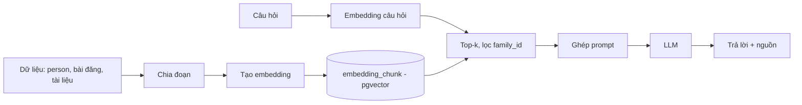

# Thiết kế AI và RAG

> **Người viết:** TV5 (Lê Nhựt) | **Reviewer:** TV3 (PiLo257) | **Task Jira:** SCRUM-34 | **Hạn nộp review:** Thứ Năm 15/10 (Sprint 2); spike: SCRUM-24 hạn Thứ Tư 7/10
> **Trạng thái:** Nháp 
> Cách làm: tạo nhánh `docs/<mã SCRUM>-<tên-ngắn>` từ `develop`, điền vào file này, mở Pull Request vào `develop`. Xem `docs/README.md`.

## 1. Kết quả spike (SCRUM-24)
1. Embedding tiếng Việt
   ├── Model: gemini-embedding-001
   ├── Dimension: 3072
   ├── Average: 683.5035 ms
   └── Kết luận: Đạt
2. Độ trễ
   ├── Embedding: 683.5035 ms
   ├── Semantic Search: 588.2618 ms
   └── P95 Search: 628.1556 ms
3. Chi phí ước tính
   ├── Tính theo input/output tokens
   ├── Gemini Flash: $0.75 / 1M input
   └── $3.75 / 1M output
      (đến 31/12/2026)
4. Chọn LLM Provider
   |── Gemini: Đã tích hợp + benchmark
5. Decision
   └── Chọn Gemini
## 2. Pipeline RAG


## 3. Phân đoạn dữ liệu
> Mỗi person thành một đoạn mô tả; bài đăng/câu chuyện cắt khoảng 300-500 từ.

## 4. Prompt hệ thống mẫu
```
Bạn là trợ lý gia phả. Chỉ trả lời dựa trên ngữ cảnh được cung cấp.
Nếu ngữ cảnh không có thông tin, trả lời "Không tìm thấy thông tin".
...
```

## 5. Xử lý khi AI không biết, và giới hạn
> Ngưỡng điểm tối thiểu, cache, giới hạn số câu hỏi mỗi người/giờ, xử lý timeout.

## 6. Quyền dữ liệu
> Lọc theo `family_id` và quyền xem; không gửi mật khẩu/số điện thoại cho LLM (xem `privacy.md`).

## 7. Các dịch vụ AI
| Dịch vụ | API | Ghi chú |
|---|---|---|
| Tìm kiếm ngữ nghĩa | GET /api/v1/search | |
| Chatbot | POST /api/v1/ai/chat | |
| Giải thích quan hệ | POST /api/v1/ai/explain-relationship | dùng kết quả của thuật toán, không để LLM tự suy luận |
| Tóm tắt | POST /api/v1/ai/summarize | |
| Gợi ý | GET /api/v1/ai/recommendations | |
