# Đặc tả thuật toán xác định quan hệ họ hàng ("A là gì của B")

> **Người viết:** TV2 (Nguyễn Minh Trí) | **Reviewer:** TV5 (Lê Nhựt) | **Task Jira:** SCRUM-19 (1-06)
> **Phiên bản:** 0.1 (bản nháp) | **Nhánh:** `docs/SCRUM-19-relationship-algorithm`
> **Liên quan:** FR-GEN-07, FR-GEN-08, FR-AI-03 | UC-GEN-07, UC-GEN-08 | API `GET /families/{familyId}/relationship` | bảng `parent_child`, `person`, `marriage`

---

## 1. Các quan hệ cần hỗ trợ

Mỗi cặp (A, B) được quy về hai số, tính từ **tổ tiên chung gần nhất (LCA)**:
- **a** = số đời từ A lên LCA; **b** = số đời từ B lên LCA.
- Kết quả đọc theo hướng **"A là gì của B"** (trùng `stepsFromA`, `stepsFromB` trong OpenAPI).

| (a, b) | Quan hệ | Nhóm theo task | Mức |
|---|---|---|---|
| (0, 1) | A là cha/mẹ của B | cha/mẹ | Bắt buộc |
| (1, 0) | A là con của B | con | Bắt buộc |
| (1, 1) | A là anh/chị/em của B | anh chị em | Bắt buộc |
| (0, 2) | A là ông/bà của B | ông bà | Bắt buộc |
| (2, 0) | A là cháu của B | cháu | Bắt buộc |
| (1, 2) | A là anh/chị/em của cha hoặc mẹ B | chú bác, cô dì, cậu dì | Bắt buộc |
| (2, 1) | A là con của anh/chị/em B | cháu | Bắt buộc |
| (2, 2) | A và B là con của hai anh/chị/em | anh em họ | Bắt buộc |
| (0, 3), (3, 0) | cụ (cố), chắt | mở rộng | Đã chốt làm |
| vợ/chồng | quan hệ qua hôn nhân: bác, thím, mợ, dượng, vợ, chồng | mở rộng | Lớp mở rộng |
| các cặp khác | họ xa hơn | | Trả `supported = false` |

## 2. Cách gọi tên (chuẩn miền Nam)

### 2.1. Nguyên tắc
- **Nội / ngoại:** dựa vào bước đầu tiên đi lên.
  - Với **ông bà, cụ** và **anh/chị/em của cha mẹ**: xét bước đầu của **B** (qua cha là nội, qua mẹ là ngoại).
  - Với **cháu, chắt**: xét bước đầu của **A** (A thuộc con trai của B là nội, con gái của B là ngoại).
- **Hơn/kém tuổi** so sánh bằng năm sinh. Thiếu năm sinh hoặc cùng năm: dùng tên chung (anh/chị/em, bác/chú).
- **Con nuôi / con kế:** vẫn tính, thêm nhãn "(nuôi)" hoặc "(kế)" (BR-GEN-13).
- **Anh chị em họ:** gọi theo **tuổi thật** của A và B, kèm "bên nội/ngoại" xét theo bước đầu của B (đơn giản hóa, ghi trong báo cáo).
- Không dùng cách gọi theo thứ ("Hai", "Ba"...) vì chưa có dữ liệu thứ tự sinh. Ghi vào phần mở rộng.

### 2.2. Bảng ánh xạ chính
| (a, b) | Điều kiện | Tên gọi |
|---|---|---|
| (0, 1) | A nam / A nữ | cha / mẹ |
| (1, 0) | | con |
| (1, 1) | A lớn hơn B / nhỏ hơn / không rõ | anh (nam), chị (nữ) / em / anh/chị/em |
| (1, 1) | chỉ chung một cha hoặc một mẹ | thêm "(cùng cha khác mẹ)" hoặc "(cùng mẹ khác cha)" |
| (0, 2) | B đi lên qua cha / qua mẹ | ông (bà) nội / ông (bà) ngoại |
| (2, 0) | A đi lên qua cha / qua mẹ | cháu nội / cháu ngoại |
| (0, 3) | B đi lên qua cha / qua mẹ | ông (bà) cố nội / cố ngoại |
| (3, 0) | A đi lên qua cha / qua mẹ | chắt nội / chắt ngoại |
| (2, 1) | | cháu |
| (2, 2) | tuổi A so với B | anh/chị họ, em họ (bên nội/ngoại) |

### 2.3. Anh/chị/em của cha mẹ B, (a, b) = (1, 2)

| A là | Bên cha (B đi lên qua cha) | Bên mẹ (B đi lên qua mẹ) |
|---|---|---|
| Nam, **lớn hơn** cha/mẹ B | **bác** | **cậu** |
| Nam, **nhỏ hơn** cha/mẹ B | **chú** | **cậu** |
| Nữ (chị hoặc em) | **cô** | **dì** |
| Nam, thiếu năm sinh | bác/chú | cậu |

Bên cha: so tuổi A với **cha của B**. Bảng này đặt trong **cấu hình** để nhóm đổi cách gọi theo gia đình mà không sửa code.

### 2.4. Lớp mở rộng: quan hệ qua hôn nhân
Khi A và B **không có quan hệ huyết thống**, hệ thống xét vợ/chồng của A:

| Nếu vợ/chồng của A là ... của B | thì A là |
|---|---|
| bác | bác (vợ bác) |
| chú | thím |
| cậu | mợ |
| cô, dì | dượng |
| (A và B là vợ chồng) | vợ / chồng |

Các trường hợp khác (chị dâu, em rể, con dâu, con rể...) trả `NO_RELATION`, ghi là hạn chế.

---

## 3. Thuật toán

**Đầu vào:** hai thành viên A, B cùng gia đình. **Đầu ra:** tên quan hệ, tổ tiên chung, a, b, đường đi.

1. Nếu A = B: trả "Cùng một người".
2. **Tìm tổ tiên** của A và của B bằng truy vấn đệ quy lên `parent_child`, giới hạn **6 đời**. Mỗi tổ tiên lưu: số đời (`depth`), vai trò ở **bước đi lên đầu tiên** (`firstRole` = FATHER hoặc MOTHER), đường đi, và cờ "có cạnh nuôi/kế". Bản thân A và B tính là tổ tiên ở độ sâu 0.
3. **Tìm LCA:** giao hai tập tổ tiên, chọn người có **a + b nhỏ nhất**. Nếu hòa, ưu tiên đường qua cha.
4. **Với (1, 1):** nếu có từ 2 tổ tiên chung ở độ sâu 1 thì là anh chị em ruột; chỉ 1 thì thêm "cùng cha khác mẹ" hoặc ngược lại.
5. **Xác định nội/ngoại** theo quy tắc mục 2.1.
6. **So tuổi** khi cần (anh/em, bác/chú, anh/em họ); thiếu dữ liệu thì dùng tên chung.
7. **Tra bảng ánh xạ** (mục 2.2, 2.3) ra tên gọi.
8. **Không có tổ tiên chung:** thử lớp mở rộng (mục 2.4); không có kết quả thì trả `NO_RELATION`.
9. **Cặp (a, b) không có trong bảng:** trả `supported = false` kèm a, b.
10. **Trả kết quả:** tên quan hệ, mô tả câu, `commonAncestorId`, `stepsFromA`, `stepsFromB`, `pathPersonIds` (từ A lên LCA rồi xuống B) để hiển thị trực quan quan hệ trên cây (UC-GEN-07).

**Trường hợp đặc biệt:**
- Cặp nối bằng nhiều đường (ví dụ họ hàng kết hôn với nhau): chọn đường ngắn nhất.
- Giới tính `OTHER`: dùng tên trung tính (anh/chị/em, bác/chú/cô).
- Hai người khác gia đình: từ chối (lỗi 403/404 ở tầng API).

## 4. Mã giả (pseudo-code)

```
function relationship(A, B):
    if A == B: return {status: SAME}

    ancA = ancestors(A)      // map: id -> (depth, firstRole, path, hasAdoptedEdge)
    ancB = ancestors(B)
    common = keys(ancA) ∩ keys(ancB)

    if common is empty:
        return extension(A, B)            // lớp hôn nhân, hoặc NO_RELATION

    lca = argmin over x in common of (ancA[x].depth + ancB[x].depth)   // hòa: ưu tiên đường qua cha
    a, b   = ancA[lca].depth, ancB[lca].depth
    fa, fb = ancA[lca].firstRole, ancB[lca].firstRole
    tag    = "(nuôi/kế)" if ancA[lca].hasAdoptedEdge or ancB[lca].hasAdoptedEdge else ""

    switch (a, b):
        (0,1): name = A.male ? "cha" : "mẹ"
        (1,0): name = "con"
        (1,1): name = siblingName(A, B, countCommonAtDepth1(common) )
        (0,2): name = (A.male ? "ông " : "bà ") + side(fb)
        (2,0): name = "cháu " + side(fa)
        (0,3): name = (A.male ? "ông " : "bà ") + "cố " + side(fb)
        (3,0): name = "chắt " + side(fa)
        (2,1): name = "cháu"
        (1,2): name = uncleAuntName(A, B, fb, ancB[lca].path[1])   // bảng mục 2.3
        (2,2): name = cousinName(A, B, fb)
        default: return {supported: false, stepsFromA: a, stepsFromB: b}

    return {supported: true, relation: name + tag, commonAncestorId: lca,
            stepsFromA: a, stepsFromB: b,
            pathPersonIds: ancA[lca].path + reverse(ancB[lca].path) minus duplicate lca}

function ancestors(p):                // BFS lên tối đa 6 đời, duyệt FATHER trước MOTHER
    result = { p: (0, null, [p], false) }
    frontier = [p]
    for d in 1..6:
        next = []
        for x in frontier:
            for (parent, role, kind) in parentsOf(x):          // truy vấn bảng parent_child
                if parent not in result:
                    result[parent] = (d, result[x].firstRole ?? role,
                                      result[x].path + [parent],
                                      result[x].hasAdoptedEdge or kind != BIOLOGICAL)
                    next.append(parent)
        frontier = next
    return result

function side(role):  return role == FATHER ? "nội" : "ngoại"

function siblingName(A, B, nCommon):
    base = older(A,B) is null ? "anh/chị/em" : older(A,B) ? (A.male ? "anh" : "chị") : "em"
    return base + (nCommon >= 2 ? "" : " (cùng cha khác mẹ hoặc cùng mẹ khác cha)")

function uncleAuntName(A, B, fb, parentOfB):
    if fb == FATHER:
        if A.female: return "cô"
        o = older(A, parentOfB)
        return o is null ? "bác/chú" : (o ? "bác" : "chú")
    return A.male ? "cậu" : "dì"

function extension(A, B):
    if B in spouses(A): return A.male ? "chồng" : "vợ"
    for S in spouses(A):
        r = relationship(S, B)
        if r is supported and r.name in {bác→bác, chú→thím, cậu→mợ, cô→dượng, dì→dượng}:
            return mapped name
    return NO_RELATION
```

`older(X, Y)` so sánh năm sinh; trả `null` nếu thiếu năm sinh hoặc cùng năm.

**Truy vấn lấy cha mẹ (một bước)** cho `parentsOf(x)`:
```sql
SELECT parent_id, parent_role, kind FROM parent_child WHERE child_id = :x ORDER BY parent_role = 'FATHER' DESC;
```
Cách tối ưu: một câu **recursive CTE** lấy toàn bộ tổ tiên một lần cho mỗi người, giới hạn `depth <= 6`.

## 5. Độ phức tạp

- Mỗi lần tìm tổ tiên duyệt tối đa 6 đời. Mỗi người có tối đa 2 cha mẹ ruột và có thể thêm cha mẹ nuôi, kế, nên số nút tối đa là O(2^6) = 64 nút (kể cả trường hợp xấu).
- Với đồ thị gồm V nút, E cạnh phần được duyệt: **O(V + E)** cho mỗi người, tức hằng số nhỏ vì giới hạn 6 đời.
- Giao hai tập tổ tiên: **O(V)** khi dùng bảng băm.
- Tổng: **O(V + E)** với V, E nhỏ (tối đa vài chục nút). Với CSDL, cần index `parent_child(child_id)` và `parent_child(parent_id)` để mỗi truy vấn là O(log n).
- Mục tiêu hiệu năng: dưới 1 giây (NFR-12); thực tế dự kiến vài mili giây đến vài chục mili giây.

## 6. Gia phả mẫu dùng cho kiểm thử

Gia phả mẫu có 4 đời (từ Tổ đến Bảo), 33 người, gồm cả trường hợp đặc biệt: anh em cùng cha khác mẹ (Tuấn), con nuôi (Nhân), thiếu ngày sinh (Hà), họ xa (Long).

### 6.1. Sơ đồ (năm sinh sau tên; ? là chưa rõ)

```mermaid
flowchart TD
  To["Tổ 1920"]
  Co["Cội 1924"]
  Hai["Hải 1946"]
  Cuong["Cường 1950"]
  Hoa["Hoa 1953"]
  Dung["Dũng 1956"]
  Lan["Lan 1948"]
  Yen["Yến 1958"]
  Son["Sơn 1950"]
  Phat["Phát 1925"]
  Sen["Sen 1928"]
  Quan["Quân 1950"]
  Mai["Mai 1954"]
  Thu["Thu 1958"]
  Hong["Hồng 1952"]
  Phuong["Phương 1960"]
  An["An 1975"]
  Bich["Bích 1978"]
  Khai["Khải 1972"]
  Linh["Linh 1980"]
  Phuc["Phúc 1982"]
  Ha["Hà ?"]
  Tam["Tâm 1979"]
  Vinh["Vinh 1976"]
  Tuan["Tuấn 1985"]
  Huong["Hương 1976"]
  Duc["Đức 1975"]
  Bao["Bảo 2003"]
  Chau["Châu 2006"]
  Giang["Giang 2008"]
  Nhan["Nhân 2010"]
  Long["Long 2001"]
  Ngan["Ngân 1975"]
  To-->Hai
  Co-->Hai
  To-->Cuong
  Co-->Cuong
  To-->Hoa
  Co-->Hoa
  To-->Dung
  Co-->Dung
  Hai-->Khai
  Lan-->Khai
  Hai-->Linh
  Lan-->Linh
  Dung-->Phuc
  Yen-->Phuc
  Dung-->Ha
  Yen-->Ha
  Hoa-->Tam
  Son-->Tam
  Phat-->Mai
  Sen-->Mai
  Phat-->Quan
  Sen-->Quan
  Phat-->Thu
  Sen-->Thu
  Quan-->Vinh
  Hong-->Vinh
  Cuong-->An
  Mai-->An
  Cuong-->Bich
  Mai-->Bich
  Cuong-->Tuan
  Phuong-->Tuan
  An-->Bao
  Huong-->Bao
  An-->Chau
  Huong-->Chau
  An-->Nhan
  Huong-->Nhan
  Duc-->Giang
  Bich-->Giang
  Khai-->Long
  Ngan-->Long
```


### 6.2. Bảng dữ liệu mẫu

Quan hệ cha-mẹ-con (bảng `parent_child`, một dòng một người con):

| Người con | Cha | Mẹ | Loại |
|---|---|---|---|
| Hải (nam, 1946) | Tổ | Cội | ruột |
| Cường (nam, 1950) | Tổ | Cội | ruột |
| Hoa (nữ, 1953) | Tổ | Cội | ruột |
| Dũng (nam, 1956) | Tổ | Cội | ruột |
| Khải (nam, 1972) | Hải | Lan | ruột |
| Linh (nữ, 1980) | Hải | Lan | ruột |
| Phúc (nam, 1982) | Dũng | Yến | ruột |
| Hà (nữ, ?) | Dũng | Yến | ruột |
| Tâm (nữ, 1979) | Sơn | Hoa | ruột |
| Mai (nữ, 1954) | Phát | Sen | ruột |
| Quân (nam, 1950) | Phát | Sen | ruột |
| Thu (nữ, 1958) | Phát | Sen | ruột |
| Vinh (nam, 1976) | Quân | Hồng | ruột |
| An (nam, 1975) | Cường | Mai | ruột |
| Bích (nữ, 1978) | Cường | Mai | ruột |
| Tuấn (nam, 1985) | Cường | Phương | ruột |
| Bảo (nam, 2003) | An | Hương | ruột |
| Châu (nữ, 2006) | An | Hương | ruột |
| Nhân (nam, 2010) | An | Hương | nuôi |
| Giang (nữ, 2008) | Đức | Bích | ruột |
| Long (nam, 2001) | Khải | Ngân | ruột |

Hôn nhân (bảng `marriage`, trạng thái `MARRIED`):
- Hải và Lan
- Dũng và Yến
- Quân và Hồng
- Hoa và Sơn
- An và Hương
- Cường và Mai
- Cường và Phương
- Tổ và Cội
- Phát và Sen
- Bích và Đức

Giới tính và năm sinh lấy theo sơ đồ 6.1 (ví dụ Phúc nam 1982, Hà nữ chưa rõ năm sinh).

## 7. Bảng ca kiểm thử mẫu (39 ca)

Cột "(a, b)" là giá trị trung gian mà thuật toán phải tính ra. Kết quả đọc theo hướng **"A là gì của B"**. Bảng này được kiểm chứng bằng bản cài đặt thử của thuật toán trên đúng dữ liệu mục 6.

| # | A | B | (a, b) | Kết quả mong đợi | Mục đích |
|---|---|---|---|---|---|
| 1 | An | An |  | Cùng một người | Cùng một người |
| 2 | Cường | An | (0, 1) | Cường là **cha** của An | Cha |
| 3 | Mai | An | (0, 1) | Mai là **mẹ** của An | Mẹ |
| 4 | An | Cường | (1, 0) | An là **con** của Cường | Con |
| 5 | An | Bích | (1, 1) | An là **anh** của Bích | Anh chị em ruột, A lớn hơn |
| 6 | Bích | An | (1, 1) | Bích là **em** của An | Anh chị em ruột, A nhỏ hơn |
| 7 | An | Tuấn | (1, 1) | An là **anh (cùng cha khác mẹ)** của Tuấn | Cùng cha khác mẹ |
| 8 | Tuấn | An | (1, 1) | Tuấn là **em (cùng cha khác mẹ)** của An | Cùng cha khác mẹ, A nhỏ hơn |
| 9 | Phúc | Hà | (1, 1) | Phúc là **anh/chị/em** của Hà | Thiếu ngày sinh, dùng tên chung |
| 10 | Bảo | Nhân | (1, 1) | Bảo là **anh (nuôi)** của Nhân | Anh em có con nuôi (BR-GEN-13) |
| 11 | Cường | Bảo | (0, 2) | Cường là **ông nội** của Bảo | Ông nội |
| 12 | Phát | An | (0, 2) | Phát là **ông ngoại** của An | Ông ngoại |
| 13 | Sen | An | (0, 2) | Sen là **bà ngoại** của An | Bà ngoại |
| 14 | Bảo | Cường | (2, 0) | Bảo là **cháu nội** của Cường | Cháu nội (qua con trai) |
| 15 | Giang | Cường | (2, 0) | Giang là **cháu ngoại** của Cường | Cháu ngoại (qua con gái) |
| 16 | Tổ | Bảo | (0, 3) | Tổ là **ông cố nội** của Bảo | Ông cố nội |
| 17 | Cội | Giang | (0, 3) | Cội là **bà cố ngoại** của Giang | Bà cố ngoại |
| 18 | Bảo | Tổ | (3, 0) | Bảo là **chắt nội** của Tổ | Chắt nội |
| 19 | Giang | Tổ | (3, 0) | Giang là **chắt ngoại** của Tổ | Chắt ngoại |
| 20 | Hải | An | (1, 2) | Hải là **bác** của An | Bác (anh của cha) |
| 21 | Dũng | An | (1, 2) | Dũng là **chú** của An | Chú (em trai của cha) |
| 22 | Hoa | An | (1, 2) | Hoa là **cô** của An | Cô (chị/em gái của cha) |
| 23 | Quân | An | (1, 2) | Quân là **cậu** của An | Cậu (anh/em trai của mẹ) |
| 24 | Thu | An | (1, 2) | Thu là **dì** của An | Dì (chị/em gái của mẹ) |
| 25 | An | Hải | (2, 1) | An là **cháu** của Hải | Cháu (con của anh/chị/em B) |
| 26 | Khải | An | (2, 2) | Khải là **anh họ (bên nội)** của An | Anh họ bên nội |
| 27 | Linh | An | (2, 2) | Linh là **em họ (bên nội)** của An | Em họ bên nội |
| 28 | Vinh | An | (2, 2) | Vinh là **em họ (bên ngoại)** của An | Em họ bên ngoại |
| 29 | Tâm | An | (2, 2) | Tâm là **em họ (bên nội)** của An | Con của cô |
| 30 | Bảo | Giang | (2, 2) | Bảo là **anh họ (bên ngoại)** của Giang | Anh họ, tên bên ngoại theo B |
| 31 | Long | Bảo | (3, 3) | `supported=false`, a=3, b=3 | Họ xa, ngoài bảng ánh xạ |
| 32 | Hải | Bảo | (1, 3) | `supported=false`, a=1, b=3 | Quan hệ (1,3) chưa hỗ trợ |
| 33 | Hương | Bích |  | `NO_RELATION` | Không có huyết thống |
| 34 | An | Hương |  | An là **chồng** của Hương | Vợ chồng trực tiếp |
| 35 | Hương | An |  | Hương là **vợ** của An | Vợ chồng trực tiếp |
| 36 | Lan | An |  | Lan là **bác** của An | Mở rộng: vợ của bác |
| 37 | Yến | An |  | Yến là **thím** của An | Mở rộng: vợ của chú |
| 38 | Hồng | An |  | Hồng là **mợ** của An | Mở rộng: vợ của cậu |
| 39 | Sơn | An |  | Sơn là **dượng** của An | Mở rộng: chồng của cô |

**Phân bố:** quan hệ trực hệ (cùng một người, cha mẹ, con, ông bà, cháu, cố, chắt) 13 ca; anh chị em (ruột, cùng cha khác mẹ, nuôi, thiếu tuổi) 6 ca; chú bác cô cậu dì 6 ca; anh em họ 5 ca; ngoài phạm vi và lỗi (không phải họ, họ xa) 3 ca; vợ chồng và lớp mở rộng 6 ca.

### 7.1. Ghi chú cho người viết test (TV5)
- Dữ liệu mẫu nên đưa vào script SQL seed riêng để test tích hợp.
- Mỗi dòng bảng có thể thành một ca JUnit (đầu vào là hai id, đầu ra so sánh `relation`, `stepsFromA`, `stepsFromB`).
- Cần thêm ca đảo chiều (đổi A và B) cho từng cặp, kỳ vọng tên đối xứng (ví dụ cha và con).

## 8. Hạn chế đã biết
- Chưa hỗ trợ họ hàng xa từ (3, 3), (1, 3) trở đi (ví dụ anh em họ đời thứ hai, ông bác).
- Quan hệ qua hôn nhân chỉ hỗ trợ năm trường hợp ở mục 2.4.
- Cách gọi theo thứ (Hai, Ba) và các biến thể vùng miền khác miền Nam cần chỉnh trong bảng cấu hình.
- Quan hệ "bên nội/ngoại" của anh em họ xét theo bước đầu của B, là cách đơn giản hóa.
