# Đặc tả thuật toán xác định quan hệ họ hàng ("A là gì của B")

> **Người viết:** TV2 (Nguyễn Minh Trí) | **Reviewer:** TV1 (Nguyễn Thanh Tuấn) | **Task Jira:** SCRUM-19 (1-06) | **Trạng thái:** Chờ review
> **Phiên bản:** 0.3 (đã sửa theo review lần 2 của TV1) | **Nhánh:** `docs/SCRUM-19-relationship-algorithm`
> **Liên quan:** FR-GEN-07, FR-GEN-08, FR-AI-03 | UC-GEN-07 «include» UC-GEN-08 | API `GET /relationships?personA=&personB=` | bảng `parent_child`, `person`, `marriage`

---

## 1. Các quan hệ cần hỗ trợ

Mỗi cặp (A, B) được quy về hai số, tính từ **tổ tiên chung gần nhất (LCA)**:
- **a** = số đời từ A lên LCA; **b** = số đời từ B lên LCA.
- Kết quả đọc theo hướng **"A là gì của B"** (trùng `stepsFromA`, `stepsFromB` trong OpenAPI).

| (a, b) | Quan hệ | Nhóm theo task | Mức |
|---|---|---|---|
| (0, 1) | A là cha/mẹ của B | cha/mẹ | Bắt buộc |
| (1, 0) | A là con của B | con | Bắt buộc |
| (1, 1) | A là anh/chị/em của B | anh chị em | Bắt buộc |
| (0, 2) | A là ông/bà của B | ông bà | Bắt buộc |
| (2, 0) | A là cháu của B | cháu | Bắt buộc |
| (1, 2) | A là anh/chị/em của cha hoặc mẹ B | chú bác, cô dì, cậu dì | Bắt buộc |
| (2, 1) | A là con của anh/chị/em B | cháu | Bắt buộc |
| (2, 2) | A và B là con của hai anh/chị/em | anh em họ | Bắt buộc |
| (0, 3), (3, 0) | cụ (cố), chắt | mở rộng | Đã chốt làm |
| vợ/chồng | quan hệ qua hôn nhân: bác, thím, mợ, dượng, vợ, chồng | mở rộng | Lớp mở rộng |
| các cặp khác | họ xa hơn | | Trả `supported = false` |

## 2. Cách gọi tên (chuẩn miền Nam)

### 2.1. Nguyên tắc
- **Nội / ngoại:** dựa vào bước đầu tiên đi lên.
  - Với **ông bà, cụ** và **anh/chị/em của cha mẹ**: xét bước đầu của **B** (qua cha là nội, qua mẹ là ngoại).
  - Với **cháu, chắt**: xét bước đầu của **A** (A thuộc con trai của B là nội, con gái của B là ngoại).
- **Hơn/kém tuổi:** lấy `birth_date`; nếu trống thì lấy `birth_year` (chỉ người đã mất mới được thiếu `birth_date`, theo BR-GEN-17); nếu vẫn trống hoặc hai người cùng ngày thì dùng tên chung (anh/chị/em, bác/chú).
- **Giới tính `OTHER`:** dùng tên trung tính: cha/mẹ, anh/chị, ông/bà, bác/chú/cô, cậu/dì, anh/chị họ.
- **Con nuôi / con kế:** vẫn tính, thêm nhãn "(nuôi)" hoặc "(kế)" (BR-GEN-13).
- **Anh chị em họ:** gọi theo **tuổi thật** của A và B, kèm "bên nội/ngoại" xét theo bước đầu của B (đơn giản hóa, ghi trong báo cáo).
- Không dùng cách gọi theo thứ ("Hai", "Ba"...) vì chưa có dữ liệu thứ tự sinh. Ghi vào phần mở rộng.

### 2.2. Bảng ánh xạ chính
| (a, b) | Điều kiện | Tên gọi |
|---|---|---|
| (0, 1) | A nam / A nữ | cha / mẹ |
| (1, 0) | | con |
| (1, 1) | A lớn hơn B / nhỏ hơn / không rõ | anh (nam), chị (nữ) / em / anh/chị/em |
| (1, 1) | chỉ chung một cha hoặc một mẹ | thêm "(cùng cha khác mẹ)" hoặc "(cùng mẹ khác cha)" |
| (0, 2) | B đi lên qua cha / qua mẹ | ông (bà) nội / ông (bà) ngoại |
| (2, 0) | A đi lên qua cha / qua mẹ | cháu nội / cháu ngoại |
| (0, 3) | B đi lên qua cha / qua mẹ | ông (bà) cố nội / cố ngoại |
| (3, 0) | A đi lên qua cha / qua mẹ | chắt nội / chắt ngoại |
| (2, 1) | | cháu |
| (2, 2) | tuổi A so với B | anh/chị họ, em họ (bên nội/ngoại) |

### 2.3. Anh/chị/em của cha mẹ B, (a, b) = (1, 2)

| A là | Bên cha (B đi lên qua cha) | Bên mẹ (B đi lên qua mẹ) |
|---|---|---|
| Nam, **lớn hơn** cha/mẹ B | **bác** | **cậu** |
| Nam, **nhỏ hơn** cha/mẹ B | **chú** | **cậu** |
| Nữ (chị hoặc em) | **cô** | **dì** |
| Nam, thiếu năm sinh | bác/chú | cậu |

Bên cha: so tuổi A với **cha của B**. Bảng này đặt trong **cấu hình** để nhóm đổi cách gọi theo gia đình mà không sửa code.

### 2.4. Lớp mở rộng: quan hệ qua hôn nhân
Khi A và B **không có quan hệ huyết thống**, hệ thống xét vợ/chồng của A:

| Nếu vợ/chồng của A là ... của B | thì A là |
|---|---|
| bác | bác (vợ bác) |
| chú | thím |
| cậu | mợ |
| cô, dì | dượng |
| (A và B là vợ chồng, trạng thái `MARRIED` hoặc `WIDOWED`) | vợ / chồng |
| (A và B từng là vợ chồng, trạng thái `DIVORCED`) | vợ cũ / chồng cũ |

Chỉ xét vợ/chồng còn hôn nhân (`MARRIED`) hoặc góa (`WIDOWED`); người đã ly hôn không dùng để suy ra mợ, thím... Lớp này **chỉ gọi hàm tính huyết thống** (`bloodRelation`), không gọi lại `relationship` hay chính nó, để không bị đệ quy vô hạn. Các trường hợp khác (chị dâu, em rể, con dâu, con rể...) trả `supported = false`, ghi là hạn chế.

---

## 3. Thuật toán

**Đầu vào:** hai thành viên A, B. **Đầu ra:** tên quan hệ, tổ tiên chung, a, b, đường đi (xem mục 3.1).

1. Nếu A và B khác gia đình, người dùng chưa xác minh, hoặc không tìm thấy một trong hai người: trả lỗi theo mục 3.2 (xử lý ở tầng API, trước khi chạy thuật toán).
2. Nếu A = B: trả "cùng một người" (`supported = true`, a = b = 0, `path` chỉ có A).
3. **Tính huyết thống** bằng hàm `bloodRelation(A, B)`:
   1. **Tìm tổ tiên** của A và của B bằng truy vấn đệ quy lên `parent_child`, giới hạn **6 đời**. Mỗi tổ tiên lưu: số đời (`depth`), vai trò ở **bước đi lên đầu tiên** (`firstRole`), vai trò ở **bước cuối** vào tổ tiên đó (`lastRole`), đường đi, và các loại cạnh đã đi qua (ruột, nuôi, kế). Bản thân A và B là tổ tiên ở độ sâu 0. Khi duyệt, **luôn đi qua cha (FATHER) trước, rồi mới đến mẹ (MOTHER)**; tổ tiên nào đã gặp ở độ sâu nhỏ hơn thì giữ nguyên (đường ngắn nhất, không ghi đè).
   2. **Chọn LCA:** giao hai tập tổ tiên; chọn người theo thứ tự ưu tiên: (1) **a + b nhỏ nhất**; (2) nếu hòa, người có `lastRole = FATHER` (ưu tiên đường qua cha; `lastRole` tính ở phía A, riêng khi A chính là tổ tiên đó thì tính ở phía B); (3) nếu vẫn hòa, người có **id nhỏ hơn**. Nhờ vậy `commonAncestorId` luôn cố định cho cùng một dữ liệu. Ví dụ An và Tâm có hai tổ tiên cùng độ sâu là Tổ và Cội: chọn **Tổ** vì Tổ là cha.
   3. **Với (1, 1):** nếu có từ 2 tổ tiên chung ở độ sâu 1 thì là anh chị em ruột (hoặc cùng cha mẹ nuôi); chỉ có 1 thì xét `lastRole` của người đó: FATHER ghi "(cùng cha khác mẹ)", MOTHER ghi "(cùng mẹ khác cha)".
   4. **Xác định nội/ngoại** theo mục 2.1; **so tuổi** bằng `birth_date`, nếu trống thì `birth_year` (mục 2.1); xét **giới tính** (kể cả `OTHER`) rồi **tra bảng ánh xạ** (mục 2.2, 2.3).
   5. Cặp (a, b) không có trong bảng: trả kết quả `supported = false` kèm a, b.
4. **Nếu không có tổ tiên chung:** thử lớp mở rộng `extension(A, B)` (mục 2.4). Hàm này chỉ gọi `bloodRelation`, **không gọi lại `relationship`**. Không có kết quả thì trả `supported = false`, `relation = null`, a và b để `null`.
5. **Trả kết quả** theo định dạng mục 3.1, với `path` là chuỗi người từ A lên LCA rồi xuống B để làm nổi bật trên cây (UC-GEN-07).

**Trường hợp đặc biệt:**
- Cặp nối bằng nhiều đường (ví dụ cha mẹ của một người là họ hàng với nhau): chọn đường **ngắn nhất**; nếu hòa thì qua cha trước (bước 3.2). Có ca test với bộ dữ liệu phụ ở mục 6.3.
- Con nuôi (`ADOPTED`), con kế (`STEP`): vẫn tính, thêm nhãn "(nuôi)" hoặc "(kế)" (BR-GEN-13).

### 3.1. Định dạng kết quả

Mọi trường hợp (có quan hệ, họ xa chưa hỗ trợ, không có quan hệ) dùng **cùng một dạng response**, trả mã **200**. Đây là khớp với `genealogy.yaml` của SCRUM-18 (endpoint `GET /relationships?personA=&personB=`).

```json
{
  "personA": "7a9d...", "personB": "e5f6...",
  "supported": true,
  "relation": "chú",
  "description": "Dũng là chú của An",
  "commonAncestorId": "c0d1...",
  "stepsFromA": 1, "stepsFromB": 2,
  "path": [ { "id": "7a9d...", "fullName": "Dũng" }, { "id": "c0d1...", "fullName": "Tổ" }, { "id": "e5f6...", "fullName": "An" } ]
}
```

| Trường hợp | `supported` | `relation` | `stepsFromA/B` | `commonAncestorId` | `path` |
|---|---|---|---|---|---|
| Có quan hệ | `true` | tên quan hệ | số | id LCA | danh sách |
| Cùng một người | `true` | "cùng một người" | 0, 0 | chính người đó | chỉ A |
| Quan hệ qua hôn nhân (lớp mở rộng) | `true` | "thím", "vợ"... | `null` | `null` | A và vợ/chồng liên quan |
| Họ xa chưa có trong bảng | `false` | `null` | số (a, b) | id LCA | `[]` |
| Không có quan hệ | `false` | `null` | `null` | `null` | `[]` |

Hai dòng cuối phân biệt bằng `stepsFromA/B`: có số nghĩa là có huyết thống nhưng chưa hỗ trợ; `null` nghĩa là không tìm thấy quan hệ.

**Riêng tư (BR-GEN-10):** `path` chỉ gồm `id` và `fullName`. Không trả ngày sinh, địa chỉ hay số điện thoại, vì kết quả này được dùng lại làm ngữ cảnh cho AI (FR-AI-03) và gửi ra dịch vụ AI bên ngoài.

### 3.2. Mã lỗi (theo `conventions.md`)

| Tình huống | Mã lỗi |
|---|---|
| A hoặc B thuộc gia đình khác với người đang gọi | `PERM_001` |
| Người dùng chưa được xác minh | `PERM_002` |
| Không tìm thấy A hoặc B | `NOT_FOUND_001` |

Chưa có quan hệ huyết thống **không phải lỗi**: trả 200 với `supported = false`.

## 4. Mã giả (pseudo-code)

```
function relationship(A, B):
    if A == B: return SAME(A)

    r = bloodRelation(A, B)          // huyết thống: ancestors, LCA, bảng ánh xạ (a, b)
    return r ?? extension(A, B)      // chỉ khi KHÔNG có huyết thống

function extension(A, B):
    m = marriageBetween(A, B)
    if m exists:
        if m.status == DIVORCED: return (A.male ? "chồng cũ" : A.female ? "vợ cũ" : "vợ/chồng cũ")
        return (A.male ? "chồng" : A.female ? "vợ" : "vợ/chồng")
    for S in spouses(A) where status in {MARRIED, WIDOWED}:
        r = bloodRelation(S, B)      // KHÔNG gọi lại relationship hay extension
        if r is supported and r.name in {bác→bác, chú→thím, cậu→mợ, cô→dượng, dì→dượng}:
            return mapped name
    return NONE                      // trả supported=false, relation=null

function bloodRelation(A, B):        // trả null nếu không có tổ tiên chung
    ancA = ancestors(A)              // map: id -> (depth, firstRole, lastRole, path, kinds)
    ancB = ancestors(B)
    common = keys(ancA) ∩ keys(ancB)
    if common is empty: return null

    lca = argmin over x in common of
              ( ancA[x].depth + ancB[x].depth,                  // 1. tổng bước nhỏ nhất
                lastRole(x) == FATHER ? 0 : 1,                  // 2. ưu tiên đường qua cha; lastRole(x) = ancA[x].lastRole, nếu A chính là x (a = 0) thì lấy ancB[x].lastRole
                x.id )                                          // 3. id nhỏ hơn
    a, b   = ancA[lca].depth, ancB[lca].depth
    fa, fb = ancA[lca].firstRole, ancB[lca].firstRole
    tag    = "(nuôi)" if ADOPTED in kinds, "(kế)" if STEP in kinds, else ""

    switch (a, b):
        (0,1): name = pick(A.gender, "cha", "mẹ", "cha/mẹ")
        (1,0): name = "con"
        (1,1): name = siblingName(A, B, common, lca)
        (0,2): name = pick(A.gender, "ông ", "bà ", "ông/bà ") + side(fb)
        (2,0): name = "cháu " + side(fa)
        (0,3): name = pick(A.gender, "ông ", "bà ", "ông/bà ") + "cố " + side(fb)
        (3,0): name = "chắt " + side(fa)
        (2,1): name = "cháu"
        (1,2): name = uncleAuntName(A, B, fb, ancB[lca].path[1])
        (2,2): name = cousinName(A, B, fb)
        default: return {supported: false, stepsFromA: a, stepsFromB: b, commonAncestorId: lca}

    return {supported: true, relation: name + tag, commonAncestorId: lca,
            stepsFromA: a, stepsFromB: b,
            path: toIdAndName(ancA[lca].path + reverse(ancB[lca].path) minus duplicate lca)}

function ancestors(p):               // BFS lên tối đa 6 đời, duyệt FATHER trước MOTHER
    result = { p: (0, null, null, [p], {}) }
    frontier = [p]
    for d in 1..6:
        next = []
        for x in frontier:
            for (parent, role, kind) in parentsOf(x) ordered by (role = FATHER first, id):
                if parent not in result:                         // đã gặp ở độ sâu nhỏ hơn thì giữ
                    result[parent] = (d, result[x].firstRole ?? role, role,
                                      result[x].path + [parent],
                                      result[x].kinds ∪ {kind})
                    next.append(parent)
        frontier = next
    return result

function side(role):  return role == FATHER ? "nội" : "ngoại"

function older(X, Y):                // ưu tiên birth_date, nếu trống thì birth_year
    dx = X.birth_date ?? X.birth_year        // người còn sống luôn có birth_date (BR-GEN-17)
    dy = Y.birth_date ?? Y.birth_year
    if dx is null or dy is null or dx == dy: return null
    return dx < dy

function siblingName(A, B, common, lca):
    o = older(A, B)
    base = o is null ? "anh/chị/em"
         : o ? pick(A.gender, "anh", "chị", "anh/chị")
             : "em"
    nCommon = count of x in common with depth 1 on both sides
    if nCommon >= 2: return base
    return base + (lastRole(lca) == FATHER ? " (cùng cha khác mẹ)" : " (cùng mẹ khác cha)")

function uncleAuntName(A, B, fb, parentOfB):
    if fb == FATHER:                                  // bên cha
        if A.gender == F: return "cô"
        if A.gender == OTHER: return "bác/chú/cô"
        o = older(A, parentOfB)
        return o is null ? "bác/chú" : (o ? "bác" : "chú")
    return pick(A.gender, "cậu", "dì", "cậu/dì")      // bên mẹ

function cousinName(A, B, fb):
    o = older(A, B)
    base = o is null ? "anh/chị/em họ"
         : (o ? pick(A.gender, "anh", "chị", "anh/chị") : "em") + " họ"
    return base + " (bên " + side(fb) + ")"

function pick(gender, m, f, other):  // other dùng tên trung tính cho giới tính OTHER
    return gender == MALE ? m : gender == FEMALE ? f : other
```

`older(X, Y)` trả `null` khi thiếu cả ngày sinh lẫn năm sinh, hoặc cùng ngày. Truy vấn lấy cha mẹ một bước cho `parentsOf(x)`:
```sql
SELECT parent_id, parent_role, kind FROM parent_child
WHERE child_id = :x AND deleted_at IS NULL
ORDER BY (parent_role = 'FATHER') DESC, parent_id;
```
Cách tối ưu: một câu **recursive CTE** lấy toàn bộ tổ tiên một lần cho mỗi người, giới hạn `depth <= 6`.

## 5. Độ phức tạp

- Mỗi lần tìm tổ tiên duyệt tối đa 6 đời. Mỗi người có tối đa 2 cha mẹ ruột và có thể thêm cha mẹ nuôi, kế, nên số nút tối đa là O(2^6) = 64 nút (kể cả trường hợp xấu).
- Với đồ thị gồm V nút, E cạnh phần được duyệt: **O(V + E)** cho mỗi người, tức hằng số nhỏ vì giới hạn 6 đời.
- Giao hai tập tổ tiên: **O(V)** khi dùng bảng băm.
- Tổng: **O(V + E)** với V, E nhỏ (tối đa vài chục nút). Với CSDL, cần index `parent_child(child_id)` và `parent_child(parent_id)` để mỗi truy vấn là O(log n).
- Mục tiêu hiệu năng: dưới 1 giây (NFR-12); thực tế dự kiến vài mili giây đến vài chục mili giây.

## 6. Gia phả mẫu dùng cho kiểm thử

Gia phả mẫu có 4 đời (từ Tổ đến Bảo), 36 người, gồm các trường hợp đặc biệt: anh em cùng cha khác mẹ (Tuấn), anh em cùng mẹ khác cha (Hạnh), con nuôi (Nhân), người đã mất không rõ ngày sinh (Hà), giới tính khác (Mây), người đã ly hôn và tái hôn (Cường, Mai), họ xa (Long).

**Quy ước dữ liệu mẫu** (khớp `genealogy.md` của SCRUM-18):
- Người **còn sống** có `birth_date` đầy đủ (BR-GEN-17); người **đã mất** chỉ cần `birth_year`. Dữ liệu seed dùng ngày giả định `năm-06-15`, thứ tự tuổi được giữ đúng theo năm sinh.
- Mỗi người có tối đa **một hôn nhân `MARRIED`** (BR-GEN-07). Cường đã ly hôn Mai (`DIVORCED`, có `end_date`) trước khi cưới Phương; Mai sau đó cưới Thành.

### 6.1. Sơ đồ (năm sinh sau tên; ? là chưa rõ)

```mermaid
flowchart TD
  To["Tổ 1920"]
  Co["Cội 1924"]
  Phat["Phát 1925"]
  Sen["Sen 1928"]
  Ha["Hà ?"]
  Hai["Hải 1946"]
  Cuong["Cường 1950"]
  Hoa["Hoa 1953"]
  Dung["Dũng 1956"]
  Lan["Lan 1948"]
  Yen["Yến 1958"]
  Son["Sơn 1950"]
  Quan["Quân 1950"]
  Mai["Mai 1954"]
  Thu["Thu 1958"]
  Hong["Hồng 1952"]
  Phuong["Phương 1960"]
  Thanh["Thành 1955"]
  An["An 1975"]
  Bich["Bích 1978"]
  Khai["Khải 1972"]
  Linh["Linh 1980"]
  Phuc["Phúc 1982"]
  Tam["Tâm 1979"]
  Vinh["Vinh 1976"]
  Tuan["Tuấn 1985"]
  Huong["Hương 1976"]
  Duc["Đức 1975"]
  Hanh["Hạnh 1990"]
  Bao["Bảo 2003"]
  Chau["Châu 2006"]
  Giang["Giang 2008"]
  May["Mây 2005"]
  Nhan["Nhân 2010"]
  Long["Long 2001"]
  Ngan["Ngân 1975"]
  To-->Hai
  Co-->Hai
  To-->Cuong
  Co-->Cuong
  To-->Hoa
  Co-->Hoa
  To-->Dung
  Co-->Dung
  Hai-->Khai
  Lan-->Khai
  Hai-->Linh
  Lan-->Linh
  Dung-->Phuc
  Yen-->Phuc
  Dung-->Ha
  Yen-->Ha
  Son-->Tam
  Hoa-->Tam
  Phat-->Mai
  Sen-->Mai
  Phat-->Quan
  Sen-->Quan
  Phat-->Thu
  Sen-->Thu
  Quan-->Vinh
  Hong-->Vinh
  Cuong-->An
  Mai-->An
  Cuong-->Bich
  Mai-->Bich
  Cuong-->Tuan
  Phuong-->Tuan
  Thanh-->Hanh
  Mai-->Hanh
  An-->Bao
  Huong-->Bao
  An-->Chau
  Huong-->Chau
  An-->Nhan
  Huong-->Nhan
  Duc-->Giang
  Bich-->Giang
  Duc-->May
  Bich-->May
  Khai-->Long
  Ngan-->Long
```


### 6.2. Bảng dữ liệu mẫu

Thành viên (`person`):

| Tên | Giới tính | birth_date | birth_year | Đã mất |
|---|---|---|---|---|
| Tổ | nam |  | 1920 | có |
| Cội | nữ |  | 1924 | có |
| Phát | nam |  | 1925 | có |
| Sen | nữ |  | 1928 | có |
| Hà | nữ |  |  | có |
| Hải | nam | 1946-06-15 |  |  |
| Cường | nam | 1950-06-15 |  |  |
| Hoa | nữ | 1953-06-15 |  |  |
| Dũng | nam | 1956-06-15 |  |  |
| Lan | nữ | 1948-06-15 |  |  |
| Yến | nữ | 1958-06-15 |  |  |
| Sơn | nam | 1950-06-15 |  |  |
| Quân | nam | 1950-06-15 |  |  |
| Mai | nữ | 1954-06-15 |  |  |
| Thu | nữ | 1958-06-15 |  |  |
| Hồng | nữ | 1952-06-15 |  |  |
| Phương | nữ | 1960-06-15 |  |  |
| Thành | nam | 1955-06-15 |  |  |
| An | nam | 1975-06-15 |  |  |
| Bích | nữ | 1978-06-15 |  |  |
| Khải | nam | 1972-06-15 |  |  |
| Linh | nữ | 1980-06-15 |  |  |
| Phúc | nam | 1982-06-15 |  |  |
| Tâm | nữ | 1979-06-15 |  |  |
| Vinh | nam | 1976-06-15 |  |  |
| Tuấn | nam | 1985-06-15 |  |  |
| Hương | nữ | 1976-06-15 |  |  |
| Đức | nam | 1975-06-15 |  |  |
| Hạnh | nữ | 1990-06-15 |  |  |
| Bảo | nam | 2003-06-15 |  |  |
| Châu | nữ | 2006-06-15 |  |  |
| Giang | nữ | 2008-06-15 |  |  |
| Mây | khác | 2005-06-15 |  |  |
| Nhân | nam | 2010-06-15 |  |  |
| Long | nam | 2001-06-15 |  |  |
| Ngân | nữ | 1975-06-15 |  |  |

Quan hệ cha-mẹ-con (bảng `parent_child`, một dòng một người con):

| Người con | Cha | Mẹ | Loại |
|---|---|---|---|
| Hải (nam, 1946) | Tổ | Cội | ruột |
| Cường (nam, 1950) | Tổ | Cội | ruột |
| Hoa (nữ, 1953) | Tổ | Cội | ruột |
| Dũng (nam, 1956) | Tổ | Cội | ruột |
| Khải (nam, 1972) | Hải | Lan | ruột |
| Linh (nữ, 1980) | Hải | Lan | ruột |
| Phúc (nam, 1982) | Dũng | Yến | ruột |
| Hà (nữ, ?) | Dũng | Yến | ruột |
| Tâm (nữ, 1979) | Sơn | Hoa | ruột |
| Mai (nữ, 1954) | Phát | Sen | ruột |
| Quân (nam, 1950) | Phát | Sen | ruột |
| Thu (nữ, 1958) | Phát | Sen | ruột |
| Vinh (nam, 1976) | Quân | Hồng | ruột |
| An (nam, 1975) | Cường | Mai | ruột |
| Bích (nữ, 1978) | Cường | Mai | ruột |
| Tuấn (nam, 1985) | Cường | Phương | ruột |
| Hạnh (nữ, 1990) | Thành | Mai | ruột |
| Bảo (nam, 2003) | An | Hương | ruột |
| Châu (nữ, 2006) | An | Hương | ruột |
| Nhân (nam, 2010) | An | Hương | nuôi |
| Giang (nữ, 2008) | Đức | Bích | ruột |
| Mây (khác, 2005) | Đức | Bích | ruột |
| Long (nam, 2001) | Khải | Ngân | ruột |

Hôn nhân (bảng `marriage`):

| Người 1 | Người 2 | Trạng thái | Bắt đầu | Kết thúc |
|---|---|---|---|---|
| Hải | Lan | MARRIED | 1970 |  |
| Dũng | Yến | MARRIED | 1980 |  |
| Quân | Hồng | MARRIED | 1974 |  |
| Hoa | Sơn | MARRIED | 1977 |  |
| An | Hương | MARRIED | 2000 |  |
| Cường | Mai | DIVORCED | 1973 | 1983-12-31 |
| Cường | Phương | MARRIED | 1984-05-01 |  |
| Tổ | Cội | WIDOWED | 1944 |  |
| Phát | Sen | WIDOWED | 1947 |  |
| Bích | Đức | MARRIED | 2002 |  |
| Khải | Ngân | MARRIED | 1999 |  |
| Mai | Thành | MARRIED | 1988 |  |

### 6.3. Bộ dữ liệu phụ cho ca "nhiều đường nối"

Chỉ dùng để kiểm thử, không nằm trong gia phả chính. Cha mẹ của C là họ hàng của nhau (cùng thuộc dòng của X), nên X có hai đường nối tới C.

| Quan hệ | Dữ liệu |
|---|---|
| X (nam, đã mất) | cha của A1 và A2 |
| A1 (nam), A2 (nữ) | con của X |
| B1 (nam) | con của A1 |
| B2 (nữ) | con của A2 |
| C (nam) | con của B1 (cha) và B2 (mẹ) |

Ca kiểm thử #49 và #50 dùng bộ dữ liệu này (mục 7).

## 7. Bảng ca kiểm thử mẫu (53 ca)

Cột "(a, b)" là giá trị trung gian mà thuật toán phải tính ra. Kết quả đọc theo hướng **"A là gì của B"**. Các ca #1 đến #48 chạy trên gia phả mục 6.2, ca #49 và #50 chạy trên bộ dữ liệu phụ 6.3, ba ca cuối kiểm tra tầng API. Bảng này được kiểm chứng bằng bản cài đặt thử của thuật toán v0.2 (có tách `bloodRelation` khỏi `extension`) trên đúng dữ liệu đã nêu; riêng ba ca API cần TV5 kiểm tra ở tầng controller.

| # | A | B | (a, b) | Kết quả mong đợi | Mục đích |
|---|---|---|---|---|---|
| 1 | An | An | (0, 0) | Cùng một người | Cùng một người |
| 2 | Cường | An | (0, 1) | Cường là **cha** của An | Cha |
| 3 | Mai | An | (0, 1) | Mai là **mẹ** của An | Mẹ |
| 4 | An | Cường | (1, 0) | An là **con** của Cường | Con |
| 5 | An | Bích | (1, 1) | An là **anh** của Bích | Anh chị em ruột, A lớn hơn |
| 6 | Bích | An | (1, 1) | Bích là **em** của An | Anh chị em ruột, A nhỏ hơn |
| 7 | An | Tuấn | (1, 1) | An là **anh (cùng cha khác mẹ)** của Tuấn | Cùng cha khác mẹ |
| 8 | Tuấn | An | (1, 1) | Tuấn là **em (cùng cha khác mẹ)** của An | Cùng cha khác mẹ, A nhỏ hơn |
| 9 | Phúc | Hà | (1, 1) | Phúc là **anh/chị/em** của Hà | Hà đã mất, thiếu ngày sinh: dùng tên chung |
| 10 | Bảo | Nhân | (1, 1) | Bảo là **anh (nuôi)** của Nhân | Anh em có con nuôi (BR-GEN-13) |
| 11 | Cường | Bảo | (0, 2) | Cường là **ông nội** của Bảo | Ông nội |
| 12 | Phát | An | (0, 2) | Phát là **ông ngoại** của An | Ông ngoại (A đã mất) |
| 13 | Sen | An | (0, 2) | Sen là **bà ngoại** của An | Bà ngoại (A đã mất) |
| 14 | Bảo | Cường | (2, 0) | Bảo là **cháu nội** của Cường | Cháu nội (qua con trai) |
| 15 | Giang | Cường | (2, 0) | Giang là **cháu ngoại** của Cường | Cháu ngoại (qua con gái) |
| 16 | Tổ | Bảo | (0, 3) | Tổ là **ông cố nội** của Bảo | Ông cố nội (A đã mất) |
| 17 | Cội | Giang | (0, 3) | Cội là **bà cố ngoại** của Giang | Bà cố ngoại (A đã mất) |
| 18 | Bảo | Tổ | (3, 0) | Bảo là **chắt nội** của Tổ | Chắt nội (B đã mất) |
| 19 | Giang | Tổ | (3, 0) | Giang là **chắt ngoại** của Tổ | Chắt ngoại (B đã mất) |
| 20 | Hải | An | (1, 2) | Hải là **bác** của An | Bác (anh của cha) |
| 21 | Dũng | An | (1, 2) | Dũng là **chú** của An | Chú (em trai của cha) |
| 22 | Hoa | An | (1, 2) | Hoa là **cô** của An | Cô (chị/em gái của cha) |
| 23 | Quân | An | (1, 2) | Quân là **cậu** của An | Cậu (anh/em trai của mẹ) |
| 24 | Thu | An | (1, 2) | Thu là **dì** của An | Dì (chị/em gái của mẹ) |
| 25 | An | Hải | (2, 1) | An là **cháu** của Hải | Cháu (con của anh/chị/em B) |
| 26 | Khải | An | (2, 2) | Khải là **anh họ (bên nội)** của An | Anh họ bên nội |
| 27 | Linh | An | (2, 2) | Linh là **em họ (bên nội)** của An | Em họ bên nội |
| 28 | Vinh | An | (2, 2) | Vinh là **em họ (bên ngoại)** của An | Em họ bên ngoại |
| 29 | Tâm | An | (2, 2) | Tâm là **em họ (bên nội)** của An | Con của cô; bên nội tính theo B |
| 30 | Bảo | Giang | (2, 2) | Bảo là **anh họ (bên ngoại)** của Giang | Anh họ, bên ngoại tính theo B (Giang) |
| 31 | Long | Bảo | (3, 3) | `supported=false`, `relation=null`, a=3, b=3 | Họ xa, ngoài bảng ánh xạ |
| 32 | Hải | Bảo | (1, 3) | `supported=false`, `relation=null`, a=1, b=3 | Quan hệ (1,3) chưa hỗ trợ |
| 33 | Hương | Bích |  | `supported=false`, `relation=null`, a và b để null | Có hôn nhân nhưng không có huyết thống, không thuộc 5 trường hợp mở rộng |
| 34 | An | Hương |  | An là **chồng** của Hương | Vợ chồng trực tiếp |
| 35 | Hương | An |  | Hương là **vợ** của An | Vợ chồng trực tiếp |
| 36 | Lan | An |  | Lan là **bác** của An | Mở rộng: vợ của bác |
| 37 | Yến | An |  | Yến là **thím** của An | Mở rộng: vợ của chú |
| 38 | Hồng | An |  | Hồng là **mợ** của An | Mở rộng: vợ của cậu |
| 39 | Sơn | An |  | Sơn là **dượng** của An | Mở rộng: chồng của cô |
| 40 | Lan | Yến |  | `supported=false`, `relation=null`, a và b để null | không quan hệ, hàm extension không được lặp vô hạn |
| 41 | Hương | Ngân |  | `supported=false`, `relation=null`, a và b để null | không quan hệ, không treo |
| 42 | Sơn | Phương |  | `supported=false`, `relation=null`, a và b để null | không quan hệ, không treo |
| 43 | An | Hạnh | (1, 1) | An là **anh (cùng mẹ khác cha)** của Hạnh | cùng mẹ khác cha |
| 44 | Hạnh | An | (1, 1) | Hạnh là **em (cùng mẹ khác cha)** của An | cùng mẹ khác cha, A nhỏ hơn |
| 45 | Mây | Giang | (1, 1) | Mây là **anh/chị** của Giang | giới tính OTHER, dùng tên trung tính |
| 46 | An | Tâm | (2, 2) | An là **anh họ (bên ngoại)** của Tâm; `commonAncestorId` = Tổ | hòa LCA giữa Tổ và Cội, kiểm tra commonAncestorId = Tổ |
| 47 | Cội | Tổ |  | Cội là **vợ** của Tổ | vợ chồng, cả hai đã mất (WIDOWED) |
| 48 | Cường | Mai |  | Cường là **chồng cũ** của Mai | đã ly hôn, trả "chồng cũ" |
| 49 | C | A1 | (2, 0) | C là **cháu nội** của A1 | Dữ liệu phụ 6.3: C có hai đường lên X, đường tới A1 chỉ qua B1 |
| 50 | C | X | (3, 0) | C là **chắt nội** của X | Dữ liệu phụ 6.3: hai đường cùng độ sâu, chọn đường qua cha (B1) |
| 51 | (xem mục đích) | (xem mục đích) | | Trả lỗi `PERM_001` | Tầng API: A thuộc gia đình khác với người gọi |
| 52 | (xem mục đích) | (xem mục đích) | | Trả lỗi `PERM_002` | Tầng API: người gọi chưa được xác minh |
| 53 | (xem mục đích) | (xem mục đích) | | Trả lỗi `NOT_FOUND_001` | Tầng API: id của A hoặc B không tồn tại |

**Phân bố:** quan hệ trực hệ (cha mẹ, con, ông bà, cháu, cố, chắt, kể cả cùng một người) 15 ca; anh chị em (ruột, cùng cha hoặc cùng mẹ, nuôi, OTHER, thiếu tuổi) 9 ca; bác, chú, cô, cậu, dì 5 ca; cháu của anh chị em B 1 ca; anh em họ 6 ca; không có quan hệ và họ xa chưa hỗ trợ 6 ca; vợ chồng và lớp mở rộng 8 ca; lỗi ở tầng API 3 ca.

### 7.1. Ghi chú cho người viết test (TV5)
- Đưa dữ liệu mục 6.2 và 6.3 vào script SQL seed riêng để test tích hợp. Chú ý thứ tự: tạo `person`, `parent_child`, rồi `marriage` đúng trạng thái, vì BR-GEN-07 chỉ cho một hôn nhân `MARRIED` tại một thời điểm.
- Mỗi dòng bảng có thể thành một ca JUnit (đầu vào là hai id, đầu ra so sánh `supported`, `relation`, `stepsFromA`, `stepsFromB`, `commonAncestorId`).
- Cần thêm ca **đảo chiều** (đổi A và B) cho từng cặp, kỳ vọng tên đối xứng (ví dụ cha và con).
- Các ca #51 đến #53 kiểm tra mã lỗi `PERM_001`, `PERM_002`, `NOT_FOUND_001`; viết ở tầng controller.
- Kết quả chỉ chứa `id` và `fullName` trong `path`; test nên kiểm tra không có trường nhạy cảm (ngày sinh, địa chỉ).

## 8. Hạn chế đã biết
- Chưa hỗ trợ họ hàng xa từ (3, 3), (1, 3) trở đi (ví dụ anh em họ đời thứ hai, ông bác); các cặp này trả `supported = false` kèm a, b.
- Quan hệ qua hôn nhân chỉ hỗ trợ các trường hợp ở mục 2.4 (bác, thím, mợ, dượng, vợ, chồng, vợ cũ, chồng cũ).
- Cách gọi theo thứ (Hai, Ba) và các biến thể vùng miền khác miền Nam cần chỉnh trong bảng cấu hình.
- Quan hệ "bên nội/ngoại" của anh em họ xét theo bước đầu của B, là cách đơn giản hóa.
- Với cặp có nhiều đường nối, thuật toán chỉ chọn một đường (đường ngắn nhất, ưu tiên qua cha) và không báo các đường còn lại.
