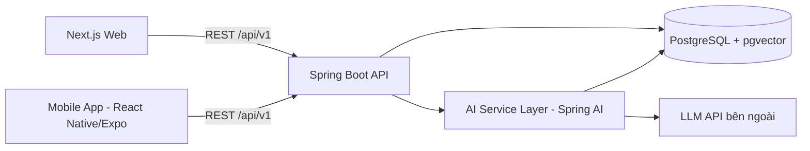
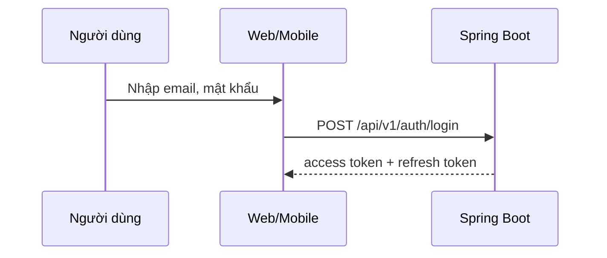

# Kiến trúc tổng thể

> **Người viết:** TV4 (Huy Quốc) | **Reviewer:** TV2 (Nguyễn Minh Trí) | **Task Jira:** SCRUM-23 | **Hạn nộp review:** Thứ Tư 7/10
> **Trạng thái:** Nháp 
> Cách làm: tạo nhánh `docs/<mã SCRUM>-<tên-ngắn>` từ `develop`, điền vào file này, mở Pull Request vào `develop`. Xem `docs/README.md`.

## 1. Sơ đồ thành phần
> Thể hiện đúng kiến trúc đề tài: **Web Management Portal**, **Mobile Application**, **AI Service Layer** kết nối qua **RESTful API**.


> Chỉnh lại cho khớp quyết định cuối cùng (ví dụ thêm Nginx load balancer).

## 2. Quyết định về lớp AI Service
> Lớp AI nằm trong Spring Boot, tách thành package riêng, đường dẫn `/api/v1/ai/**`. Ghi lý do, rủi ro, cách tách ra service riêng sau này.

## 3. Sơ đồ triển khai Docker
> Container: frontend, backend (2 bản), PostgreSQL (pgvector), Nginx. Ghi cổng, volume, mạng.

## 4. Sơ đồ trình tự
### 4.1 Đăng nhập JWT

### 4.2 Hỏi chatbot AI
> Vẽ tương tự: câu hỏi → tạo embedding → tìm top-k (lọc family_id) → ghép prompt → LLM → câu trả lời kèm nguồn.

## 5. Cấu trúc mã nguồn
### Backend (Spring Boot)
```
backend/src/main/java/.../
  auth/ genealogy/ community/ events/ heritage/ directory/ dashboard/ ai/ admin/
    controller/ service/ repository/ dto/ entity/
```
### Frontend (Next.js)
```
frontend/ app/ components/ lib/ services/
```
### Mobile (Expo)
```
mobile/ src/ screens/ navigation/ api/
```
> Điều chỉnh cho đúng quyết định của nhóm (phối hợp TV1 ở task repo, TV5 ở task Mobile).

## 6. Đáp ứng yêu cầu phi chức năng
| NFR | Cách đáp ứng |
|---|---|
| Modular architecture | |
| RESTful | |
| JWT | |
| High Availability (mức cơ bản) | |
| Audit logging | |
