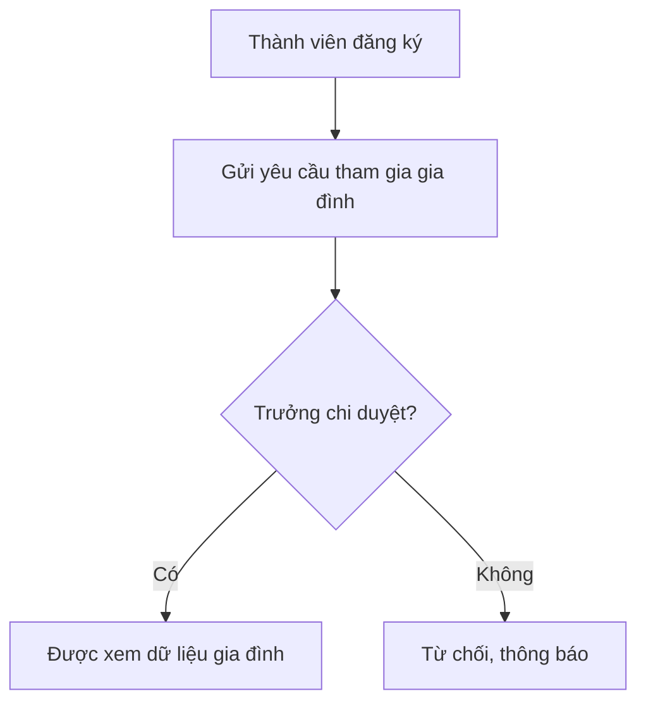

# Mô hình hóa quy trình nghiệp vụ

> **Người viết:** TV3 (PiLo257) | **Reviewer:** TV1 (Tuấn Nguyễn Thanh) | **Task Jira:** SCRUM-83 | **Hạn nộp review:** Thứ Năm 15/10 (Sprint 2)
> **Trạng thái:** Nháp 
> Cách làm: tạo nhánh `docs/<mã SCRUM>-<tên-ngắn>` từ `develop`, điền vào file này, mở Pull Request vào `develop`. Xem `docs/README.md`.

> Vẽ 4 quy trình bằng Mermaid (flowchart có phân làn) hoặc draw.io (BPMN). Mỗi quy trình có làn theo vai trò: Thành viên, Quản trị gia đình, Hệ thống, AI Service.

## 1. Đăng ký, xác minh thành viên và tham gia gia đình

## 2. Thêm thành viên và quan hệ trong gia phả
> ...
## 3. Tạo sự kiện, RSVP và nhắc nhở
> ...
## 4. Hỏi trợ lý AI (RAG)
> ...
