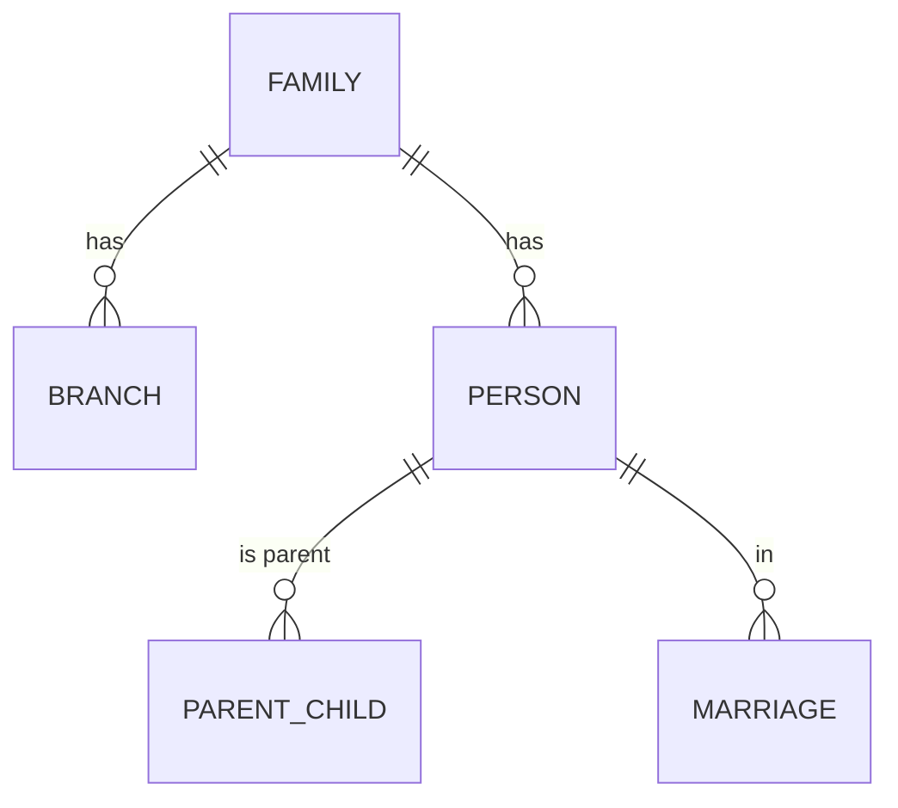

# ERD tổng hợp

> **Người viết:** TV2 (Nguyễn Minh Trí) | **Reviewer:** TV5 (Lê Nhựt) | **Task Jira:** SCRUM-28 | **Hạn nộp review:** Thứ Ba 13/10 (Sprint 2)
> **Trạng thái:** Nháp 
> Cách làm: tạo nhánh `docs/<mã SCRUM>-<tên-ngắn>` từ `develop`, điền vào file này, mở Pull Request vào `develop`. Xem `docs/README.md`.

## 1. Quy ước đặt tên
- Tên bảng `snake_case`, số ít (`person`, `parent_child`); ngoại lệ duy nhất là `users` (vì `user` là từ khóa PostgreSQL).
- Khóa chính `id` kiểu UUID (`DEFAULT gen_random_uuid()`), khóa ngoại cũng UUID.
- Khóa ngoại (`FOREIGN KEY`) chỉ dùng giữa các bảng trong cùng một module. Cột tham chiếu sang bảng của module khác chỉ lưu UUID thường, có index; service kiểm tra tồn tại, quyền và `family_id` qua interface Java của module đó (`architecture.md` mục 7, quyết định 9).
- Cột chuẩn: `created_at`, `updated_at`, xóa mềm `deleted_at` (kiểu `TIMESTAMPTZ`, lưu UTC), thêm `created_by`, `updated_by` cho bảng nghiệp vụ. Không dùng `created_date`.
- Thay đổi schema chỉ qua **Flyway migration**, báo cả nhóm.

## 2. ERD
> Dùng Mermaid `erDiagram` hoặc ảnh từ dbdiagram.io / draw.io (lưu ảnh trong `../images/`).

## 3. Danh sách bảng theo module
| Bảng | Module | Người sở hữu | Trạng thái |
|---|---|---|---|
| users, role, user_role, refresh_token, member_verification, audit_log, system_config | Auth/Admin | TV1 | |
| family, branch, person, parent_child, marriage | Gia phả | TV2 | |
| post, comment, reaction, media, announcement, notification, event, event_participant | Community/Events | TV3 | |
| heritage_document, family_story, outstanding_member, profession_profile, education_profile | Heritage/Directory | TV4 | |
| ai_embedding_chunk, ai_chat_session, ai_chat_message, ai_summary_cache | AI | TV5 | |

## 4. Kiểm tra xung đột
- [ ] Không còn khóa ngoại treo; khóa ngoại chỉ trong cùng module, tham chiếu chéo module chỉ là cột UUID có index
- [ ] Mỗi bảng có người sở hữu
- [ ] Đã họp 30 phút xác nhận ERD v1 (đóng băng)
